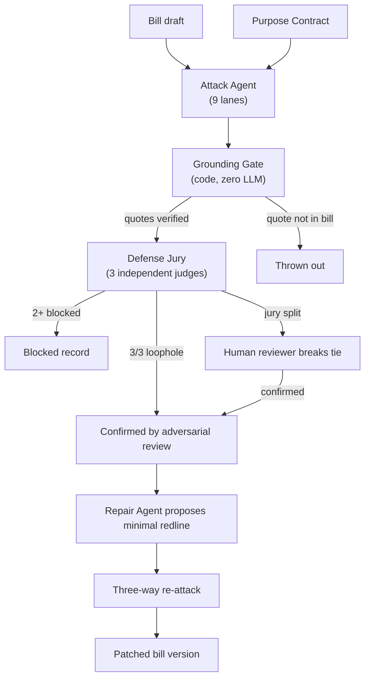
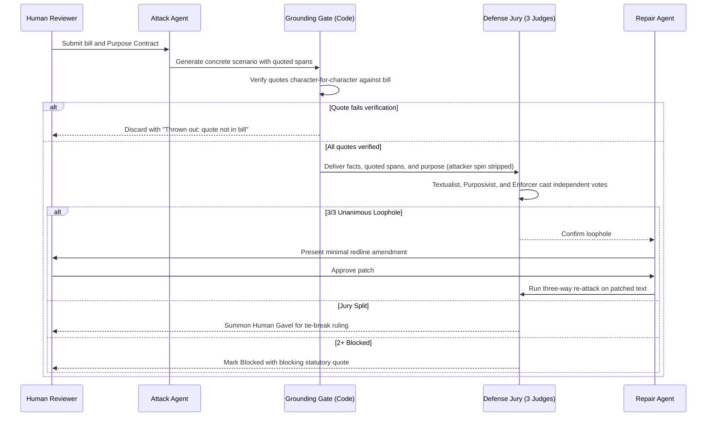

# Loophole

**AI finds the loopholes. You make the call.**

**Demo video:** [Watch Loophole](https://youtu.be/txExNNDeeIE)

Loophole is an adversarial red-teaming War Room for legislation, regulations, and institutional policies. A user pastes a draft bill and sets its policy intent. An Attack agent hunts for evasion loopholes, a deterministic code gate throws out any claim that does not quote the bill verbatim, a jury of three independent AI judges cross-examines every exploit, a human reviewer breaks ties with a gavel, and confirmed loopholes receive a surgical redline that is re-attacked in real time.

The result is a testable pre-deployment workbench for rules: stress-testing statutory text before autonomous agents and motivated actors exploit it in the wild.

## The Problem

Software teams never deploy code without automated fuzzing, regression suites, and penetration testing. Yet governments, regulatory agencies, and corporate compliance teams regularly deploy trillion-dollar rules into production completely untested against adversarial evasion.

In the real world, sophisticated actors rarely break laws outright. Instead, they exploit definitions, thresholds, timing windows, and procedural carve-outs to comply with every literal word of a statute while completely defeating its policy goal. Finding these loopholes after enactment takes years of litigation and emergency amendments. 

Most AI legal tools build conversational chatbots. Loophole builds a red-teaming harness.

## How It Works

Loophole turns rule drafting into an active, testable engineering discipline.

A user defines the policy intent once:

- the target statutory draft or section;
- the core outcome the law is intended to protect;
- the legitimate everyday activities that must stay legal.

Every red-teaming run then follows the same path:

1. **The Attack Agent** probes the bill across 9 tactical evasion lanes.
2. **The Grounding Gate** checks every cited quote character-for-character against the raw text.
3. **The Defense Jury** (Textualist, Purposivist, Enforcer) evaluates the facts, blind to the attacker's spin.
4. **Allowed schemes** that defeat the policy purpose are marked as confirmed loopholes.
5. **Blocked schemes** record the exact statutory clause that stopped the conduct.
6. **Contested schemes** summon the human reviewer with a gavel to break the tie.
7. **Confirmed loopholes** receive a minimal redline repair and run through an immediate three-way re-attack.

That means the demo is not just "an LLM summarized a bill." The demo shows an autonomous agent probing a statute, a deterministic gate catching fake quotes, three judges debating the text, and a human arbitrating the fix.

## Architecture



## Attack & Deliberation Sequence



## Key Applications

| Domain | How Loophole Applies |
|---|---|
| AI Governance & Tech Policy | Stress-testing emerging technology rules and compute thresholds before bad actors exploit them. |
| Legislative & Statutory Drafting | Identifying loopholes, ambiguous exceptions, and unintended carve-outs directly during drafting. |
| Corporate Policy & Compliance | Red-teaming platform terms of service, acceptable use policies, and internal regulatory controls. |

## The Defense Jury

Every scheme is evaluated by three independent judges prompting at temperature 0, completely blind to the attacker's persuasive reasoning:

| Judge | Perspective | Guiding Question |
|---|---|---|
| Textualist | Literal text | "Do these exact statutory words forbid this conduct?" |
| Purposivist | Legislative intent | "Would a court read the legislative purpose into these words to cover this scenario?" |
| Enforcer | Regulatory agency | "Could an enforcement action be brought and won under this text today?" |

### Deterministic Verdict Rules

- **Confirmed Loophole:** Unanimous 3/3 vote that the conduct obeys the text but defeats the purpose.
- **Blocked:** 2 or more judges find the conduct prohibited by statute (the blocking quote is cited).
- **Harmless:** 2 or more judges find the conduct permitted, but causing no harm to the purpose.
- **Contested:** Any split vote summons the human reviewer with the gavel.

## Tactical Evasion Lanes

The Attack Agent explores evasion strategies across 9 tactical lanes:

1. `threshold_split`: Dividing metrics or activities across subsidiaries or timeframes to stay below triggers.
2. `relabel`: Recharacterizing prohibited operations under alternative business categories.
3. `affiliate`: Interposing third-party intermediaries or offshore entities.
4. `timing`: Shifting operations outside statutory surveillance windows.
5. `exception_abuse`: Stretching statutory carve-outs wider than originally intended.
6. `nominal_review`: Satisfying oversight mandates with rubber-stamp procedural steps.
7. `redefine_consideration`: Exploiting definitions that require specific forms of exchange.
8. `no_consideration`: Conducting sensitive transactions without monetary compensation.
9. `procedure_without_outcome`: Completing formal administrative steps while preserving the harmful outcome.

## Running the Demo

Start the local development server:

```bash
pnpm install --trust-lockfile
pnpm db:migrate
pnpm dev
```

Then open:

```text
http://localhost:3000
```

To run the verification test suite:

```bash
pnpm test
```

## Verification Checklist

| Area | Verification |
|---|---|
| Grounding Gate | Verbatim substring matching and normalization verified by unit tests |
| Jury Verdict Logic | Deterministic aggregation (`decideVerdict`) verified across all vote permutations |
| Blind Evaluation | Server-level payload filtering confirms judges never receive attacker arguments |
| Database & Audit | Neon Postgres migrations applied; immutable hashed sources and append-only human rulings active |
| Three-Way Re-Attack | Patched drafts verify old loopholes blocked, zero fresh exploits, and legitimate uses preserved |
| Test Suite | Vitest unit and integration suites passing with 78 tests |

## Stack

```text
Next.js 16 (App Router)
TypeScript strict
Tailwind CSS v4
shadcn/ui
Motion
Zod
Neon Serverless Postgres
Drizzle ORM
@ai-sdk/groq (Primary: Reasoning & Fast models)
@ai-sdk/openai (Fallback provider via OpenRouter)
Vitest & Playwright
```

## Disclaimer

Research and drafting support only. Not legal advice. Findings are AI-reviewed, grounded in quoted text, and require human judgment.
