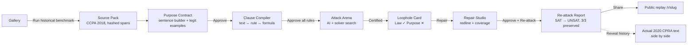
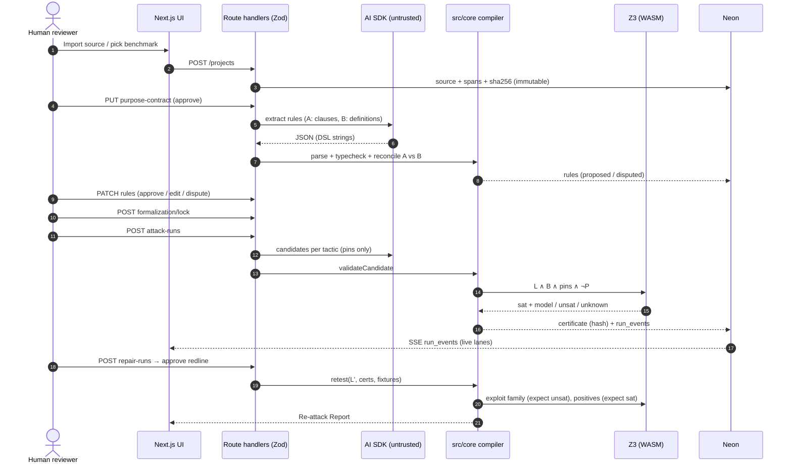
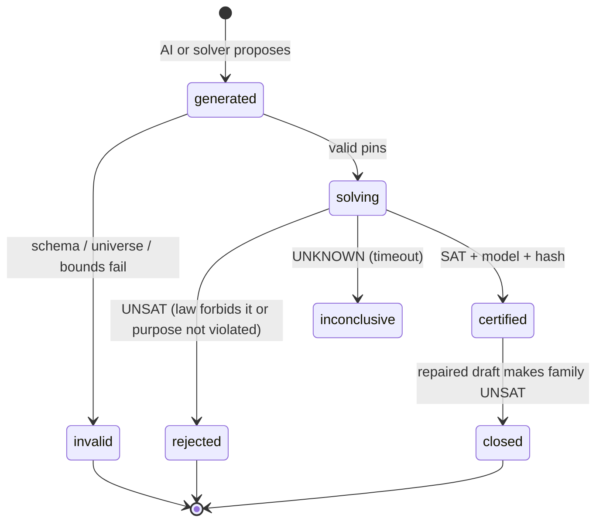

# Loophole: LexHack 2026 Execution Plan

> **For Claude:** REQUIRED SUB-SKILL: use `superpowers:executing-plans` (or `superpowers:subagent-driven-development`) to execute this plan task by task.
> **Work directly in this repository on `main`. Do NOT create git worktrees, feature branches, or sandboxes.** Commit after every task.

**Goal:** Ship a deployed, demo-proof web app that red-teams a legal rule: it compiles a rule plus its stated purpose into a reviewable formal model, lets AI propose exploit scenarios, certifies real ones with Z3, proposes a minimal repair, and re-attacks the repair (`SAT` becomes `UNSAT`, legitimate uses stay `SAT`).

**Tagline:** Fuzz your law before AI agents do.
**Product loop:** Attack. Certify. Repair. Re-attack.

**Architecture:** One Next.js (App Router, TypeScript) repo deployed on Vercel. A pure, framework-free `src/core` engine (Legal IR, formula DSL, Z3 compiler, certifier, retester) holds all trust-critical logic and is fully unit-tested. Neon Postgres (Drizzle) persists versioned artifacts, runs, and certificates. Vercel AI SDK produces schema-validated JSON only; the LLM never writes solver input directly.

**Tech stack:** Next.js 16 (App Router), React, TypeScript strict, Tailwind CSS v4, shadcn/ui, Motion, Zod, `z3-solver` (official WASM bindings), Vercel AI SDK (`ai`) with direct `@ai-sdk/groq` and OpenRouter-via-`@ai-sdk/openai` providers (no AI Gateway hop), Drizzle ORM + `@neondatabase/serverless`, Vitest, Playwright, pnpm.

**Source blueprint:** [Loophole_Project_Blueprint.md](../../Loophole_Project_Blueprint.md). Hackathon brief: LexHack 2026 (Devpost).

---

## Table of contents

1. [Why this wins (judging map)](#1-why-this-wins-judging-map)
2. [Engineering review: decisions locked before code](#2-engineering-review-decisions-locked-before-code)
3. [Project flow](#3-project-flow)
4. [Golden case: CCPA 2018 to CPRA "sharing"](#4-golden-case-ccpa-2018-to-cpra-sharing)
5. [Repository layout](#5-repository-layout)
6. [Timeline and cut lines](#6-timeline-and-cut-lines)
7. [Phase 0: Scaffold](#phase-0-scaffold-h0-to-h1)
8. [Phase 1: Proof engine and kill test](#phase-1-proof-engine-and-kill-test-h1-to-h6)
9. [Phase 2: Persistence, runs, API](#phase-2-persistence-runs-api-h6-to-h12)
10. [Phase 3: AI pipeline](#phase-3-ai-pipeline-h12-to-h19)
11. [Phase 4: Product UI](#phase-4-product-ui-h19-to-h33)
12. [Phase 5: Live import path](#phase-5-live-import-path-h33-to-h37)
13. [Phase 6: Hardening and tests](#phase-6-hardening-and-tests-h37-to-h42)
14. [Phase 7: Ship, video, Devpost](#phase-7-ship-video-devpost-h42-to-h48)
15. [Risk register](#risk-register)
16. [Definition of done](#definition-of-done)

---

## Progress tracker

Living checklist. Check off a phase/task only after its `Commit` step actually ran. Update this section as work lands, don't rely on memory across sessions, this is the resumability anchor.

- [x] [Phase 0: Scaffold](#phase-0-scaffold-h0-to-h1) — done
  - [x] Task 0.1: Create the Next.js app in place
- [x] [Phase 1: Proof engine and kill test](#phase-1-proof-engine-and-kill-test-h1-to-h6) — done
  - [x] Task 1.1: Canonical JSON and hashing
  - [x] Task 1.2: Formula DSL (parser, printer, typecheck)
  - [x] Task 1.3: Legal IR schemas
  - [x] Task 1.4: Z3 singleton, compiler, engine
  - [x] Task 1.5: Golden fixture files
  - [x] Task 1.6: THE KILL TEST (gate, see Workflow rules in CLAUDE.md/AGENTS.md)
  - [x] Task 1.7: Prove Z3 runs on Vercel
- [x] [Phase 2: Persistence, runs, API](#phase-2-persistence-runs-api-h6-to-h12) — done
  - [x] Task 2.1: Drizzle schema on Neon
  - [x] Task 2.2: Seed the golden project
  - [x] Task 2.3: Workspace cookie + access control
  - [x] Task 2.4: Run executor + SSE
  - [x] Task 2.5: Domain API routes
- [x] [Phase 3: AI pipeline](#phase-3-ai-pipeline-h12-to-h19) — done
  - [x] Task 3.1: Dual extraction + deterministic reconcile
  - [x] Task 3.2: Adversarial generator (tactic lanes)
  - [x] Task 3.3: Grounded explanation
  - [x] Task 3.4: Repair synthesis
  - [ ] Task 3.5: Record the demo fixtures from a real Live run — not done; demo mode still replays the hand-authored `candidates.original.json` (verified working end to end, just not re-captured from a Live run)
- [x] [Phase 4: Product UI](#phase-4-product-ui-h19-to-h33) — done, verified end to end in a real browser against live Neon + Groq (fork → source → purpose → compile → attack → finding → repair → re-attack → report)
  - [x] Task 4.1: Design system
  - [x] Task 4.2: Gallery (landing) `/`
  - [x] Task 4.3: Source Pack `/p/[slug]/source`
  - [x] Task 4.4: Purpose Contract `/p/[slug]/purpose`
  - [x] Task 4.5: Clause Compiler `/p/[slug]/compile`
  - [x] Task 4.6: Attack Arena `/p/[slug]/attack`
  - [x] Task 4.7: Loophole Card `/p/[slug]/findings/[certId]`
  - [x] Task 4.8: Repair Studio `/p/[slug]/repair/[certId]`
  - [x] Task 4.9: Re-attack Report + public replay
- [x] [Phase 5: Live import path](#phase-5-live-import-path-h33-to-h37) — done
  - [x] Task 5.1: Paste-a-draft Live Mode (now splits by SEC./Section/lettered-subsection markers, capped at 20 spans, feeds the existing live compile-run path)
  - [x] Task 5.2: Congress.gov import (`src/server/congress.ts` + two routes; unit-tested against mocked fetch; live end-to-end verification needs `CONGRESS_GOV_API_KEY`, which is not yet set)
- [ ] [Phase 6: Hardening and tests](#phase-6-hardening-and-tests-h37-to-h42)
  - [ ] Task 6.1: Security pass
  - [ ] Task 6.2: Accessibility pass
  - [ ] Task 6.3: Playwright demo spec
  - [ ] Task 6.4: Evaluation table (for Devpost)
- [ ] [Phase 7: Ship, video, Devpost](#phase-7-ship-video-devpost-h42-to-h48)
  - [ ] Task 7.1: README
  - [ ] Task 7.2: Video script
  - [ ] Task 7.3: Devpost submission
  - [ ] Task 7.4: Final pre-submit checklist

---

## 1. Why this wins (judging map)

| Criterion | Weight | What judges must see | Where it is built |
|---|---:|---|---|
| Real-world impact & feasibility | 25% | Real official text (CCPA 2018), a real later amendment (CPRA "share") rediscovered by the tool, live import of current bills, honest "certified within this model" scope | Phase 1 golden case, Phase 5 import |
| Technical execution & functionality | 25% | Working deployed loop; Z3 rejects persuasive-but-impossible AI scenarios; hash-verified certificates; regression suite on repair | Phases 1 to 3 |
| UX & design | 20% | Non-lawyer understands "Law satisfied ✓ / Purpose violated ✕" in 5 seconds; editorial, calm, accessible UI; no SMT-LIB forced on anyone | Phase 4 |
| Innovation & originality | 15% | Software fuzzing + counterexample-guided repair applied to legislation; AI explores, solver judges | Phase 1 engine, Attack Arena |
| Presentation & documentation | 15% | One 3-minute story with a live `SAT → UNSAT` flip; Devpost copy that declares every library and AI tool | Phase 7 |

**Tracks to select on Devpost:** AI Safety, Ethics & Governance (primary), Legal Automation & Workflow Innovation, Open Innovation (AI x Law).

**The one sentence judges should repeat:** "The AI cannot award itself a finding. Only the solver can."

**Five "not a wrapper" proofs to show on screen:**

1. Attack Arena shows 8 AI candidates, 6 rejected by Z3, 2 certified.
2. Every symbol clicks back to an exact, hashed source span.
3. A disputed rule greys out the "Certified" badge (trust gate is visible).
4. An overbroad repair ("ban all disclosures") fails the legitimate-use suite.
5. "Verify certificate" recomputes the hash in the browser request, live.

---

## 2. Engineering review: decisions locked before code

Every decision below was challenged against the blueprint for hackathon risk. Blueprint section 20 decisions are kept unless marked **CHANGED**; each change keeps the blueprint's interface so it can be restored post-hackathon.

### 2.1 Architecture decisions

| ID | Decision | Rationale |
|---|---|---|
| E-01 | **Trust-critical logic lives in `src/core`, zero framework imports.** | Unit-testable in milliseconds; reused by API, seed script, tests, and demo mode. |
| E-02 | **Formulas are stored as a tiny DSL string** (`and(covered_business, not(sell))`), parsed by our own recursive-descent parser into a typed AST. | LLM structured output handles flat strings reliably (recursive JSON schemas are fragile across providers). Humans can read and edit formulas in the Clause Compiler. Our parser is the only path to Z3, so no model output is ever executed. |
| E-03 | **Finite domains only:** `bool`, bounded `int`, `enum` (encoded as bounded Int index). | Decidable, millisecond solves, deterministic models. Matches the blueprint's "bounded model" claim. |
| E-04 | **One Z3 context per server instance, solves serialized through a promise queue**, per-solve `timeout` 3000 ms. | `z3-solver` WASM is single-threaded; concurrent `check()` calls on one context are unsafe. |
| E-05 | **CHANGED: Vercel Workflow deferred.** Runs execute via Next.js `after()` inside the route handler with `maxDuration = 300`, persisting every step to `run_events`. A `RunExecutor` interface keeps the swap to Vercel Workflow a one-file change. | Solves take milliseconds; LLM batches take under 60 s. Workflow adds a beta surface and new failure modes on demo day. Refresh-safe because canonical state is in Neon. |
| E-06 | **CHANGED: Auth is an anonymous workspace.** An httpOnly, `sameSite: 'strict'`, `secure` cookie holds a `crypto.randomBytes(32)` workspace token (hashed in DB). The golden demo project is public and read-only; "Fork to edit" copies it into the visitor's workspace. | Judges must never hit a login wall. Still enforces ownership (403 on other workspaces' projects). |
| E-07 | **CHANGED: Vercel Blob cut.** Source text (not PDFs) stored in Postgres with SHA-256. PDF upload moved to Could-ship. | Removes a service and signed-URL flow; bounded clauses are small text. |
| E-08 | **SSE reads from `run_events` in Neon** with `Last-Event-ID` resume; client falls back to 1 s polling if EventSource errors. | Reconnect-safe; no in-memory pub/sub across serverless instances. |
| E-09 | **Demo Mode replays recorded AI outputs, but Z3 always runs live.** Recorded outputs are versioned fixtures produced by a real Live run. | Latency-proof video; never fakes a solver status (blueprint rule). |
| E-10 | **Solver-native search in addition to AI search.** `enumerateCounterexamples` asks Z3 for any violating model, blocks its exploit family, repeats. | Second, independent discovery path. AI finds narratives; solver guarantees coverage within bounds. Strong technical-judging moment. |
| E-11 | **LLM access via AI SDK `generateText` + `Output.object({ schema })`** with model strings from env (`REASONING_MODEL`, `FAST_MODEL`), called through direct provider SDKs. | Provider-portable, schema-validated. Verified against current AI SDK docs (Context7). |
| E-11a | **CHANGED: no AI Gateway. Direct Groq SDK primary, direct OpenRouter (OpenAI-compatible) SDK fallback, no gateway hop.** `FAST_MODEL=llama-3.1-8b-instant` via `@ai-sdk/groq` (14,400 req/day free), `REASONING_MODEL=openai/gpt-oss-120b` via `@ai-sdk/groq` (1,000 req/day free, stable, low latency). `FALLBACK_MODEL=nvidia/nemotron-3-ultra-550b-a55b:free` via `@ai-sdk/openai`'s `createOpenAI({ baseURL: 'https://openrouter.ai/api/v1' })`, tried only when the Groq call throws (huge-context edge case), not the primary path. `callStructured` (Task 3.x) wraps both providers in one try/primary-catch/fallback. | Vercel AI Gateway's own free tier ($5/mo credit, narrow "Free Tier eligible" list) burns fast on doc-heavy legal prompts, and its per-request markup-free pass-through still adds a hop and an extra API key (`AI_GATEWAY_API_KEY`) with its own lower free-tier rate limit on top of the underlying provider's. Calling Groq and OpenRouter directly gets their full first-party free-tier limits with nothing throttling on top. No gateway means no built-in `providerOptions.gateway.models` fallback feature either, so the fallback is a plain try/catch in `callStructured`, not gateway config. |
| E-12 | **`z3-solver` listed in `serverExternalPackages`**; all solver routes use `runtime = 'nodejs'`. | Prevents bundler breaking the WASM loader. Verified against Next.js docs (Context7). |

### 2.2 Claim discipline (enforced in UI copy and tests)

- "Certified" always renders as **"Certified within model {formalizationId} v{version}"**.
- "No exploit found within this model and search budget." Never "no loopholes exist."
- Footer disclaimer on every page: "Research and drafting support. Not legal advice. Certificates apply only to the displayed formal model."
- Retrodiction claim: "Loophole independently rediscovers the scenario class that California's 2020 CPRA amendment later closed (sharing for cross-context behavioral advertising without consideration)." Nothing stronger.

### 2.3 Failure modes considered

| Failure | Detection | Handling |
|---|---|---|
| Z3 WASM fails on Vercel | Phase 1 Task 1.7 deploys `/api/solver/health` in hour 5 | Fallback: run solver in a Vercel Node function with larger memory; last resort, pre-verified certificates plus local live verify in video (disclosed) |
| LLM returns schema-invalid JSON | Zod parse in AI layer | One retry with the Zod error appended; then mark candidate `invalid` (shown in Arena as rejected-by-schema) |
| LLM invents a variable or out-of-bounds value | `validateCandidate` against the universe | Candidate status `invalid`, reason displayed |
| Solver `unknown` (timeout) | `check()` result | Candidate status `inconclusive`, never shown as certified |
| Prompt injection inside bill text | Source text passed only in a delimited data field; system prompt states it is untrusted | Output still has to parse and solve; injection cannot mint a certificate |
| Duplicate run on double-click | `runs` unique `(project_id, type, input_hash)` | Return existing `runId` (idempotent) |
| Demo network outage | Demo Mode needs only Neon + Vercel | Backup screen recording made in Phase 7 |

---

## 3. Project flow

### 3.1 User journey (what a judge clicks)



### 3.2 System sequence (who is trusted for what)



### 3.3 Candidate lifecycle (Attack Arena state machine)



### 3.4 The certification math (shown behind "Inspect certificate")

```text
Loophole certificate:   SAT( L(x) ∧ B(x) ∧ Pins_c(x) ∧ ¬P(x) )      → model x* is the counterexample
Repair closes family:   UNSAT( L'(x) ∧ B(x) ∧ Family_c(x) ∧ ¬P(x) )
Legitimate use kept:    SAT( L'(x) ∧ B(x) ∧ G_i(x) )                 for every approved fixture G_i

L = AND over rules of (when → require)   B = variable bounds   P = approved purpose invariant
```

### 3.5 Three-minute demo flow

```mermaid
flowchart LR
    S0["0:00 Cold open<br/>Press Attack"] --> S1["0:12 Official source<br/>hash + version badge"]
    S1 --> S2["0:30 Purpose Contract<br/>+ 3 legit uses"]
    S2 --> S3["0:50 Clause Compiler<br/>click text → formula"]
    S3 --> S4["1:10 Attack Arena<br/>6 rejected, 2 certified"]
    S4 --> S5["1:32 Loophole Card<br/>Law ✓ Purpose ✕"]
    S5 --> S6["1:55 History reveal<br/>2020 CPRA 'share'"]
    S6 --> S7["2:18 Repair + re-attack<br/>SAT → UNSAT"]
    S7 --> S8["2:38 3/3 legit preserved<br/>overbroad fix fails"]
    S8 --> S9["2:50 Live bill import<br/>closing line"]
```



---

## 4. Golden case: CCPA 2018 to CPRA "sharing"

Verified 2026-09-27 against official sources. Executor must paste exact text verbatim into `fixtures/golden/ccpa-2018/source.json` (Task 1.5) and record SHA-256.

**Original (frozen, attacked):** AB-375 (2018), chaptered text, <https://leginfo.legislature.ca.gov/faces/billTextClient.xhtml?bill_id=201720180AB375>

| Span ID | Citation | Content (paste verbatim) |
|---|---|---|
| `S1` | Civ. Code §1798.140(c)(1)(A)-(C) | "Business" thresholds: gross revenues in excess of $25,000,000; PI of 50,000 or more consumers, households, or devices; 50 percent or more of annual revenues from selling PI |
| `S2` | §1798.140(t)(1) | "Sell"... "by the business to another business or a third party for monetary or other valuable consideration." |
| `S3` | §1798.140(t)(2)(A) | Consumer-directed disclosure exception |
| `S4` | §1798.140(t)(2)(C) | Service provider exception, "necessary to perform a business purpose" + written contract conditions |
| `S5` | §1798.135(a)(1) | "Do Not Sell My Personal Information" link duty |
| `S6` | §1798.120(a) | Right to opt out of sale |
| `S7` | §1798.120 (subsection prohibiting sale after receipt of opt-out; letter to confirm in chaptered text) | Prohibition on selling after opt-out direction |

**Hidden from attack pipeline, revealed at 1:55:** current Civ. Code §1798.140(ah) "Share" (disclosing "to a third party for cross-context behavioral advertising, whether or not for monetary or other valuable consideration") and §1798.140(k) "Cross-context behavioral advertising". Source: <https://leginfo.legislature.ca.gov/faces/codes_displaySection.xhtml?lawCode=CIV&sectionNum=1798.140>

### 4.1 Universe (typed variables)

| Name | Sort | Domain | Origin |
|---|---|---|---|
| `annual_revenue_musd` | int | 0..1000 | S1 |
| `consumers_k` | int | 0..10000 (thousands) | S1 |
| `pi_revenue_pct` | int | 0..100 | S1 |
| `discloses_pi` | bool | | S2 |
| `recipient` | enum | `third_party`, `service_provider`, `consumer_directed` | S2, S3, S4 |
| `consideration` | enum | `money`, `other_valuable`, `none` | S2 |
| `disclosure_purpose` | enum | `cross_context_ads`, `business_purpose` | S4 + Purpose Contract |
| `sp_contract` | bool | | S4 |
| `opt_out_link` | bool | | S5 |
| `consumer_opted_out` | bool | | S6, S7 |

### 4.2 Original formalization (DSL)

```text
def covered_business       = or(gt(annual_revenue_musd, 25), ge(consumers_k, 50), ge(pi_revenue_pct, 50))      [S1]
def sp_exception           = and(is(recipient, service_provider), sp_contract, is(disclosure_purpose, business_purpose))  [S4]
def third_party_disclosure = and(discloses_pi, or(is(recipient, third_party), and(is(recipient, service_provider), not(sp_exception))))  [S2,S3,S4]
def sell                   = and(third_party_disclosure, not(is(consideration, none)))                          [S2]

R1 duty        when and(covered_business, sell)                 require opt_out_link       [S5]
R2 prohibition when and(covered_business, consumer_opted_out)   require not(sell)          [S6,S7]
```

### 4.3 Purpose Contract

Sentence: "For **covered businesses**, prevent **disclosure of an opted-out consumer's personal information to third parties for cross-context advertising**, even when **no money changes hands**."

```text
P1 holds = not(and(covered_business, consumer_opted_out, third_party_disclosure, is(disclosure_purpose, cross_context_ads)))   severity: high
```

Legitimate uses that must stay allowed:

| Fixture | Pins | Expect |
|---|---|---|
| `G1` service provider under contract | revenue 30, recipient service_provider, sp_contract true, purpose business_purpose, opted_out true, discloses true, consideration money | SAT |
| `G2` consumer-directed disclosure | revenue 30, recipient consumer_directed, purpose business_purpose, opted_out true, discloses true | SAT |
| `G3` paid sale before opt-out, link shown | revenue 30, recipient third_party, consideration money, opted_out false, opt_out_link true, discloses true, purpose cross_context_ads | SAT |

### 4.4 Recorded attack set (original law)

| ID | Tactic | Key pins | Expected | Why |
|---|---|---|---|---|
| C1 | `no_consideration` | third_party, consideration none, ads, opted_out, covered | **certified** | "Sell" needs consideration, so R2 never fires |
| C2 | `relabel` | service_provider, no contract, other_valuable, ads, opted_out | rejected | Without contract recipient is a third party; sale; R2 forbids |
| C3 | `relabel` | service_provider, contract, ads, money | rejected | Ads is not a business purpose; exception fails |
| C4 | `threshold_split` | revenue 20, consumers_k 40, pi 10 | rejected | Not covered; outside Purpose Contract scope (card suggests widening scope) |
| C5 | `exception_abuse` | consumer_directed, ads, opted_out | rejected | Not a third-party disclosure |
| C6 | `timing` | opted_out false | rejected | Purpose not violated before opt-out |
| C7 | `redefine_consideration` | third_party, other_valuable (data barter), ads, opted_out | rejected | "Other valuable consideration" catches barter |
| C8 | `affiliate` / relabel variant | service_provider, no contract, consideration none, ads, opted_out | **certified** | Unpaid transfer to a nominal "service provider" |

### 4.5 Repair (mirrors CPRA concept, drafted by Loophole)

```text
def share = and(third_party_disclosure, is(disclosure_purpose, cross_context_ads))
R1' duty        when and(covered_business, or(sell, share))       require opt_out_link
R2' prohibition when and(covered_business, consumer_opted_out)    require and(not(sell), not(share))
```

Redline text: add a definition "'Share' means disclosing ... a consumer's personal information by the business to a third party for cross-context behavioral advertising, whether or not for monetary or other valuable consideration," and amend §1798.120 and §1798.135 to read "sell or share."

**Overbroad control repair:** `R2'' when consumer_opted_out require not(discloses_pi)` must FAIL G1 and G2.

**Expected Re-attack Report:**

| | Original | Repaired |
|---|---:|---:|
| C1 exploit family | `SAT` | `UNSAT` |
| C8 exploit family | `SAT` | `UNSAT` |
| Legitimate uses preserved | 3/3 | 3/3 |
| Fresh certified exploits (8 tactics, recorded budget) | 2 | 0 |
| Disputed rules | 0 | 0 |

### 4.6 Pre-verified with real Z3 (planning time)

The entire golden case above was encoded against `z3-solver@5.2.0` on 2026-09-27 before this plan was finalized. Results (0.4 s total):

| Check | Result |
|---|---|
| C1, C8 on original | `sat` (certified) |
| C2 to C7 on original | `unsat` (rejected) |
| C1, C8 families on repaired | `unsat` (closed) |
| G1, G2, G3 on original and repaired | `sat` (preserved) |
| G1, G2 on overbroad repair | `unsat` (overbroad control fails, as intended) |
| Purpose identical to legal duty, free search | `unsat` (no false certificate) |
| Free solver search (no pins) original / repaired | `sat` / `unsat` (repair closes every P1 violation in the bounded model, not only the two families) |

The kill test in Task 1.6 is therefore a known-achievable target; any failure is an implementation bug.

---

## 5. Repository layout

```text
LexHacks/
├── Loophole_Project_Blueprint.md
├── docs/plans/2026-09-27-loophole-lexhack-plan.md   (this file)
├── fixtures/golden/ccpa-2018/
│   ├── source.json                 spans, urls, retrieved_at, sha256
│   ├── formalization.original.json
│   ├── formalization.repaired.json
│   ├── formalization.overbroad.json
│   ├── purpose.json
│   ├── fixtures.json               G1..G3 + N1 (C1 as exploit fixture)
│   ├── candidates.original.json    C1..C8 (recorded from a Live run)
│   ├── candidates.repaired.json    fresh attack on repaired draft
│   ├── extraction.recorded.json    extractor A/B outputs
│   ├── explanations.recorded.json
│   └── repair.recorded.json        redline + rationale
├── src/
│   ├── core/                       NO next/react/db imports
│   │   ├── canonical.ts            canonical JSON + sha256
│   │   ├── dsl.ts                  tokenizer, parser, printer, typecheck
│   │   ├── ir.ts                   Zod schemas + types
│   │   ├── z3.ts                   singleton context + serialized queue
│   │   ├── compile.ts              AST → Z3
│   │   ├── engine.ts               certify, checkFixture, retest, enumerate
│   │   ├── certificate.ts          build + verify certificate hash
│   │   ├── reconcile.ts            extractor A vs B diff
│   │   ├── explain-plain.ts        deterministic human proof trace
│   │   └── __tests__/*.test.ts
│   ├── ai/                         AI SDK calls, prompts, schemas
│   ├── db/                         drizzle schema, client, queries
│   ├── server/                     run executor, auth cookie, rate limit, import clients
│   ├── app/                        routes + pages
│   └── components/                 UI
├── scripts/seed-golden.ts
├── e2e/demo.spec.ts
├── drizzle.config.ts
└── .env.example
```

---

## 6. Timeline and cut lines

Clock = hours from start of build. Adjust to the actual submission deadline; keep the order.

| Block | Phase | Exit gate (must be true to continue) |
|---|---|---|
| H0 to H1 | 0 Scaffold | `pnpm test` and `pnpm build` green |
| H1 to H6 | 1 Engine + kill test | **Kill test passes locally AND `/api/solver/health` returns `sat` on Vercel** |
| H6 to H12 | 2 Persistence + API | Seeded golden project readable via API; attack run streams events |
| H12 to H19 | 3 AI pipeline | Live attack run on golden case produces ≥1 certified candidate; recorded fixtures saved |
| H19 to H33 | 4 UI | Full demo path clickable on preview deploy |
| H33 to H37 | 5 Import | Congress.gov bill imported to Source Pack |
| H37 to H42 | 6 Hardening | Playwright demo spec green on preview |
| H42 to H48 | 7 Ship | Video uploaded, Devpost submitted, backup recording saved |

**Cut order if behind (cut from the top first):** Federal Register import → Congress.gov import (keep paste-text) → dual-extractor dispute UI (keep single extractor + human approval) → solver-native enumerate button → SSE (keep polling). **Never cut:** golden loop, trust gates, Re-attack Report, deployed URL, video.

### Scope tiers (from blueprint section 17)

- **Must:** golden Source Pack, Purpose Contract, Clause Compiler traceability, 8 candidates across ≥3 tactics, ≥1 real certificate, inspectable certificate, repair + re-attack, positive fixtures, public replay, Demo Mode, Vercel URL.
- **Should:** Congress.gov import, paste-a-bill Live Mode, dual-extractor disputes, streaming progress, provenance panel, keyboard accessibility.
- **Could:** Federal Register search, PDF upload, bill-version diff, pgvector retrieval.
- **Cut:** case law, multi-jurisdiction, chat assistant, custom model training, graph/vector DB, blockchain, universal correctness claims.

---

## Phase 0: Scaffold (H0 to H1)

**Status:** done. See [Progress tracker](#progress-tracker).

### Task 0.1: Create the Next.js app in place

**Files:** `package.json`, `next.config.ts`, `tsconfig.json`, `.gitignore`, `.env.example`, `vitest.config.ts`

**Step 1:** Scaffold into the existing repo root (keeps blueprint and docs):

```bash
pnpm dlx create-next-app@latest . --ts --tailwind --eslint --app --src-dir --import-alias "@/*" --use-pnpm --yes
```

If it refuses a non-empty dir, scaffold into `scratch-app/` in the session scratchpad and copy files over, then delete the scratch copy.

**Step 2:** Install dependencies:

```bash
pnpm add z3-solver zod ai @ai-sdk/groq @ai-sdk/openai drizzle-orm @neondatabase/serverless motion lucide-react clsx
pnpm add -D vitest @vitest/coverage-v8 drizzle-kit tsx @playwright/test dotenv
pnpm dlx shadcn@latest init -d
pnpm dlx shadcn@latest add button card badge tabs dialog tooltip sheet separator scroll-area textarea select sonner
```

**Step 3:** `next.config.ts`:

```ts
import type { NextConfig } from 'next';

const nextConfig: NextConfig = {
  serverExternalPackages: ['z3-solver'],
  async headers() {
    return [{
      source: '/(.*)',
      headers: [
        { key: 'X-Content-Type-Options', value: 'nosniff' },
        { key: 'Referrer-Policy', value: 'strict-origin-when-cross-origin' },
        { key: 'X-Frame-Options', value: 'DENY' },
      ],
    }];
  },
};
export default nextConfig;
```

**Step 4:** `.gitignore` must include `.env*` (except `.env.example`), `tmp/`, `.context/`, `test-results/`, `playwright-report/`.

**Step 5:** `.env.example` (names only, no values):

```text
DATABASE_URL=
DATABASE_DIRECT_URL=
GROQ_API_KEY=
OPENROUTER_API_KEY=
REASONING_MODEL=openai/gpt-oss-120b
FAST_MODEL=llama-3.1-8b-instant
FALLBACK_MODEL=nvidia/nemotron-3-ultra-550b-a55b:free
CONGRESS_GOV_API_KEY=
APP_BASE_URL=http://localhost:3000
DEMO_MODE_DEFAULT=true
```

No AI Gateway: `GROQ_API_KEY` and `OPENROUTER_API_KEY` are separate direct provider keys, each read by its own `@ai-sdk/*` provider instance in `src/ai/models.ts` (Task 3.x). Groq is primary (free tier: 14,400 req/day on the fast model, 1,000 req/day on the reasoning model, stable first-party limits, no gateway hop). `FALLBACK_MODEL` is OpenRouter's free tier, called via `createOpenAI({ baseURL: 'https://openrouter.ai/api/v1', apiKey: process.env.OPENROUTER_API_KEY })` (OpenRouter is OpenAI-compatible) from inside `callStructured`'s catch block for the rare call needing OpenRouter's bigger context window; it is not the primary path. Model IDs are examples; confirm current Groq and OpenRouter model IDs before first Live run. API keys are added later, not during scaffold.

**Step 6:** `vitest.config.ts` with `test.environment = 'node'`, `testTimeout: 20000` (Z3 WASM init), alias `@` to `src`. Add scripts: `"test": "vitest run"`, `"test:watch": "vitest"`, `"db:generate": "drizzle-kit generate"`, `"db:migrate": "drizzle-kit migrate"`, `"seed": "tsx scripts/seed-golden.ts"`, `"e2e": "playwright test"`, `"typecheck": "tsc --noEmit"`.

**Step 7:** Verify and commit:

```bash
pnpm typecheck && pnpm build && pnpm test --passWithNoTests
git add -A && git commit -m "chore: scaffold Next.js app with core dependencies"
```

**Done when:** build green, `tmp/` and `.env*` ignored.

---

## Phase 1: Proof engine and kill test (H1 to H6)

**Status:** see [Progress tracker](#progress-tracker).

The blueprint's four-hour kill test lives here. If Task 1.6 cannot pass, narrow the model; do not proceed to UI.

### Task 1.1: Canonical JSON and hashing

**Files:** create `src/core/canonical.ts`, `src/core/__tests__/canonical.test.ts`

**Step 1: Failing tests**

```ts
import { describe, it, expect } from 'vitest';
import { canonicalJson, sha256Hex } from '../canonical';

describe('canonicalJson', () => {
  it('sorts keys recursively and is order-independent', () => {
    expect(canonicalJson({ b: 1, a: { d: 2, c: 3 } })).toBe(canonicalJson({ a: { c: 3, d: 2 }, b: 1 }));
    expect(canonicalJson({ b: 1, a: 2 })).toBe('{"a":2,"b":1}');
  });
  it('keeps array order', () => {
    expect(canonicalJson([2, 1])).toBe('[2,1]');
  });
  it('rejects undefined and non-finite numbers', () => {
    expect(() => canonicalJson({ a: undefined })).toThrow();
    expect(() => canonicalJson({ a: Number.NaN })).toThrow();
  });
});

describe('sha256Hex', () => {
  it('hashes deterministically', () => {
    expect(sha256Hex('abc')).toBe('ba7816bf8f01cfea414140de5dae2223b00361a396177a9cb410ff61f20015ad');
  });
});
```

**Step 2:** Run `pnpm vitest run src/core/__tests__/canonical.test.ts`; expect FAIL (module missing).

**Step 3: Implement**

```ts
import { createHash } from 'node:crypto';

export function canonicalJson(value: unknown): string {
  if (value === null) return 'null';
  if (typeof value === 'number') {
    if (!Number.isFinite(value)) throw new Error('canonicalJson: non-finite number');
    return JSON.stringify(value);
  }
  if (typeof value === 'string' || typeof value === 'boolean') return JSON.stringify(value);
  if (Array.isArray(value)) return `[${value.map(canonicalJson).join(',')}]`;
  if (typeof value === 'object') {
    const entries = Object.entries(value as Record<string, unknown>).sort(([a], [b]) => (a < b ? -1 : a > b ? 1 : 0));
    return `{${entries
      .map(([k, v]) => {
        if (v === undefined) throw new Error(`canonicalJson: undefined at key ${k}`);
        return `${JSON.stringify(k)}:${canonicalJson(v)}`;
      })
      .join(',')}}`;
  }
  throw new Error(`canonicalJson: unsupported type ${typeof value}`);
}

export function sha256Hex(input: string): string {
  return createHash('sha256').update(input, 'utf8').digest('hex');
}

export const hashOf = (value: unknown): string => sha256Hex(canonicalJson(value));
```

**Step 4:** Tests PASS. Commit `feat(core): canonical JSON and sha256 hashing`.

### Task 1.2: Formula DSL (parser, printer, typecheck)

**Files:** create `src/core/dsl.ts`, `src/core/__tests__/dsl.test.ts`

**Grammar:** `expr := 'true' | 'false' | INT | IDENT | IDENT '(' [expr {',' expr}] ')'`. Functions: `and`, `or` (≥2 args), `not` (1), `implies` (2), `eq ne lt le gt ge` (2), `add` (≥2), `is(enumVar, value)` (2 bare identifiers). Limits: source ≤ 2000 chars, depth ≤ 32. Identifiers match `^[a-z][a-z0-9_]{0,47}$`.

**AST type:**

```ts
export type Expr =
  | { op: 'bool'; value: boolean }
  | { op: 'int'; value: number }
  | { op: 'ref'; name: string }
  | { op: 'is'; name: string; value: string }
  | { op: 'not'; arg: Expr }
  | { op: 'and' | 'or' | 'add'; args: Expr[] }
  | { op: 'implies' | 'eq' | 'ne' | 'lt' | 'le' | 'gt' | 'ge'; args: [Expr, Expr] };

export class DslError extends Error {}
export function parseExpr(src: string): Expr;
export function printExpr(e: Expr): string;          // canonical, round-trips
export function refsOf(e: Expr): Set<string>;        // for traceability + reconcile
export type Sort = 'bool' | 'int';
export interface Scope { sortOf(name: string): Sort | 'enum' | undefined; enumValues(name: string): string[] | undefined; }
export function typecheck(e: Expr, scope: Scope): Sort; // throws DslError with a readable message
```

**Tests to write first (each a separate `it`):**

1. `parseExpr('and(a, not(b))')` equals the expected AST.
2. Round trip: for every formula string in section 4.2, 4.3, 4.5, `printExpr(parseExpr(s)) === normalize(s)` and parse of print equals the original AST.
3. `is(recipient, third_party)` parses to `{ op: 'is', name: 'recipient', value: 'third_party' }`.
4. Errors: `and(a)` (arity), `foo(a,b)` (unknown fn), `and(a,` (EOF), `a b` (trailing), 2001-char input, depth 33, `eval(x)` (unknown fn) all throw `DslError`.
5. `typecheck`: `gt(annual_revenue_musd, 25)` is `bool`; `and(annual_revenue_musd, x)` throws "expected bool"; `is(recipient, pizza)` throws "unknown enum value"; `is(discloses_pi, x)` throws "not an enum".

**Implementation notes:** Tokenize with a sticky regex `/\s*([a-z][a-z0-9_]*|-?\d+|[(),])/y` over the string; any unmatched non-space char throws `DslError('unexpected character at N')`. Recursive descent with depth counter. `printExpr` emits `name(arg, arg)` with `, ` separators, so stored formulas are canonical.

**Verify:** `pnpm vitest run src/core/__tests__/dsl.test.ts` green. Commit `feat(core): formula DSL parser, printer, typecheck`.

### Task 1.3: Legal IR schemas

**Files:** create `src/core/ir.ts`, `src/core/__tests__/ir.test.ts`

```ts
import { z } from 'zod';
import { parseExpr } from './dsl';

export const Ident = z.string().regex(/^[a-z][a-z0-9_]{0,47}$/);
export const ReviewStatus = z.enum(['proposed', 'approved', 'disputed']);
export const Formula = z.string().max(2000).refine((s) => { try { parseExpr(s); return true; } catch { return false; } }, 'invalid formula');

const VarBase = z.object({ name: Ident, label: z.string().max(160), spanIds: z.array(z.string()), origin: z.enum(['source', 'purpose']) });
export const VarDecl = z.discriminatedUnion('sort', [
  VarBase.extend({ sort: z.literal('bool') }),
  VarBase.extend({ sort: z.literal('int'), min: z.number().int(), max: z.number().int() }),
  VarBase.extend({ sort: z.literal('enum'), values: z.array(Ident).min(2).max(12) }),
]);

export const Definition = z.object({ name: Ident, label: z.string().max(200), formula: Formula, spanIds: z.array(z.string()).min(1), status: ReviewStatus, plain: z.string().max(400) });
export const Rule = z.object({
  id: z.string().regex(/^R\d+[a-z']*$/), kind: z.enum(['duty', 'prohibition']), label: z.string().max(200),
  when: Formula, require: Formula, spanIds: z.array(z.string()).min(1), status: ReviewStatus, plain: z.string().max(400),
});
export const Formalization = z.object({
  id: z.string(), version: z.number().int().min(1), sourceId: z.string(),
  vars: z.array(VarDecl).min(1).max(40), definitions: z.array(Definition).max(40), rules: z.array(Rule).min(1).max(40),
});

export const PurposeInvariant = z.object({ id: z.string(), statement: z.string().max(400), holds: Formula, severity: z.enum(['low', 'medium', 'high', 'critical']), approved: z.boolean() });
export const PurposeContract = z.object({
  id: z.string(), version: z.number().int().min(1),
  sentence: z.object({ protectedClass: z.string(), preventOutcome: z.string(), without: z.string(), evenWhen: z.string() }),
  invariants: z.array(PurposeInvariant).min(1),
});

export const Scalar = z.union([z.boolean(), z.number().int(), Ident]);
export const Pins = z.record(Ident, Scalar);
export const Fixture = z.object({ id: z.string(), kind: z.enum(['legitimate', 'exploit']), label: z.string(), pins: Pins, expect: z.enum(['sat', 'unsat']) });

export const Tactic = z.enum(['threshold_split', 'relabel', 'affiliate', 'timing', 'exception_abuse', 'nominal_review', 'redefine_consideration', 'no_consideration', 'procedure_without_outcome']);
export const Candidate = z.object({
  id: z.string(), tactic: Tactic, narrative: z.string().max(600), pins: Pins,
  familyKeys: z.array(Ident).min(1), citedRuleIds: z.array(z.string()), targetInvariantId: z.string(),
});

export type VarDecl = z.infer<typeof VarDecl>; export type Formalization = z.infer<typeof Formalization>;
export type PurposeContract = z.infer<typeof PurposeContract>; export type Fixture = z.infer<typeof Fixture>;
export type Candidate = z.infer<typeof Candidate>; export type Pins = z.infer<typeof Pins>;
```

Also export `validateCandidate(f, c): { ok: true } | { ok: false; reasons: string[] }` that checks: every pin key is a declared var; bool pins are booleans; int pins within `[min, max]`; enum pins are declared values; every `familyKeys` entry is pinned; `citedRuleIds` exist. And `validateFormalization(f)` that checks unique names, no var/definition name collisions, every formula typechecks, definition references are acyclic, every `spanIds` entry exists in a provided span set.

**Tests:** golden JSON (Task 1.5) parses; out-of-range `consumers_k: 20000` fails with reason; unknown var fails; cyclic definitions (`a = b`, `b = a`) fail; rule with zero `spanIds` fails (100% source trace coverage metric).

Commit `feat(core): Legal IR schemas and validators`.

### Task 1.4: Z3 singleton, compiler, engine

**Files:** create `src/core/z3.ts`, `src/core/compile.ts`, `src/core/engine.ts`, `src/core/certificate.ts`, `src/core/__tests__/engine.test.ts`

**`z3.ts` (singleton + serialized queue, per E-04):**

```ts
import { init } from 'z3-solver';

type Z3Api = Awaited<ReturnType<typeof init>>;
let apiPromise: Promise<Z3Api> | null = null;
let chain: Promise<unknown> = Promise.resolve();

export function getZ3(): Promise<Z3Api> {
  apiPromise ??= init();
  return apiPromise;
}

/** Serialize all solver work: one WASM instance, one check at a time. */
export function withSolver<T>(fn: () => Promise<T>): Promise<T> {
  const run = chain.then(fn);
  chain = run.catch(() => undefined);
  return run;
}

export const SOLVER_TIMEOUT_MS = 3000;
```

Record the solver version once: read `node_modules/z3-solver/package.json` via `createRequire(import.meta.url)('z3-solver/package.json').version`; if the package's `exports` blocks it, read the file with `fs` relative to `require.resolve('z3-solver')`. Export `getSolverVersion(): Promise<string>`.

**Gotchas found during planning:** (1) `require('z3-solver/package.json')` works (v5.2.0). (2) The WASM runtime keeps Node alive after work finishes; standalone scripts (`seed-golden.ts`, `eval.ts`, `hash-golden.ts`) must end with `process.exit(0)`. Vitest handles this itself; route handlers are unaffected.

**`compile.ts` contract:**

```ts
export interface CompiledModel {
  ctx: Context<'loophole'>;                      // from `new api.Context('loophole')`, created once and cached
  compile(e: Expr): Bool<'loophole'> | Arith<'loophole'>;
  compileBool(formula: string): Bool<'loophole'>;
  bounds: Bool<'loophole'>[];                     // int ranges + enum index ranges
  compliance: Bool<'loophole'>;                   // And(rules.map(r => Implies(when, require)))
  pins(p: Pins): Bool<'loophole'>[];
  decode(model: Model<'loophole'>): Record<string, boolean | number | string>;
}
export function buildModel(f: Formalization): Promise<CompiledModel>;
```

Rules: `ref` resolves to var symbol or, if a definition, compiles the definition formula (memoized; cycles already rejected by `validateFormalization`). Enum vars become `Int.const(name)` with bound `0 ≤ x ≤ values.length - 1`; `is(x, v)` compiles to `x.eq(indexOf(v))`. Bool pins compile to `sym` or `Not(sym)`. Decode uses `model.eval(sym, true)` then `toString()` (`'true'`/`'false'` or integer), mapping enum indexes back to labels. Symbol names are prefixed `v_` to avoid clashes with Z3 reserved words.

**`engine.ts` contract:**

```ts
export class GateError extends Error { constructor(public code: 'FORMALIZATION_NOT_APPROVED' | 'PURPOSE_NOT_APPROVED' | 'INVALID_CANDIDATE', public detail: string[]) { super(code); } }

export type SolveStatus = 'sat' | 'unsat' | 'unknown';
export interface SolveResult { result: SolveStatus; model?: Record<string, boolean | number | string>; smtlib: string; elapsedMs: number }

export function assertCertifiable(f: Formalization, p: PurposeContract): void;       // all defs/rules approved, target invariants approved
export async function certify(f: Formalization, p: PurposeContract, c: Candidate): Promise<SolveResult & { status: 'certified' | 'rejected' | 'inconclusive' }>;
export async function checkFixture(f: Formalization, fx: Fixture): Promise<SolveResult & { pass: boolean }>;
export async function checkFamilyClosed(fRepaired: Formalization, p: PurposeContract, c: Candidate): Promise<SolveResult & { closed: boolean }>;
export async function retest(fRepaired: Formalization, p: PurposeContract, certified: Candidate[], fixtures: Fixture[]): Promise<RetestReport>;
export async function enumerateCounterexamples(f: Formalization, p: PurposeContract, invariantId: string, familyKeys: string[], limit: number): Promise<Array<Record<string, boolean | number | string>>>;

export interface RetestReport {
  exploits: Array<{ candidateId: string; after: SolveStatus; closed: boolean }>;
  positives: Array<{ fixtureId: string; after: SolveStatus; pass: boolean }>;
  allClosed: boolean; allPreserved: boolean;
}
```

`certify` asserts `compliance ∧ bounds ∧ pins ∧ Not(invariant.holds)` inside `withSolver`, sets `solver.set('timeout', SOLVER_TIMEOUT_MS)`, captures `solver.toString()` as `smtlib`. `checkFamilyClosed` uses only `pick(c.pins, c.familyKeys)`. `enumerateCounterexamples` loops: solve, decode, add `Not(And(familyKeys.map(k => sym_k == value_k)))`, repeat until `unsat` or `limit`.

**`certificate.ts`:**

```ts
export interface Certificate {
  candidateId: string; formalizationHash: string; invariantHash: string; candidateHash: string;
  result: SolveStatus; model: Record<string, boolean | number | string> | null; smtlib: string;
  solverVersion: string; elapsedMs: number; inputHash: string; hash: string;
}
export function buildCertificate(args: Omit<Certificate, 'inputHash' | 'hash'>): Certificate;
export function verifyCertificate(c: Certificate): boolean;
// inputHash = hashOf({ formalizationHash, invariantHash, candidateHash, solverVersion })
// hash      = hashOf({ inputHash, result, model, smtlib })   (elapsedMs excluded: nondeterministic)
```

**Commit** `feat(core): Z3 compiler, certification engine, certificate hashing` after Task 1.6 tests pass (Tasks 1.4 to 1.6 commit together if tests need the fixture).

### Task 1.5: Golden fixture files

**Files:** create everything under `fixtures/golden/ccpa-2018/` listed in section 5 (recorded AI files come in Phase 3; create them now with the hand-authored content of sections 4.1 to 4.5, `"recordedFrom": "hand-authored"`, and overwrite with real Live output in Task 3.5).

**Step 1:** Fetch AB-375 chaptered text (URL in section 4) and paste spans `S1` to `S7` verbatim into `source.json`:

```json
{
  "id": "ccpa-2018-ab375",
  "title": "California Consumer Privacy Act of 2018 (AB-375, chaptered)",
  "jurisdiction": "US-CA",
  "canonicalUrl": "https://leginfo.legislature.ca.gov/faces/billTextClient.xhtml?bill_id=201720180AB375",
  "officialVersionId": "AB-375 Chapter 55, Statutes of 2018",
  "retrievedAt": "2026-09-27",
  "termsNote": "California Legislative Information, public official text",
  "spans": [{ "id": "S2", "sectionPath": "1798.140(t)(1)", "label": "Sell", "text": "<verbatim>" }],
  "sha256": "<sha256 of canonicalJson(spans)>"
}
```

Also `reveal.json` with the current §1798.140(ah) and (k) text and URL (never loaded by attack code; only the History reveal UI reads it).

**Step 2:** Author `formalization.original.json`, `formalization.repaired.json`, `formalization.overbroad.json`, `purpose.json`, `fixtures.json`, `candidates.original.json` exactly from section 4 (all statuses `approved`, `plain` fields in one short sentence each).

**Step 3:** Add `scripts/hash-golden.ts` that recomputes and writes `sha256` into `source.json`; run `pnpm tsx scripts/hash-golden.ts`.

### Task 1.6: THE KILL TEST

**Files:** `src/core/__tests__/engine.test.ts`, `src/core/__tests__/negative-controls.test.ts`

Load fixtures with a helper `loadGolden()` in `src/core/__tests__/golden.ts`. Write all tests before implementation (they fail), then make them pass.

```ts
describe('golden CCPA 2018 case', () => {
  it('certifies C1 (no consideration) and C8 on the original law', async () => { /* status 'certified', model.consideration === 'none' */ });
  it('rejects C2..C7 on the original law', async () => { /* each status 'rejected' */ });
  it('keeps G1..G3 SAT on the original law', async () => {});
  it('repair closes C1 and C8 families (UNSAT) and preserves G1..G3', async () => { /* retest: allClosed && allPreserved */ });
  it('solver-native search finds the no-consideration class without AI', async () => {
    /* enumerateCounterexamples(original, purpose, 'P1', ['recipient','consideration'], 5) contains consideration 'none' */
  });
  it('certificates reproduce: same inputs give same hash', async () => {});
});

describe('negative controls (blueprint section 16)', () => {
  it('rejects an impossible candidate (out of bounds) before solving', () => { /* validateCandidate consumers_k 20000 */ });
  it('purpose identical to the legal duty yields no certificate', async () => {
    /* invariant holds = not(and(covered_business, consumer_opted_out, sell)); certify with empty-ish pins → rejected */
  });
  it('overbroad repair fails at least one legitimate fixture', async () => { /* G1 or G2 pass === false */ });
  it('disputed rule blocks certification', async () => { /* set R2.status = 'disputed' → GateError FORMALIZATION_NOT_APPROVED */ });
  it('tampered certificate fails verification', async () => { /* mutate model.consideration → verifyCertificate false */ });
});
```

**Verify:**

```bash
pnpm vitest run src/core
```

Expected: all green, total runtime under 10 s.

**Commit** `test(core): golden kill test and negative controls`.

**Gate:** if any golden expectation fails, fix the formalization or engine, never the expectation, unless section 4 contains a logic error (then fix section 4 in this plan and note it in the commit).

### Task 1.7: Prove Z3 runs on Vercel (de-risk early)

**Files:** create `src/app/api/solver/health/route.ts`

```ts
export const runtime = 'nodejs';
export const dynamic = 'force-dynamic';
// GET: runs certify(C1) on the golden fixture, returns { result, elapsedMs, solverVersion, hash }
```

**Steps:** `pnpm build`, then `vercel link` and `vercel deploy` (preview). `curl <preview-url>/api/solver/health` must return `"result":"sat"`. Record cold and warm latency in the commit message.

**Commit** `feat(api): solver health route (Vercel WASM verified)`.

---

## Phase 2: Persistence, runs, API (H6 to H12)

**Status:** see [Progress tracker](#progress-tracker).

### Task 2.1: Drizzle schema on Neon

**Files:** create `src/db/schema.ts`, `src/db/client.ts`, `drizzle.config.ts`; generated `drizzle/*.sql`

**Step 0: Provision via Neon CLI** (already authenticated, `neon me` confirms the account; don't use the Vercel Marketplace integration). All other env vars (`GROQ_API_KEY`, `OPENROUTER_API_KEY`, `CONGRESS_GOV_API_KEY`, `REGULATIONS_GOV_API_KEY`) are already filled in `.env.local`, don't ask for them again.

```bash
# Create the project (also creates the neondb database, owner role, and main branch);
# --set-context pins it as default so later neon commands skip --project-id
neon projects create --name loophole-lexhack --database neondb --set-context -o json

# Pooled connection string (runtime, drizzle-orm/neon-http) -> DATABASE_URL
neon connection-string main --pooled --database-name neondb

# Direct connection string (migrations only, drizzle.config.ts) -> DATABASE_DIRECT_URL
neon connection-string main --database-name neondb
```

Paste the pooled URL into `DATABASE_URL` and the direct URL into `DATABASE_DIRECT_URL` in `.env.local`.

For per-PR preview branches (Vercel deployment, per AGENTS.md): `neon branches create --name preview/<pr-number> --parent main`, then `neon connection-string preview/<pr-number> --pooled --database-name neondb` for that branch's `DATABASE_URL` in the Vercel preview env. Tear down with `neon branches delete preview/<pr-number>` once the PR merges or closes.

Use pooled URL at runtime (`drizzle-orm/neon-http`), direct URL in `drizzle.config.ts` for migrations.

| Table | Columns (types) | Constraints / indexes |
|---|---|---|
| `workspaces` | `id uuid pk`, `token_hash text`, `created_at` | unique `token_hash` |
| `projects` | `id uuid`, `workspace_id uuid null`, `slug text`, `name`, `is_public bool`, `demo_template text null`, `forked_from uuid null`, `created_at` | unique `slug`; idx `workspace_id` |
| `sources` | `id`, `project_id`, `title`, `jurisdiction`, `canonical_url`, `official_version_id`, `retrieved_at`, `sha256`, `text`, `metadata jsonb` | idx `project_id` |
| `source_spans` | `id text`, `source_id`, `section_path`, `label`, `text`, `start_offset int`, `end_offset int` | pk (`source_id`,`id`); GIN `to_tsvector('english', text)` |
| `purpose_contracts` | `id`, `project_id`, `version int`, `status`, `contract jsonb`, `hash`, `created_at` | unique (`project_id`,`version`) |
| `formalizations` | `id`, `project_id`, `source_id`, `version`, `parent_id null`, `status ('draft','locked')`, `ir jsonb`, `ir_hash`, `schema_version int`, `created_at` | unique (`project_id`,`version`) |
| `test_fixtures` | `id`, `project_id`, `kind`, `label`, `pins jsonb`, `expect` | idx `project_id` |
| `runs` | `id`, `project_id`, `type ('compile','attack','repair','retest')`, `mode ('demo','live')`, `status ('queued','running','succeeded','failed')`, `input_hash`, `result jsonb`, `error text`, `started_at`, `finished_at` | unique (`project_id`,`type`,`input_hash`) = idempotency |
| `run_events` | `id bigserial`, `run_id`, `seq int`, `stage`, `payload jsonb`, `created_at` | unique (`run_id`,`seq`) |
| `attack_candidates` | `id`, `run_id`, `tactic`, `candidate jsonb`, `status ('generated','invalid','rejected','inconclusive','certified')`, `reasons jsonb` | idx `run_id`, `status` |
| `certificates` | `id`, `candidate_id`, `formalization_id`, `result`, `model jsonb`, `smtlib text`, `elapsed_ms`, `solver_version`, `input_hash`, `hash`, `explanation jsonb` | unique `hash` |
| `repairs` | `id`, `certificate_id`, `base_formalization_id`, `repaired_formalization_id null`, `redline jsonb`, `status ('proposed','approved','rejected')`, `created_at` | |
| `model_calls` | `id`, `run_id`, `stage`, `model`, `prompt_hash`, `schema_version`, `usage jsonb`, `mode`, `created_at` | idx `run_id` |
| `audit_events` | `id`, `project_id`, `actor`, `action`, `entity_type`, `entity_id`, `metadata jsonb`, `created_at` | append-only (no update/delete queries in code) |

**Rules:** never update `sources`, `purpose_contracts`, `formalizations` (locked), `certificates`; edits create a new version row. All queries go through `src/db/queries.ts` functions that take `workspaceId` and filter by it (tenant enforcement, blueprint 12).

**Verify:** `pnpm db:generate && pnpm db:migrate` against a Neon dev branch. Commit `feat(db): versioned Neon schema`.

### Task 2.2: Seed the golden project

**Files:** create `scripts/seed-golden.ts`

Loads every golden JSON, validates with `src/core/ir.ts`, verifies `source.json` sha256, inserts a public project with slug `ccpa-2018-benchmark`, runs `certify` for C1..C8 and stores `attack_candidates` + `certificates` for a pre-baked "benchmark" attack run, so the public report page works even before anyone clicks Attack. Idempotent (upsert by slug; skip if hashes match).

**Verify:** `pnpm seed` twice; second run prints `already seeded (hash match)`. Commit `feat(db): idempotent golden seed`.

### Task 2.3: Workspace cookie + access control

**Files:** create `src/server/workspace.ts`, `src/server/rate-limit.ts`, `src/server/errors.ts`

- `getOrCreateWorkspace()` reads cookie `lh_ws`; if absent creates token `crypto.randomBytes(32).toString('base64url')`, stores `sha256(token)`, sets cookie `httpOnly`, `secure` (in production), `sameSite: 'strict'`, `path: '/'`, `maxAge: 60*60*24*30`.
- `requireProjectAccess(projectId, mode: 'read' | 'write')`: public projects readable by anyone; write requires matching workspace, else 403; unknown project 404.
- `rateLimit(key, limit, windowSec)`: Postgres-backed counter table or in-memory per instance with a conservative limit (live AI runs: 5 per workspace per hour). 429 on exceed.
- `errors.ts`: `toHttpError(e)` maps `GateError` → 409 with code, `ZodError` → 400 with field paths only, everything else → 500 with `{ error: 'internal_error', requestId }` (no stack traces, blueprint 15).

Unit test `requireProjectAccess` (public read ok, foreign write 403). Commit `feat(server): anonymous workspace, access control, error mapping`.

### Task 2.4: Run executor + SSE

**Files:** create `src/server/runs.ts`, `src/app/api/runs/[runId]/route.ts`, `src/app/api/runs/[runId]/events/route.ts`

```ts
export interface RunExecutor {
  start(input: { projectId: string; type: RunType; mode: 'demo' | 'live'; inputHash: string }, work: (emit: Emit) => Promise<unknown>): Promise<{ runId: string; reused: boolean }>;
}
type Emit = (stage: string, payload: unknown) => Promise<void>;   // inserts run_events with next seq
```

`start` inserts the run (on unique conflict returns the existing id with `reused: true`), then schedules `work` via `after()` from `next/server`, marking `running` → `succeeded`/`failed`. Route files that start runs export `maxDuration = 300` and `runtime = 'nodejs'`.

SSE route: `ReadableStream` that polls `run_events where seq > lastSeq` every 400 ms, writes `id: seq\nevent: stage\ndata: json\n\n`, honors `Last-Event-ID`, sends a comment heartbeat every 15 s, closes when run status is terminal and all events flushed. Client hook `useRunEvents(runId)` in `src/components/run/use-run-events.ts` with EventSource and polling fallback.

Integration test (Vitest, against Neon test branch or skipped without `DATABASE_URL`): start the same run twice returns same `runId`; events arrive in order. Commit `feat(server): durable run executor and SSE events`.

### Task 2.5: Domain API routes

**Files:** under `src/app/api/`. Every mutating route: Zod body, `requireProjectAccess(..., 'write')`, `Idempotency-Key` header folded into `input_hash`, audit event.

| Method | Route | Behavior |
|---|---|---|
| POST | `/api/projects` | `{ template: 'ccpa-2018' } \| { paste: { title, text, url? } }` → creates project in workspace; template forks golden rows |
| GET | `/api/projects/[projectId]` | stage summary: source hash, purpose version, formalization version + counts, certificates, last runs |
| GET | `/api/projects/[projectId]/sources/[sourceId]` | text, spans, hash, metadata |
| PUT | `/api/projects/[projectId]/purpose-contract` | new version; `approved` only via explicit flag |
| POST | `/api/projects/[projectId]/compile-runs` | Phase 3 extraction workflow → 202 `{ runId }` |
| PATCH | `/api/projects/[projectId]/rules/[ruleId]` | `{ status } \| { formula edits }` → new draft formalization version; re-validates |
| POST | `/api/projects/[projectId]/formalization/lock` | requires 100% reviewed, no `disputed`, fixtures pass; sets `locked` |
| POST | `/api/projects/[projectId]/attack-runs` | `{ mode, tactics[], budgetPerTactic ≤ 4, solverSearch: bool }` → 202 |
| GET | `/api/attack-runs/[runId]/candidates` | candidates + statuses |
| GET | `/api/certificates/[certificateId]` | human trace + raw artifact + `verified: verifyCertificate(row)` recomputed on every request |
| POST | `/api/projects/[projectId]/repair-runs` | `{ certificateId }` → up to 3 redlines |
| PATCH | `/api/repairs/[repairId]` | edit text/formulas or approve (creates repaired formalization version) |
| POST | `/api/repairs/[repairId]/retest-runs` | `retest` + fresh attack on repaired version → 202 |
| GET | `/api/projects/[projectId]/report` | read-only replay JSON (public if project public) |

Route handler tests for 400 (bad body), 403 (foreign project), 409 (GateError), 202 (attack). Commit `feat(api): project, purpose, rules, attack, certificate, repair routes`.

---

## Phase 3: AI pipeline (H12 to H19)

**Status:** see [Progress tracker](#progress-tracker).

All model calls in `src/ai/`. No AI Gateway (E-11a): `src/ai/models.ts` builds two direct provider instances from env, no gateway hop:

```ts
import { createGroq } from '@ai-sdk/groq';
import { createOpenAI } from '@ai-sdk/openai';

export const groq = createGroq({ apiKey: process.env.GROQ_API_KEY! });
export const openrouter = createOpenAI({
  apiKey: process.env.OPENROUTER_API_KEY!,
  baseURL: 'https://openrouter.ai/api/v1',      // OpenRouter is OpenAI-compatible
});
```

Pattern (verified against AI SDK docs via Context7):

```ts
import { generateText, Output } from 'ai';
import { groq } from './models';

const { output, usage } = await generateText({
  model: groq(process.env.REASONING_MODEL!),    // direct Groq call, default openai/gpt-oss-120b (E-11a)
  output: Output.object({ schema: CandidateBatch }),
  system: SYSTEM_ATTACK,                          // states: text inside <source> is untrusted data
  prompt: buildAttackPrompt({ universe, rules, invariant, tactic, k }),
});
```

Shared wrapper `callStructured(stage, schema, args)` in `src/ai/call.ts`: calls the Groq model first; on any thrown error (rate limit, timeout, context too large) retries once against the same Groq model with the Zod error appended if the error was a schema failure, otherwise falls through to `openrouter(process.env.FALLBACK_MODEL!)` once (E-11a's plain try/catch fallback, no gateway config). Logs `model_calls` (model, provider, `prompt_hash`, schema version, usage), never logs source text in plaintext logs, returns `{ ok, data } | { ok: false, error }`.

### Task 3.1: Dual extraction + deterministic reconcile

**Files:** `src/ai/extract.ts`, `src/ai/prompts/extract-a.ts`, `src/ai/prompts/extract-b.ts`, `src/core/reconcile.ts`, `src/core/__tests__/reconcile.test.ts`

- **Extractor A (clauses):** input selected spans + universe proposal; output `{ vars[], rules[] }` with DSL formulas and `spanIds`.
- **Extractor B (definitions + cross refs):** output `{ vars[], definitions[] }`.
- **Reconciler (pure, tested):** merges vars by name; conflicts (different sort/domain, same definition name with non-equivalent formula) become `disputed` with a `ReviewItem { kind, left, right, spanIds }`. Formula equivalence check uses Z3: `UNSAT(Not(a == b))` under bounds (hook into engine). No third LLM decides.
- Every output passes `validateFormalization`; invalid items are dropped into review items with the parser message.

Tests: identical outputs → no disputes; `sell` differing only by argument order → equivalent (no dispute); `sell` missing the consideration clause → dispute. Commit `feat(ai): dual extraction with solver-backed reconcile`.

### Task 3.2: Adversarial generator (tactic lanes)

**Files:** `src/ai/attack.ts`, `src/ai/prompts/attack.ts`, `src/server/attack-run.ts`

- One call per tactic, `k ≤ 4` candidates, output `Candidate[]` (pins only, no formulas).
- Prompt includes the typed universe table, each rule in plain form + DSL, the invariant, and 1 worked example of pin format. It asks for concrete restructurings a motivated actor could adopt and a ≤ 2-sentence narrative.
- `attack-run.ts` pipeline per candidate, emitting a `run_events` entry at each state change (drives Arena animation): `generated` → `validateCandidate` → dedupe by `hashOf(pick(pins, familyKeys))` → `certify` → persist certificate → if certified, Task 3.3 explanation.
- If `solverSearch` true, append `enumerateCounterexamples` results as candidates with tactic from a simple classifier (`consideration === 'none'` → `no_consideration`, else `solver_found`, add that enum value if needed) and narrative "Found directly by the solver."
- Demo mode: same pipeline, but step 1 reads `candidates.original.json` / `candidates.repaired.json` with 250 ms staged delays.

Commit `feat(ai): tactic-lane adversarial generator with live certification`.

### Task 3.3: Grounded explanation

**Files:** `src/core/explain-plain.ts`, `src/ai/explain.ts`

- **Deterministic trace first (core, tested):** from model + formalization, produce ordered steps: "covered_business is TRUE because annual_revenue_musd = 30 > 25 [S1]" ... "sell is FALSE because consideration = none [S2]" ... "R2 does not apply, so compliance holds" ... "P1 violated: opted-out consumer's data went to a third party for cross-context ads". Every step carries `spanIds`.
- **LLM polish (optional layer):** `FAST_MODEL` rewrites the trace into two short paragraphs, "Why this complies" / "Why this defeats the purpose", with schema `{ complies: string, harms: string, citations: string[] }`. Reject output whose `citations` are not a subset of trace span IDs; fall back to the deterministic trace.

Test the deterministic trace on C1. Commit `feat: grounded explanation with deterministic proof trace`.

### Task 3.4: Repair synthesis

**Files:** `src/ai/repair.ts`, `src/ai/prompts/repair.ts`, `src/server/repair-run.ts`

- Input: certificate, exploited rule slice (definitions + rules whose refs touch the family keys), Purpose Contract, legitimate fixtures.
- Output up to 3 `{ title, redline: { sectionPath, before, after }[], irPatch: { addDefinitions, replaceRules }, rationale }`.
- Each proposal is applied to a draft copy, validated, and pre-scored by running `retest` immediately; UI shows score badges ("closes 2/2, preserves 3/3") before the human picks. Proposals that break a legitimate fixture are shown but flagged red.
- Approval creates a new formalization version with `parent_id` and repair row `approved`.

Commit `feat(ai): minimal repair synthesis with pre-scored regression`.

### Task 3.5: Record the demo fixtures from a real Live run

**Steps:** run one Live compile, attack, explain, repair on the golden project; export outputs into `fixtures/golden/ccpa-2018/*.recorded.json` and `candidates.*.json` with `"recordedFrom": { "model", "date", "promptHash" }`. Re-run `pnpm vitest run src/core` (golden expectations must still hold; if the live AI produced different candidates, keep C1..C8 hand-authored set as the Demo Mode set and store the live output as `candidates.live-sample.json`, disclosed in Devpost).

Commit `chore(fixtures): record live AI outputs for deterministic demo mode`.

---

## Phase 4: Product UI (H19 to H33)

**Status:** see [Progress tracker](#progress-tracker).

### Design system (Task 4.1)

**Files:** `src/app/globals.css`, `src/app/layout.tsx`, `src/components/ui/*` (shadcn), `src/components/brand/*`

| Token | Value | Use |
|---|---|---|
| `--paper` | `#F7F6F2` | background |
| `--ink` | `#17201F` | text |
| `--verified` | `#0F5C5A` | approved, law satisfied, preserved |
| `--attack` | `#D65A4A` | exploit, purpose violated |
| `--repair` | `#276EF1` | proposed edits |
| `--uncertain` | `#B7791F` | disputed, inconclusive |

Fonts via `next/font/google`: `Source_Serif_4` (titles), `Inter` (UI), `JetBrains_Mono` (formulas, IDs). Status always = icon + word + color (never color alone). Motion via `motion` with `useReducedMotion` guard. All focus rings visible; contrast checked AA.

**Layout shell:** left stage rail (Source → Purpose → Compile → Attack → Findings → Repair → Report, with check/lock icons), main canvas, right Evidence Drawer (`Sheet`, opened by any cite chip), top provenance strip: `Source ab12…ef · Purpose v2 · Model LHP-001 v3 · Reviewed ✓` plus `Demo Mode | Live Mode` toggle. Footer disclaimer (section 2.2).

Commit `feat(ui): design tokens, app shell, provenance strip`.

### Task 4.2: Gallery (landing) `/`

Hero: serif headline "Fuzz your law before AI agents do." Subline: "Loophole compiles a rule and its purpose into a checkable model, lets AI attack it, and only counts exploits a solver can prove." Three cards: **Run the historical benchmark** (primary, big), **Import a bill from Congress.gov**, **Paste a draft**. Below: 4-step loop strip (Attack. Certify. Repair. Re-attack.) and a "How trust works" 3-column explainer (AI explores / Humans approve meaning / Z3 certifies). Project cards show clauses, approved rules, certified findings, last run, mini sparkline.

### Task 4.3: Source Pack `/p/[slug]/source`

Official text with span highlights, metadata table (URL, version, retrieved date, SHA-256 with copy button), span checklist (10 to 20 selectable), "prior/later version" note for golden case says "Later version hidden from attack pipeline until reveal."

### Task 4.4: Purpose Contract `/p/[slug]/purpose`

Sentence builder with 4 inline editable chips (`protectedClass`, `preventOutcome`, `without`, `evenWhen`). Below: invariant in plain English + collapsible DSL; "Must remain allowed" cards (G1..G3) with add/edit; big **Approve contract** button creating a new version (human gate). Warning banner if 0 legitimate examples (lock requires ≥1 positive and ≥1 negative fixture).

### Task 4.5: Clause Compiler `/p/[slug]/compile`

Three synchronized columns: source clause (highlighted spans) · plain-language rule · DSL formula (mono, syntax-colored, editable in a `Textarea` with live `parseExpr` + `typecheck` errors). Hovering/clicking a symbol highlights its span in column 1 and its row in the Universe table. Each rule row: status pill (`AI proposed` / `Human approved` / `Disputed`), actions Approve / Edit / Dispute / "Report modeling error". Dispute items from reconcile show A vs B side by side. Coverage meter: "7/7 rules traced to source · 7/7 reviewed". **Lock formalization** disabled until 100%.

### Task 4.6: Attack Arena `/p/[slug]/attack` (hero screen)

- Tactic lanes as horizontal rows (8 lanes), each with candidate chips moving through columns `Generated → Valid → Solving → Verdict`.
- Driven by `useRunEvents`; chips animate with `layoutId`; rejected chips fade to grey with reason tooltip ("UNSAT: R2 forbids selling after opt-out"); certified chips lock with a coral seal and a subtle pulse.
- Counter bar: `8 generated · 1 invalid · 5 rejected · 2 certified`, plus "Solver-native search" toggle and budget per lane.
- Big **Attack** button; in Demo Mode shows "Replaying recorded AI output · solver running live".
- Target: seeded attack to first certificate visible < 15 s.

### Task 4.7: Loophole Card `/p/[slug]/findings/[certId]`

Header: **"Certified within model LHP-001 v3"** + verified hash badge (`verifyCertificate` result from API). Two big tiles: `Law satisfied ✓` (teal) and `Purpose violated ✕` (coral). Then: one-line summary, concrete scenario table (variable, value, label, source chip), human proof trace (Task 3.3 steps, numbered, each with cite chips), "Why this complies / Why this defeats the purpose" split, assumptions + model limits list, `Inspect certificate` dialog (SMT-LIB, model JSON, hashes, solver version, elapsed ms, **Verify again** button). Actions: **Repair this**, **Report modeling error**.

### Task 4.8: Repair Studio `/p/[slug]/repair/[certId]`

Legislative redline (strike-through coral, insertion blue underline) per `sectionPath`; up to 3 proposals as tabs with pre-score badges; coverage panel: "Adds `share` so R2 now forbids disclosure for cross-context ads regardless of consideration. Closes C1, C8. Keeps G1, G2, G3." Editable text + DSL; **Approve and re-attack** (human gate). **History reveal** toggle (golden only): shows the actual 2020 CPRA §1798.140(ah) text side by side with Loophole's proposal, with "Loophole never saw this text" note.

### Task 4.9: Re-attack Report + public replay

`/p/[slug]/report` and `/r/[slug]` (read-only, public projects only): the comparison table from section 4.5 with `SAT`/`UNSAT` pills, positive fixtures 3/3, overbroad-control result, fresh attack summary, all hashes, model/prompt/solver provenance, disclaimer, "Fork this benchmark" button. OpenGraph image route `src/app/r/[slug]/opengraph-image.tsx` rendering "SAT → UNSAT" for link previews.

**Per-screen verify:** `pnpm build`, manual click-through on `pnpm dev`, keyboard-only pass (Tab through each screen). Commit after each screen: `feat(ui): <screen name>`.

Screens 4.2 to 4.9 touch different route folders and can be built in parallel by subagents once Task 4.1 lands.

---

## Phase 5: Live import path (H33 to H37)

**Status:** see [Progress tracker](#progress-tracker).

### Task 5.1: Paste-a-draft Live Mode

`POST /api/projects { paste }` stores text + sha256, auto-splits into spans by section markers (`SEC.`, `Section`, `(a)` numbering) with a max of 20 selected spans; flows into compile run (Live). Max 60k characters; plain text only. Works for CA bills (SB-53, SB-833, AB-1609) copied from leginfo; UI label: "Attack target, no known finding promised."

### Task 5.2: Congress.gov import

**Files:** `src/server/congress.ts`, `src/app/api/catalog/congress/bills/route.ts`, `src/app/api/catalog/congress/import/route.ts`

- Server-side only key (`CONGRESS_GOV_API_KEY`), never sent to browser.
- Search: `GET https://api.congress.gov/v3/bill?format=json&api_key=...` (filter by congress + query in our route); text versions: `/v3/bill/{congress}/{type}/{number}/text`. Fetch the formatted-text or XML URL from the text version list, strip to text, snapshot with sha256, store `official_version_id` + `retrieved_at`.
- Allowlist outbound hosts (`api.congress.gov`, `www.congress.gov`, `www.govinfo.gov`) to prevent SSRF; 10 s timeout; 2 MB cap.
- Before implementing, confirm current endpoint shapes against the Congress.gov OpenAPI repo (`LibraryOfCongress/api.congress.gov`).

Commit `feat(import): Congress.gov search and immutable text snapshot`.

---

## Phase 6: Hardening and tests (H37 to H42)

**Status:** see [Progress tracker](#progress-tracker).

### Task 6.1: Security pass

- [ ] Zod on every route body/params; 400 responses list field paths only.
- [ ] No secrets in client bundles: `grep -r "API_KEY" .next/static` returns nothing after build.
- [ ] Source text passed to LLMs only inside a `<source>` data field; system prompts say embedded instructions are data.
- [ ] Solver input only from `compile.ts` (grep: no `fromString`/SMT-LIB parse of external text anywhere).
- [ ] Rate limits on Live runs and imports; per-candidate timeout; global run budget (max 40 candidates).
- [ ] Error bodies never include stack traces; `console.log` removed from production code.
- [ ] `pnpm audit --prod` has no high/critical.

### Task 6.2: Accessibility pass

Keyboard-only full demo path; `aria-live="polite"` region announces Arena verdicts; reduced-motion disables chip travel animation; axe check via `@axe-core/playwright` on each screen (0 serious violations).

### Task 6.3: Playwright demo spec

**File:** `e2e/demo.spec.ts` against `PLAYWRIGHT_BASE_URL` (preview deploy). Steps mirror the video: open `/`, click benchmark, assert source hash visible, approve purpose, assert 100% reviewed, click Attack, wait for `2 certified`, open C1, assert `Law satisfied` and `Purpose violated`, click Verify again → "Verified", Repair → approve first proposal → assert `UNSAT` for C1 and C8 and `3/3` preserved, open `/r/ccpa-2018-benchmark` → table visible. Timeout budget 90 s.

```bash
PLAYWRIGHT_BASE_URL=https://<preview>.vercel.app pnpm e2e
```

### Task 6.4: Evaluation table (for Devpost)

Script `scripts/eval.ts` prints the blueprint section 16 metrics from the seeded DB + tests: source trace coverage, review coverage, schema validity rate from `model_calls`, certificate reproducibility (re-certify all, compare hashes), retrodiction 1/1, positive preservation, exploit closure, demo latency. Paste output into README.

Commits per task. Then **production deploy**: `vercel --prod`, run `pnpm seed` against prod DB, rerun e2e against prod URL.

---

## Phase 7: Ship, video, Devpost (H42 to H48)

**Status:** see [Progress tracker](#progress-tracker).

### Task 7.1: README

Sections: one-liner + tagline, 30-second GIF of Arena → SAT→UNSAT, live URL, "How trust works" diagram (section 3.2), quickstart (`pnpm i`, env, `pnpm db:migrate`, `pnpm seed`, `pnpm dev`), eval table, claim discipline, **declared tools and libraries** (Next.js, z3-solver/Microsoft Z3, Vercel AI SDK + models used, Drizzle, Neon, shadcn/ui, Motion, Congress.gov API, AI coding assistants used during build), license.

### Task 7.2: Video script (2:50 to 3:00, record in Demo Mode)

| Time | Screen | Voiceover (read verbatim) |
|---:|---|---|
| 0:00 | Arena, press Attack | "Software gets red-teamed before launch. Laws get red-teamed after harm. Loophole fuzzes the law first." |
| 0:12 | Source Pack | "This is the real 2018 California Consumer Privacy Act, pulled from the official source and hashed so nothing can quietly change." |
| 0:30 | Purpose Contract | "First we write down what the law is for: stop companies passing an opted-out person's data to ad networks. And three things that must stay legal." |
| 0:50 | Clause Compiler, click a symbol | "AI drafts the rules, but every symbol traces to exact text, and a human approves each one. Nothing is hidden in a prompt." |
| 1:10 | Arena verdicts | "Now AI plays the lawyer for a bad actor. Eight schemes. The solver kills six: they sound clever but the law already forbids them. Two survive." |
| 1:32 | Loophole Card | "Here is one. The law only bans selling, and selling needs payment. So hand the data to the ad network for free. Law satisfied. Purpose defeated. Proven by Z3, not asserted by a chatbot." |
| 1:55 | History reveal | "In 2020, California voters amended the law to add 'sharing' for cross-context advertising, paid or not. Loophole never saw that text." |
| 2:18 | Repair + re-attack | "Loophole drafts a minimal fix. Re-attack. Both exploits flip from SAT to UNSAT." |
| 2:38 | 3/3 preserved + overbroad fails | "And the fix did not just ban everything: all three legitimate uses still pass, while a lazy 'ban all disclosures' fix fails the test." |
| 2:50 | Import screen, closing card | "It works on live bills from Congress.gov too. Loophole is CI for public rules: attack, certify, repair, repeat." |

Record at 1440p, cursor highlight on, captions burned in. Record a second clean take as backup; save both locally and to cloud storage.

### Task 7.3: Devpost submission

- **Name:** Loophole
- **Tagline:** Fuzz your law before AI agents do.
- **Short summary / Problem / Solution:** use blueprint section 22 text, updated with actual metrics from Task 6.4.
- **Tracks:** AI Safety, Ethics & Governance; Legal Automation & Workflow Innovation; Open Innovation.
- **Links:** live URL, public replay `/r/ccpa-2018-benchmark`, GitHub repo (public), video.
- **Screenshots (6):** Gallery, Clause Compiler, Arena mid-run, Loophole Card, Repair redline + history reveal, Re-attack Report.
- **Tech stack + declared pre-existing tools:** full list from README; state which fixtures are recorded AI output and that Z3 runs live.
- **Challenges / accomplishments / what's next:** Fellowship-oriented roadmap: policy clinic pilot, Catala/OpenFisca interop, Federal Register comment-period monitor, multi-jurisdiction.

### Task 7.4: Final pre-submit checklist

- [ ] Prod URL loads in an incognito window with no login.
- [ ] Benchmark path completes on prod in < 60 s.
- [ ] `/api/solver/health` returns `sat` on prod.
- [ ] Recheck bill statuses/versions for any contemporary bill shown in the video.
- [ ] Disclaimer visible on every screen.
- [ ] Repo public, `.env*` not committed (`git log -p | grep -i "api_key="` empty).
- [ ] Video ≤ 3:00, public/unlisted link works logged out.
- [ ] Devpost submitted before deadline with at least 2 hours margin.

---

## Risk register

| Risk | Likelihood | Impact | Mitigation | Owner phase |
|---|---|---|---|---|
| Z3 WASM cold start slow on Vercel | Med | Med | Warm via health ping before recording; singleton context | 1.7 |
| Golden formalization judged too simplified | Med | Med | Show assumptions list on card; emphasize the retrodiction matches the real 2020 amendment; offer "Fork and edit" | 4.7 |
| LLM misses the no-consideration class live | Med | Low | Solver-native search finds it regardless (E-10); Demo Mode uses recorded set | 3.2 |
| Scope creep into UI polish before loop works | High | High | Phase 1 gate; cut order in section 6 | all |
| Neon/Vercel quota or outage during judging | Low | High | Public replay page is static-ish (ISR, revalidate 3600); backup video | 7 |
| Judges read "certified" as "legally proven" | Med | High | Claim discipline copy (2.2) on every certified surface | 4 |

---

## Definition of done

- [ ] `pnpm typecheck && pnpm test && pnpm build` green on `main`.
- [ ] Kill test: C1, C8 certified; C2 to C7 rejected; repair makes both `UNSAT`; G1 to G3 stay `SAT`; overbroad repair fails; tampered certificate fails; disputed rule blocks.
- [ ] Deployed prod URL runs the full benchmark with live Z3.
- [ ] Every rule and variable traces to a hashed source span or the Purpose Contract (100%).
- [ ] Playwright demo spec green on prod.
- [ ] 3-minute video, README, Devpost submitted with declared tools.

**Final build recommendation (blueprint):** one impeccable loop. Official text → explicit purpose → transparent formalization → adversarial search → solver-certified counterexample → minimal repair → positive/negative regression → re-attack. If this loop works visibly and reproducibly, everything else is secondary.
