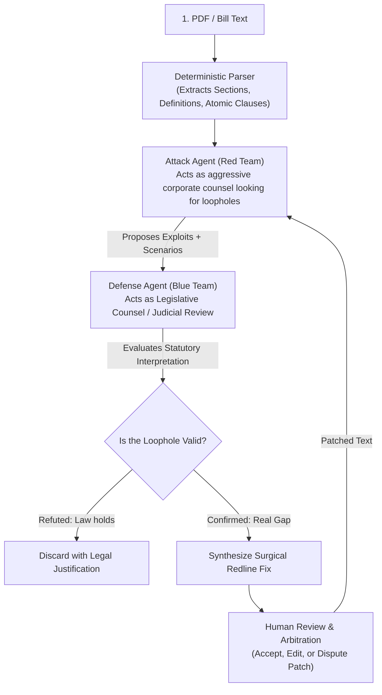

This is a very compelling and practical architectural direction. It shifts the system from a **formal mathematical verification engine** (SMT solver) to an **Adversarial Multi-Agent Debate architecture** (Red-Team vs. Blue-Team Counsel).

Here is a deep-dive feasibility analysis, covering the system flow, the pros and cons, the failure modes to protect against, and how to execute it with high rigor.

---

### 1. Proposed End-to-End Flow



1. **Deterministic Parser (`bill.pdf` $\rightarrow$ Structured Clauses):**
   * Uses rule-based/regex boundary detection (`SEC.`, `(a)`, `(1)`) to preserve exact character offsets, statutory citations, and cross-references.
2. **Attack Agent (Corporate Red-Team Counsel):**
   * Prompted with a taxonomy of evasion tactics (e.g. *nominal compliance, threshold splitting, uncompensated consideration, intermediate entities*).
   * Generates concrete adversarial fact patterns grounded strictly in cited clauses.
3. **Defense Agent (Legislative Blue Team / Judge):**
   * Evaluates the attack against the text and stated legislative intent:
     * *Can the text be reasonably construed to prohibit this conduct?*
     * *Does existing statutory language or canon of interpretation block the loophole?*
   * If the gap is real: drafts the **minimal statutory amendment (redline)** to close it.
4. **Human Reviewer:**
   * Receives the complete adversarial debate transcript, cited statutory spans, and the proposed redline diff for final sign-off.

---

### 2. Why This is Powerful (The Advantages)

* **Solves the "Subjective Law" Problem:** Formal solvers like Z3 only understand strict boolean/integer logic ($A \land \neg B$). They completely fail on real legal concepts like *"reasonable efforts"*, *"material adverse effect"*, *"in good faith"*, or *"acting in the public interest"*. Agents handle natural language nuance naturally.
* **Eliminates the "Clause Compiler" Drop-off Wall:** In the current Z3 pipeline, users must tediously map 15 clauses into DSL formulas (`and(covered_business, not(sell))`). An agentic flow eliminates that step—you upload a bill and click **Attack** immediately.
* **Extensible to Any Bill:** You can throw a 20-page federal bill or a municipal ordinance at it without needing to manually define a custom typed universe schema.

---

### 3. The Core Risks & Pitfalls (What Can Go Wrong)

If you replace a mathematical solver with LLMs on both sides, you face three primary failure modes:

| Failure Mode | How It Manifests | Consequence |
| :--- | :--- | :--- |
| **Hallucinated Agreement (Sycophancy)** | Attack Agent proposes a flawed argument; Defense Agent politely agrees it's a loophole without rigorously applying statutory text. | False alarms; users lose trust in the tool. |
| **Ghost Clauses** | An agent quotes a standard from outside the text or imagines a definition that isn't actually in the bill. | Debates detached from the real statutory language. |
| **Subjective Regression Testing** | In Z3, proving a fix works is binary ($SAT \rightarrow UNSAT$). With agents, testing whether a fix worked requires another LLM evaluation, which can be inconsistent across runs. | Harder to claim a loophole is definitively "closed." |

---

### 4. How to Build It With High Rigor (The "Not Just a Chatbot" Standard)

To keep this hackathon-winning and avoid being dismissed as "just another LLM wrapper", enforce these structural guardrails:

#### A. Structured JSON Debate Contracts (No Freeform Chat)
Both agents must communicate strictly via typed JSON schemas:
```typescript
interface AttackProposal {
  tactic: string;
  scenarioNarrative: string;
  exploitedClauseIds: string[]; // Must match exact parsed section IDs
  whyWordsPermit: string;
  whyPurposeDefeated: string;
}

interface DefenseEvaluation {
  verdict: "blocked_by_statute" | "valid_loophole" | "ambiguous";
  blockingClauseIds?: string[];
  statutoryReasoning: string;
  proposedRedline?: {
    targetSectionId: string;
    originalText: string;
    amendedText: string;
    rationale: string;
  };
}
```

#### B. Grounded Citation Verification (Zero Hallucination Gate)
Before the Defense Agent receives the Attack scenario, run a deterministic check:
* Verify that every section or quote cited by the Attack Agent exists verbatim in the parsed source text. If an agent invents a word, the scenario is automatically rejected before evaluation.

#### C. Adversarial Re-Attack Loop (Regression Test)
When the Defense Agent proposes an amendment:
* Automatically re-prompt the Attack Agent with the amended text:  
  *"Here is the amended clause. Can your previous scenario still bypass this? If not, can you find a modified evasion tactic?"*
* If the Attack Agent admits defeat or fails the criteria, the patch is marked **"Defense Verified"**.

---

### 5. Architectural Comparison: Z3 vs. Adversarial Agents

| Dimension | Current Z3 Architecture | Proposed Adversarial Agent Architecture |
| :--- | :--- | :--- |
| **Proof Standard** | **Mathematical proof** ($SAT \rightarrow UNSAT$) | **Adversarial consensus** (Legal debate) |
| **Scope of Law** | Bounded rules, tax codes, eligibility, numbers | Broad policy, privacy, ethics, standards of care |
| **User Setup Time** | High (must compile DSL formulas) | Instant (paste bill & attack) |
| **Narrative Quality** | Abstract variable assignments | Rich, realistic corporate evasion memos |
| **Determinism** | 100% deterministic | Probabilistic (needs structured rubrics) |

### Verdict & Recommendation
This flow is **significantly more practical for general legislation** than a pure SMT solver, provided you implement:
1. Strict deterministic parsing with exact span highlighting.
2. Structured Red-Team/Blue-Team debate schemas.
3. An automated re-attack regression check before presenting the fix to the human reviewer.s