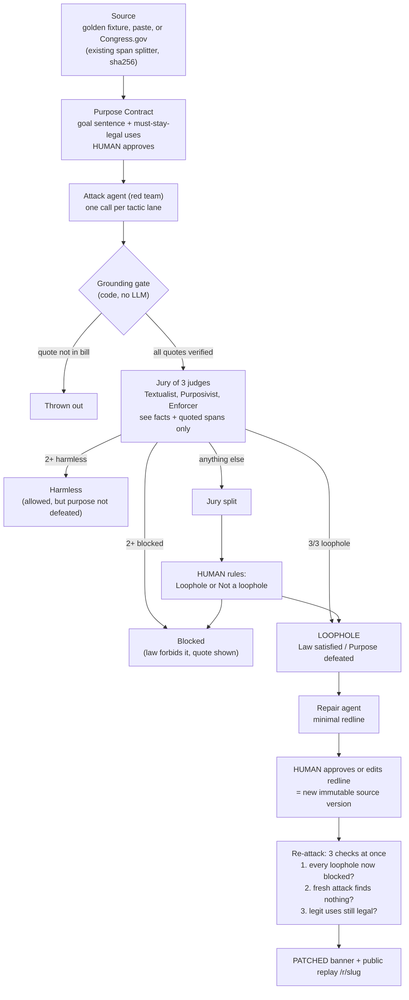

# Loophole v2: Adversarial Agent Architecture

**Status:** adopted 2026-09-27. Replaces the Z3 proof engine (v1, plan Phases 1 to 3).
**Where docs disagree, this file wins.** Plan to execute: [2026-09-27-loophole-v2-plan.md](2026-09-27-loophole-v2-plan.md). Pages, routing, layout: [frontend_v2.md](frontend_v2.md). Product intent: the blueprint.

One line: paste a bill and its purpose, an Attack agent proposes loopholes that must quote the bill word for word, a jury of 3 AI judges cross-examines each one, a human breaks ties, confirmed loopholes get a minimal redline, and the patched bill is re-attacked and checked against legitimate uses.

Pitch: **"AI argues. Code checks the quotes. Humans decide."**

---

## 1. Why we changed (and what we gave up)

| | v1 (Z3) | v2 (agents) |
|---|---|---|
| Trust standard | `SAT` / `UNSAT` inside a hand-reviewed formal model | Verbatim-quote gate (code) + jury of 3 judges + human tie-break |
| Setup before first attack | Purpose Contract + Clause Compiler (review every formal rule) | Purpose Contract only. Paste and attack. |
| Scope of law | Booleans, bounded ints, enums | Any text, including "reasonable efforts", "good faith", "material" |
| Determinism | 100% | Probabilistic. Mitigated by 3 different judges at temperature 0, human tie-break, recorded Demo Mode |
| Human role | Approve every formal rule (slow) | Approve purpose, rule on split verdicts, sign the patch |
| Findings read like | Variable assignments | Short evasion memos with quoted clauses |

**What we gave up, said honestly:** "proven by a solver." v2 never claims proof. The trust story: *the attacker cannot award itself a finding. Every claim must quote the bill verbatim and survive three judges who never hear the attacker's argument.*

---

## 2. End-to-end flow



### Agents and their contracts

Four agents, all through the existing `callStructured` (Groq primary, OpenRouter fallback), Zod-validated, source text inside a delimited `<source>` field marked as untrusted data.

```ts
// 1. Attack agent: one per candidate
interface AttackProposal {
  tactic: Lane;            // v1 Tactic enum minus 'solver_found' = 9 lanes (src/core/contracts.ts):
                           // threshold_split, relabel, affiliate, timing, exception_abuse,
                           // nominal_review, redefine_consideration, no_consideration, procedure_without_outcome
  title: string;           // "Free data hand-off to ad network"
  scenario: string;        // concrete facts, <= 4 sentences, no legal argument
  quotes: { spanId: string; text: string }[];   // verbatim excerpts the scheme relies on
  whyWordsPermit: string;      // attacker's argument: NEVER shown to the jury
  whyPurposeDefeated: string;  // attacker's argument: NEVER shown to the jury
}

// 2. Defense jury: one vote per judge
interface DefenseVote {
  judge: 'textualist' | 'purposivist' | 'enforcer';
  verdict: 'blocked' | 'harmless' | 'loophole' | 'unclear';
  //  blocked  = the text forbids this conduct (must quote the forbidding words)
  //  harmless = the text allows it, but it does not defeat the stated purpose
  //  loophole = the text allows it AND it defeats the stated purpose
  quotes: { spanId: string; text: string }[];
  reasoning: string;       // <= 5 sentences
}

// 3. Repair agent
interface RepairProposal {
  title: string;
  redline: { spanId: string; before: string; after: string }[];  // 'before' verbatim; new language goes inside 'after'
  rationale: string;
}

// 4. Purpose helper (pasted bills only, FAST_MODEL): drafts a Purpose Contract the human edits and approves
interface PurposeSuggestion { sentence: string; legitimateUses: string[] }
```

**Why the jury has a `harmless` verdict.** A loophole needs two things: the law allows it **and** it defeats the purpose (v1's `L ∧ ¬P`). Asking only "does the text forbid this?" would confirm schemes that are legal but hurt nobody, for example golden C6, a disclosure *before* the consumer opts out, or C5, a disclosure the consumer asked for. `harmless` catches that case.

### Grounding gate (the deterministic trust layer)

Pure functions in `src/core/grounding.ts`, unit-tested, and they run live in Demo Mode too:

- every `spanId` exists in the source version under attack;
- every `quote.text` is a substring of that span after normalization (collapse whitespace, curly to straight quotes, case-sensitive);
- a jury `blocked` vote without a verified quote counts as `unclear`;
- a Repair `redline.before` that isn't verbatim drops that proposal.

Failures show in the Arena as **Thrown out: quote not in bill**. That's a visible "not a wrapper" moment.

### Verdict rule: a jury of 3

Three judges, each a **different prompt** (same model, temperature 0). All get the same input: `scenario + full text of the quoted spans + Purpose Contract`. None sees `whyWordsPermit` or `whyPurposeDefeated`.

| Judge       | Reads the bill like | Brief                                                            |
| -------------| ---------------------| ------------------------------------------------------------------|
| Textualist  | the exact words     | "Do these words forbid this conduct?"                            |
| Purposivist | legislative intent  | "Would a court read the purpose into these words to cover this?" |
| Enforcer    | a regulator         | "Could I bring an enforcement action under this text today?"     |

Each judge answers both questions (forbidden? purpose defeated?) from its own angle, then picks one verdict.

**Why 3 different prompts, not 3 copies:** the same prompt at temperature 0 gives the same answer 3 times, so it isn't a real vote. Three readings are genuinely independent checks, and a loophole that survives all three is strong.

**"Parallel" means one thing only:** the 3 calls don't depend on each other, so they're sent at the same time (`Promise.all`), about 3x faster. It doesn't change the logic.

`decideVerdict(votes)` in `src/core/verdict.ts` sets the status. No LLM picks it.

| Jury | Status | UI |
|---|---|---|
| 3/3 `loophole` | `confirmed` | coral stamp "LOOPHOLE 3/3" |
| 2+ `blocked` | `blocked` | teal shield + the blocking quote |
| 2+ `harmless` | `harmless` | grey "Allowed, but no harm to the purpose" |
| anything else | `contested` | amber "Jury split. Your call." + gavel |

Cut line if Groq quota bites: a Textualist-only jury (`DEFENSE_JURY=textualist`); then `loophole` → confirmed, and a quoted `blocked` → blocked.

### Human in the room (3 touchpoints)

The human moved from the slow v1 step (approving every formal rule) to the three decisions that matter:

1. **Set the goal.** Approve the Purpose Contract and legitimate uses (pre-approved for the golden demo; drafted by the purpose helper for pasted bills).
2. **Break ties.** A `contested` chip asks "Loophole or Not a loophole?" The ruling (`loophole` | `no_loophole`, optional note) is appended to `finding_rulings`. The chip shows "Ruled by reviewer" next to the jury's split. The drawer also lets a human overrule any verdict; the jury verdict always stays visible.
3. **Sign the patch.** No redline becomes the new text until a human approves or edits it.

**Effective status** = the latest human ruling if there is one, otherwise the jury status (`effectiveStatus()` in `src/core/verdict.ts`). The UI, repair and re-attack all use effective status.

### Repair

- Input: one finding plus its cited spans, the Purpose Contract, the legitimate uses, and the other open loophole findings (so one patch can close several, as CPRA did).
- Approve: each `before` is replaced by `after` inside its span, and **all** spans are copied into a new `sources` row (`parent_source_id`, new sha256). Span ids are stable, so quotes map across versions. The old version is never edited.

### Re-attack: 3 checks at once

Once the human approves a patch, three independent checks fire together (`Promise.all`); the War Room shows three rows filling side by side:

| Check | What runs | Pass |
|---|---|---|
| Old loopholes | Jury re-judges **every** loophole finding (confirmed or human-ruled) against the patched text: cited spans + every span the redline touched | each one `blocked` |
| Fresh attack | Attack agent on the patched source, 1 scheme per lane, full grounding + jury | 0 `confirmed` (any `contested` needs a human ruling) |
| Legit uses | Textualist asks, per legitimate use, "does the patched text forbid this?" | none forbidden |

The attacker's old quotes are not re-grounded against the new text (the patch may have changed those words). The jury simply gets the new span text.

All pass → **PATCHED**: chips flip coral to teal, banner "2 loopholes → 0. 3/3 legit uses kept." Any fail → that row turns red and says why.

Overbroad control (golden only): "Try the lazy fix" applies the recorded "ban all disclosures" redline, and the Legit uses row goes red on G1 and G2.

---

## 3. What stays, what goes

**Keep (logic reused, UI re-housed in the War Room per frontend_v2):** span splitter + sha256, Congress.gov import, paste mode, workspace cookie + 403 ownership, runs + `run_events` + SSE (`useRunEvents`), rate limits, `model_calls` logging, `callStructured`, `canonical.ts` hashing, the Arena lane logic, purpose editor (minus DSL), redline rendering, report view, design tokens, a11y work.

**Delete:** `src/core/{ir,dsl,compile,engine,z3,reconcile,explain-plain,certificate}.ts` and their tests (`certificate.ts` is Z3-shaped throughout); `src/ai/{extract,explain}.ts` and `src/ai/prompts/{extract-a,extract-b,explain}.ts`; routes `compile-runs`, `formalization/lock`, `rules/[ruleId]`, `solver/health`; the `z3-solver` dependency and its `serverExternalPackages` entry. Scripts keep `process.exit(0)` (it also closes DB handles).

**Rewrite:** new `src/core/{contracts,grounding,verdict,finding,events}.ts` (replaces `ir.ts`); `src/ai/{attack,repair,schemas}.ts` + prompts; new `src/ai/{defense,purpose}.ts` + prompts; `src/server/{attack-run,repair-run,projects,page-data,report-data}.ts`; `scripts/{seed-golden,eval}.ts`; golden fixtures.

### Data model changes (one Drizzle migration)

- Drop `formalizations` and `certificates`.
- `runs.type`: `attack | repair | retest` (drop `compile`).
- `attack_candidates.status`: `generated | ungrounded | blocked | harmless | contested | confirmed`.
- New `findings` (one row per jury-reviewed candidate): `candidate_id`, `source_id`, `proposal` jsonb, `votes` jsonb, `verdict`, `hash` = canonical sha256 of `{ sourceSha, purposeHash, proposal, votes }`. Immutable.
- New `finding_rulings` (append-only): `finding_id`, `ruling`, `note`, `workspace_id`, `created_at`. Latest row wins.
- `repairs`: `certificate_id` → `finding_id`, `base_formalization_id` → `base_source_id`, `repaired_formalization_id` → `repaired_source_id`.
- `sources`: add `parent_source_id`.
- `test_fixtures`: replace `pins` / `expect` with `scenario` text (legitimate uses in plain language).

---

## 4. Golden case in v2 (CCPA 2018 to CPRA "share")

Same source, spans S1 to S7, same hidden CPRA reveal, same Purpose Contract sentence. G1 to G3 become plain-language legitimate uses. C1 to C8 become `AttackProposal`s with verbatim quotes from `source.json`.

| Candidate | Expected |
|---|---|
| C1 no consideration, C8 unpaid "service provider" | `confirmed` |
| C2 "service provider" with no contract, paid in kind, C3 ads are not a business purpose, C7 data barter is "other valuable consideration" | `blocked`, each with a blocking quote |
| C4 below every threshold, C5 disclosure the consumer directed, C6 before opt-out | `harmless` (the law allows it, but the purpose is not defeated) |

Golden scoreboard: **8 schemes · 3 blocked · 3 harmless · 2 LOOPHOLES** (plus any thrown out in the recorded run).
| After the CPRA-style "sell or share" redline | C1 and C8 `blocked`; fresh attack 0 confirmed; G1 to G3 not forbidden |
| Overbroad "ban all disclosures" redline | forbids G1 and G2 |

**Pivot gate (replaces the v1 kill test):** in Live mode, C1 and C8 confirmed, none of C2 to C7 confirmed, and the three re-attack checks pass, in at least 2 of 3 runs. If not, fix prompts or `verdict.ts` before touching UI. Demo Mode replays one recorded Live run that passed. If that run naturally contains a `contested` chip, keep it, since it shows the gavel. Never hand-edit a verdict into the fixtures.

---

## 5. Claim discipline (v2)

- Never "certified", "proven", or "SAT/UNSAT" in UI copy.
- Jury finding: **"Confirmed by adversarial review (3/3 judges, run {id})"**. Human-ruled: **"Ruled a loophole by reviewer (jury split)"**.
- "No loophole survived review in this run's search budget." Never "no loopholes exist."
- Footer: "Research and drafting support. Not legal advice. Findings are AI-reviewed, grounded in quoted text, and require human judgment."
- Demo Mode label: "Replaying recorded agent output. Quote verification running live."

## 6. Risks and guards

| Risk | Guard |
|---|---|
| Sycophancy (a judge agrees with a bad attack) | Judges never see the attacker's arguments; 3/3 different judges required; `blocked` must quote |
| Legal-but-harmless schemes counted as loopholes | `harmless` verdict; judges answer the purpose question too |
| Ghost clauses / invented words | Grounding gate, code, runs live |
| Non-deterministic verdicts | 3 distinct judges; splits go to a human, not a coin flip; video uses Demo Mode |
| Prompt injection in bill text | `<source>` data field; output still must pass the grounding gate |
| Groq quota (`gpt-oss-120b` ~1000 req/day) | Attack run ≈ 9 lanes + 18 candidates × 3 judges ≈ 63 calls; re-attack ≈ 9 + 27 + 6 + 3 ≈ 45. Pivot gate ≈ 330 calls. Textualist-only fallback; judges use Demo Mode |
