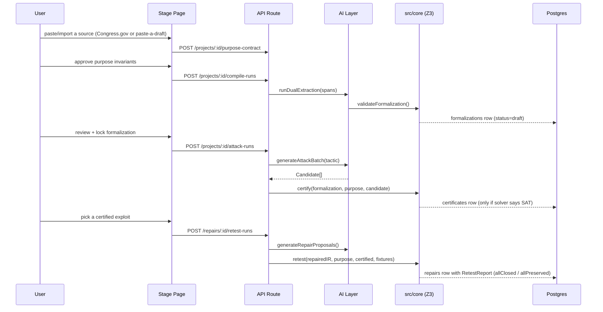

# 1 — Overview

## Relevant Source Files
- `CLAUDE.md`
- `Loophole_Project_Blueprint.md`
- `src/core/*`
- `src/ai/*`
- `src/server/*`
- `src/app/**`

## TL;DR

Loophole takes a rule (e.g. a CCPA section) plus a plain-English statement of its purpose, compiles both into a small typed DSL, and runs a five-stage pipeline — Source → Purpose → Compile → Attack → Repair — where an LLM proposes adversarial "loophole" scenarios but **only Z3 (`src/core/engine.ts`) decides** whether a scenario is a real exploit. Nothing outside `src/core` is allowed to touch the solver directly (`CLAUDE.md`). The one-line product claim, enforced in UI copy: "Certified within model {id} v{version}", never bare "certified."

## Overview

Loophole is a Next.js 16 App Router application (TypeScript strict) built for LexHack 2026. Its central architectural decision is a hard trust boundary: `src/core` is pure TypeScript with zero framework imports, fully unit-tested, and is the *only* code path that compiles the Legal IR into SMT-LIB and calls `z3-solver`. The LLM (Groq primary, OpenRouter fallback, `src/ai/*`) never writes SMT-LIB or executable code the server runs — it only emits DSL strings and JSON that `src/core` re-validates and re-compiles from scratch (`Loophole_Project_Blueprint.md`, `CLAUDE.md`). This means a hallucinated or malicious model output can, at worst, fail a Zod parse or fail to compile — it can never fabricate a "certified" result.

The rest of the system exists to feed data into and read results out of that boundary: `src/server` orchestrates long-running work (extraction, attack generation, repair synthesis) as durable background runs tracked in Postgres (`src/server/runs.ts`); `src/db/schema.ts` (Drizzle + Neon) stores every artifact (sources, formalizations, purpose contracts, certificates, repairs) as immutable, hash-versioned rows; and `src/app` renders a five-stage workspace UI (`/p/[slug]/source` → `.../purpose` → `.../compile` → `.../attack` → `.../repair/[certId]`) plus a public, forkable report page (`/r/[slug]`). See [02 — Legal IR & DSL](02-legal-ir-and-dsl.md) for the data model this whole pipeline moves, and [08 — Frontend](08-frontend-pages.md) for the stage UI.

## Architecture Diagram

```mermaid
graph TD
    subgraph Client["Browser"]
        UI[Stage pages: source/purpose/compile/attack/repair]
        SSE[useRunEvents — SSE + poll fallback]
    end

    subgraph API["Next.js API Routes (src/app/api)"]
        WS[requireProjectAccess — cookie workspace auth]
        RUNS[runExecutor.start — after() background work]
    end

    subgraph AI["AI Layer (src/ai) — proposes, never decides"]
        EXTRACT[runDualExtraction]
        ATTACK[generateAttackBatch]
        REPAIR[generateRepairProposals]
        CALL[callStructured — Groq to OpenRouter fallback]
    end

    subgraph Core["src/core — trust boundary, zero framework imports"]
        DSL[dsl.ts parser/typechecker]
        IR[ir.ts Zod schemas + validation]
        COMPILE[compile.ts buildModel]
        ENGINE[engine.ts certify/retest/enumerate]
        Z3[z3.ts single Context, serialized solves]
        CERT[certificate.ts hash-chained certificates]
    end

    subgraph Data["Neon Postgres (src/db)"]
        DB[(projects, sources, formalizations,\npurpose_contracts, runs, run_events,\nattack_candidates, certificates, repairs)]
    end

    UI --> WS --> RUNS
    SSE -.->|GET /api/runs/:id/events| RUNS
    RUNS --> EXTRACT & ATTACK & REPAIR
    EXTRACT & ATTACK & REPAIR --> CALL
    RUNS --> ENGINE
    EXTRACT --> IR
    ATTACK --> IR
    REPAIR --> IR
    ENGINE --> COMPILE --> DSL
    ENGINE --> Z3
    ENGINE --> CERT
    RUNS --> DB
    CALL -.->|logs prompt hash only| DB

    style Core fill:#2d5a8e,stroke:#1a3a5c,color:#fff
    style AI fill:#5a3d2d,stroke:#3c2718,color:#fff
```

## Key Concepts

| Concept | Description | Source |
|---------|-------------|--------|
| Legal IR | The typed model of a rule: `VarDecl`, `Definition`, `Rule`, `Formalization` | `src/core/ir.ts:4-52` |
| Purpose Contract | A structured "prevent X without Y even when Z" statement plus formal invariants that must hold | `src/core/ir.ts:54-71` |
| Formula DSL | A tiny s-expression language (`and`, `implies`, `is`, …) that both humans and the LLM write instead of raw SMT-LIB | `src/core/dsl.ts:1-52` |
| Candidate | An AI-proposed exploit scenario: a tactic, a narrative, and concrete variable pins | `src/core/ir.ts:83-103` |
| Certificate | The Z3-signed, hash-chained proof that a candidate is `sat`/`unsat` against a purpose invariant | `src/core/certificate.ts:4-16` |
| Repair Proposal | An AI-proposed IR patch (new definitions / replaced rules) plus redline text | `src/core/ir.ts:105-119` |
| Run | A durable unit of background work (compile/attack/repair/retest), deduped by `(project, type, inputHash)` | `src/server/runs.ts:11-21`, `src/db/schema.ts:80-91` |
| Workspace | An anonymous, cookie-identified owner of projects; enforced server-side even with no login wall | `src/server/workspace.ts:20-67` |

## The Five-Stage Pipeline



## Active Development Areas

Git hotspots (most-changed files) center on the AI prompt/schema layer and project docs: `docs/plans/2026-09-27-loophole-lexhack-plan.md`, `src/ai/prompts/extract-a.ts`, `src/ai/prompts/extract-b.ts`, `src/ai/schemas.ts` — consistent with a hackathon still tuning extraction prompt/schema fidelity. See [04.1 — Extraction & Reconciliation](04.1-extraction-and-reconciliation.md).

`[NEEDS INVESTIGATION]`: this repo has a single commit author and a short history (2026-09-27 range per `CODEX_HISTORY/INDEX.md` references in `/Users/sourabhkapure/CLAUDE.md`); whether phases 5-7 of `docs/plans/2026-09-27-loophole-lexhack-plan.md` are fully implemented versus in-progress was not independently verified against that plan document.

## Cross-References
- Next: [02 — Legal IR & DSL](02-legal-ir-and-dsl.md)
- See also: [03 — Z3 Engine](03-z3-engine.md), [05 — Server Layer](05-server-layer.md)
