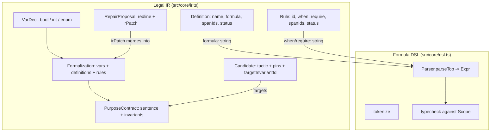

# 2 — Legal IR & DSL

## Relevant Source Files
- `src/core/ir.ts`
- `src/core/dsl.ts`
- `src/core/reconcile.ts`

## TL;DR

The Legal IR is a set of Zod schemas (`src/core/ir.ts`) describing a rule as typed variables, boolean definitions, and duty/prohibition rules, each formula written in a small custom DSL (`src/core/dsl.ts`) instead of free-form code or SMT-LIB. Validation (`validateFormalization`) enforces name uniqueness, formula well-formedness, span traceability, and an acyclic definition graph before anything is allowed near the solver.

## Overview

This is the data model at the center of the whole product — every other subsystem (AI extraction, attack generation, repair synthesis, Z3 compilation) reads or writes an IR value. It's deliberately small and closed: variables are `bool`/`int`/`enum` only (`src/core/ir.ts:21-25`), formulas are strings validated at parse time via `Formula = z.string().refine(...)` (`src/core/ir.ts:6-13`), and every `Definition`/`Rule` carries `spanIds` tracing it back to the exact source text it came from plus a `status` (`proposed`/`approved`/`disputed`) gating whether it can ever reach the solver. See [03 — Z3 Compilation Engine](03-z3-engine.md) for how a validated `Formalization` becomes an actual Z3 model, and [04.1 — Extraction & Reconciliation](04.1-extraction-and-reconciliation.md) for how two competing LLM extractors populate one.

## Architecture Diagram

## Key Concepts

| Concept | Description | Source |
|---------|-------------|--------|
| `VarDecl` | Discriminated union on `sort`: `bool`, `int` (with `min`/`max`), `enum` (with `values`) | `src/core/ir.ts:15-25` |
| `Formula` | A DSL string, refined at Zod-parse time by attempting `parseExpr()` | `src/core/ir.ts:6-13` |
| `Definition` | A named boolean formula with `status` and `spanIds`, min 1 span required | `src/core/ir.ts:27-34` |
| `Rule` | `when → require` (duty/prohibition), id pattern `R\d+[a-z']*` | `src/core/ir.ts:35-44` |
| `PurposeContract` | `sentence` (protectedClass/preventOutcome/without/evenWhen) + `invariants[]` | `src/core/ir.ts:61-71` |
| `Candidate` | Exploit proposal: `tactic`, `pins` (concrete values), `familyKeys` (which pins define its equivalence class), `targetInvariantId` | `src/core/ir.ts:95-103` |
| `RepairProposal` | `redline` (human-readable diff) + `irPatch` (`addDefinitions`, `replaceRules`) + `rationale` | `src/core/ir.ts:114-119` |
| `applyIrPatch` | Merges a repair's patch into a base `Formalization` by name/id, replacing or appending | `src/core/ir.ts:126-142` |

## How It Works

### Validation (`validateFormalization`, `src/core/ir.ts:204-303`)

1. **Uniqueness**: every var/definition name must be globally unique (`src/core/ir.ts:206-215`).
2. **Formula parse + scope typecheck**: each definition's formula and each rule's `when`/`require` must parse (`parseExpr`) and typecheck to `bool` against a `Scope` built from the formalization's own vars/definitions (`src/core/ir.ts:217-228, 282-300`).
3. **Span traceability**: if `knownSpanIds` is passed, every referenced span id must actually exist in the source (`src/core/ir.ts:237-238, 244-245`).
4. **Acyclic definitions**: a DFS (`visit()`, `src/core/ir.ts:259-280`) over `refsOf()` catches definitions that reference each other cyclically, reporting the full chain.

This function is called from three places with different intents: the AI pipeline calls it per-item to isolate bad extractions (see below), the repair pipeline calls it on a patched formalization before ever running `retest()` (`src/server/repair-run.ts:44`), and it's exercised directly in `src/core/__tests__/ir.test.ts`.

### Candidate validation (`validateCandidate`, `src/core/ir.ts:166-202`)

Before a candidate ever reaches `certify()`, every pin is checked against the declared variable's sort and bounds (int range, enum membership), every `familyKey` must actually be pinned, and every `citedRuleId` must exist — see [03 — Z3 Engine](03-z3-engine.md#certify) for what happens after this passes.

## Component Reference

| Component | Type | Responsibility | Source |
|-----------|------|----------------|--------|
| `Formalization` | Zod schema | The full compiled rule: id/version/vars/definitions/rules | `src/core/ir.ts:45-52` |
| `validateFormalization()` | function | Structural + type + cycle validation of an IR value | `src/core/ir.ts:204-303` |
| `validateCandidate()` | function | Checks an exploit candidate's pins against declared vars | `src/core/ir.ts:166-202` |
| `applyIrPatch()` | function | Merges a repair's patch into a base formalization | `src/core/ir.ts:126-142` |
| `parseExpr()` | function | Tokenizes + parses a DSL string into an `Expr` AST | `src/core/dsl.ts:148-152` |
| `typecheck()` | function | Type-checks an `Expr` against a `Scope` (var/enum lookup) | `src/core/dsl.ts:214-277` |
| `refsOf()` | function | Collects all identifier references in an `Expr` (used for cycle detection) | `src/core/dsl.ts:181-212` |

## Gotchas & Conventions

> ⚠️ **Gotcha**: `isolateInvalidItems()` in `src/ai/extract.ts:28-56` runs `validateFormalization` in a loop, marking the *specific* rule or definition named in each failure reason as `disputed` rather than discarding the whole extraction — this is why validation error messages are parsed by regex (`reason.match(/rule '([^']+)'/)`) rather than returning structured error objects. Changing the phrasing of a `reasons.push(...)` message in `ir.ts` will silently break this regex matching.

> 📌 **Convention**: `Ident` is deliberately restrictive — `^[a-z][a-z0-9_]{0,47}$` (`src/core/ir.ts:4`) — matching the DSL's own identifier grammar (`src/core/dsl.ts:22`), so a var/definition name is always a valid bare DSL reference.

## Cross-References
- Parent: [01 — Overview](01-overview.md)
- Child: [02.1 — DSL Grammar Reference](02.1-dsl-grammar.md)
- Next: [03 — Z3 Compilation & Certification Engine](03-z3-engine.md)
- Related: [04.1 — Extraction & Reconciliation](04.1-extraction-and-reconciliation.md)
