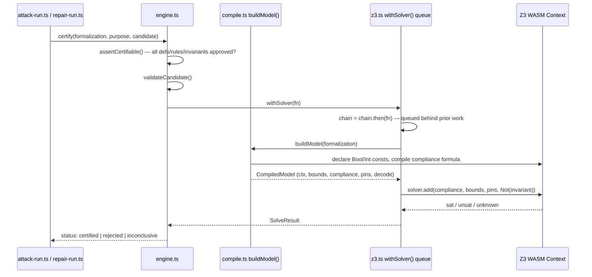

# 3 — Z3 Compilation & Certification Engine

## Relevant Source Files
- `src/core/z3.ts`
- `src/core/compile.ts`
- `src/core/engine.ts`

## TL;DR

`src/core/compile.ts` turns a validated `Formalization` into an actual Z3 model (`buildModel`); `src/core/engine.ts` is the *only* module that runs a solver check, exposing `certify()`, `checkFixture()`, `checkFamilyClosed()`, `retest()`, and `enumerateCounterexamples()`. All solver work goes through one process-wide serialized queue (`withSolver`, `src/core/z3.ts:15-19`) because z3-solver's WASM instance cannot run two `check()` calls concurrently.

## Overview

This is the product's actual claim-verification mechanism — everything upstream (AI extraction, attack generation) produces candidates for this engine to accept or reject, and nothing downstream (certificates, UI copy) is allowed to say "certified" without a result that passed through here. It sits directly below [02 — Legal IR & DSL](02-legal-ir-and-dsl.md) (consumes `Formalization`/`Candidate`/`PurposeContract`) and is called exclusively from `src/server/attack-run.ts` and `src/server/repair-run.ts` — no API route or UI component imports `src/core/engine.ts` directly, preserving the trust-boundary rule in `CLAUDE.md`.

## Architecture Diagram

## Key Concepts

| Concept | Description | Source |
|---------|-------------|--------|
| `CompiledModel` | The output of `buildModel()`: Z3 context, a `compile()`/`compileBool()` for arbitrary DSL formulas, variable `bounds`, the `compliance` formula (AND of all rules), a `pins()` builder, and `decode()` for reading a model back out | `src/core/compile.ts:11-19` |
| `withSolver` | Serializes every solver operation onto one promise chain — "one WASM instance, one check at a time" | `src/core/z3.ts:14-19` |
| `SOLVER_TIMEOUT_MS` | Hard 3000ms cap set on every `Solver` instance before `.check()` | `src/core/z3.ts:21` |
| `GateError` | Thrown when a certify/attack precondition fails: `FORMALIZATION_NOT_APPROVED`, `PURPOSE_NOT_APPROVED`, `INVALID_CANDIDATE` — mapped to HTTP 409 in `src/server/errors.ts:16-18` | `src/core/engine.ts:5-12` |
| `SolveStatus` | `'sat' \| 'unsat' \| 'unknown'` — the raw Z3 verdict, distinct from the higher-level `certified`/`rejected`/`inconclusive` | `src/core/engine.ts:14` |

## How It Works

### `buildModel()` (`src/core/compile.ts:21-144`)

1. Declares one Z3 const per variable: `Bool.const` for `bool` sort, `Int.const` for `int`/`enum` (enums are represented as bounded integers indexing into `values`) — `src/core/compile.ts:29-32`.
2. `compile(e: Expr)` recursively lowers the DSL AST to Z3 terms, memoizing definition lookups (`defMemo`) so a definition referenced from multiple rules is compiled once (`src/core/compile.ts:36-52`).
3. `bounds` are generated per variable: `ge(min)`/`le(max)` for ints, `ge(0)`/`le(values.length - 1)` for enums (`src/core/compile.ts:89-99`).
4. `compliance` is the single formula `And(...rules.map(r => Implies(when, require)))` — the entire rule-set collapsed into one Z3 boolean (`src/core/compile.ts:101`).
5. `pins(p)` and `decode(model)` are the two directions of the boundary between JS values (`Pins`, plain records) and Z3 terms.

### `certify()` (`src/core/engine.ts:46-78`)

This is the core "does an exploit actually exist" check. Given a `Formalization`, `PurposeContract`, and `Candidate`:

1. `assertCertifiable(f, p)` — every definition/rule must be `status: 'approved'`, every invariant must be `approved: true`, or it throws `GateError('FORMALIZATION_NOT_APPROVED' | 'PURPOSE_NOT_APPROVED')` (`src/core/engine.ts:22-32`).
2. `validateCandidate(f, c)` — see [02 — Legal IR & DSL](02-legal-ir-and-dsl.md#candidate-validation-validatecandidate-srccoreirts166-202).
3. Builds the model, asserts `compliance AND bounds AND pins(candidate.pins) AND Not(invariant.holds)` — i.e. "is there a world consistent with the rule and this candidate's pinned facts, where the purpose invariant is *violated*?"
4. `sat` → `status: 'certified'` (a real exploit — the solver found a concrete model). `unsat` → `'rejected'` (no such world exists under this formalization). `unknown` (timeout) → `'inconclusive'`.

### `retest()` (`src/core/engine.ts:126-148`)

Used after a repair is applied: re-checks every previously certified candidate against the *repaired* formalization via `checkFamilyClosed()` (must now be `unsat` = closed) and re-checks every legitimate fixture via `checkFixture()` (must still match its `expect`). Returns `{ allClosed, allPreserved }` — both must be true for a repair to actually be sound. See [04.2 — Attack Generation & Repair Synthesis](04.2-attack-and-repair.md).

### `enumerateCounterexamples()` (`src/core/engine.ts:150-176`)

The solver's own native search, independent of any LLM: repeatedly `check()`s `compliance AND bounds AND Not(invariant)`, and after each `sat` result, blocks that exact family of pins (`Not(And(...blockingPins))`) before checking again, up to `limit`. This produces `Candidate`s with `tactic: 'solver_found'` (or `'no_consideration'`) — see `src/server/attack-run.ts:145-164`, called when `input.solverSearch` is set.

## Component Reference

| Component | Type | Responsibility | Source |
|-----------|------|----------------|--------|
| `buildModel()` | async function | `Formalization` → `CompiledModel` | `src/core/compile.ts:21-144` |
| `certify()` | async function | Checks if a candidate is a real exploit against an invariant | `src/core/engine.ts:46-78` |
| `checkFixture()` | async function | Runs a legitimate/exploit fixture, compares result to `expect` | `src/core/engine.ts:80-94` |
| `checkFamilyClosed()` | async function | Re-checks a certified candidate's pin family after a repair | `src/core/engine.ts:96-117` |
| `retest()` | async function | Batches `checkFamilyClosed` + `checkFixture` into one report | `src/core/engine.ts:126-148` |
| `enumerateCounterexamples()` | async function | Solver-native search for counterexamples, no LLM | `src/core/engine.ts:150-176` |
| `getZ3()` | function | Lazily inits and memoizes the one `Z3Api` promise | `src/core/z3.ts:9-12` |
| `withSolver()` | function | Chains solver work onto one process-wide promise | `src/core/z3.ts:15-19` |

## Configuration & Environment

| Key | Default | Description | Source |
|-----|---------|-------------|--------|
| `SOLVER_TIMEOUT_MS` | `3000` | Per-`Solver` check timeout | `src/core/z3.ts:21` |
| `SOLVER_SEARCH_LIMIT` | `5` | Max counterexamples enumerated per invariant | `src/server/attack-run.ts:33` |
| `maxDuration` | `300` | Next.js route segment config on attack/compile routes, must cover the whole background run | `src/app/api/projects/[projectId]/attack-runs/route.ts:19` |

## Gotchas & Conventions

> ⚠️ **Gotcha**: `z3-solver`'s WASM runtime keeps a Node process alive. Standalone scripts that call into `src/core/z3.ts` (`scripts/seed-golden.ts`, `scripts/eval.ts`) must end with `process.exit(0)` or they hang forever; Vitest and Next.js route handlers are unaffected (`CLAUDE.md`).

> ⚠️ **Gotcha**: every solver call is routed through `withSolver()`, a single mutable `chain` promise (`src/core/z3.ts:7,15-19`). This is process-local state — it serializes calls within one server instance but provides no cross-instance guarantee, which is consistent with the project's one-Context-per-instance design (`CLAUDE.md`) but means horizontal scaling multiplies solver throughput linearly rather than sharing a queue.

> 📌 **Convention**: `pnpm test` / route handlers never call Z3 directly — only `src/core/engine.ts` and `src/core/reconcile.ts` (`formulasEquivalent`, for dedup-checking definitions) do. Any new code that needs a solver answer should add a function here, not reach into `compile.ts`/`z3.ts` from elsewhere.

## Cross-References
- Parent: [01 — Overview](01-overview.md)
- Prior: [02 — Legal IR & DSL](02-legal-ir-and-dsl.md)
- Child: [03.1 — Certificates & Canonical Hashing](03.1-certificates-and-hashing.md)
- Related: [04.2 — Attack Generation & Repair Synthesis](04.2-attack-and-repair.md), [05 — Server Layer](05-server-layer.md)
