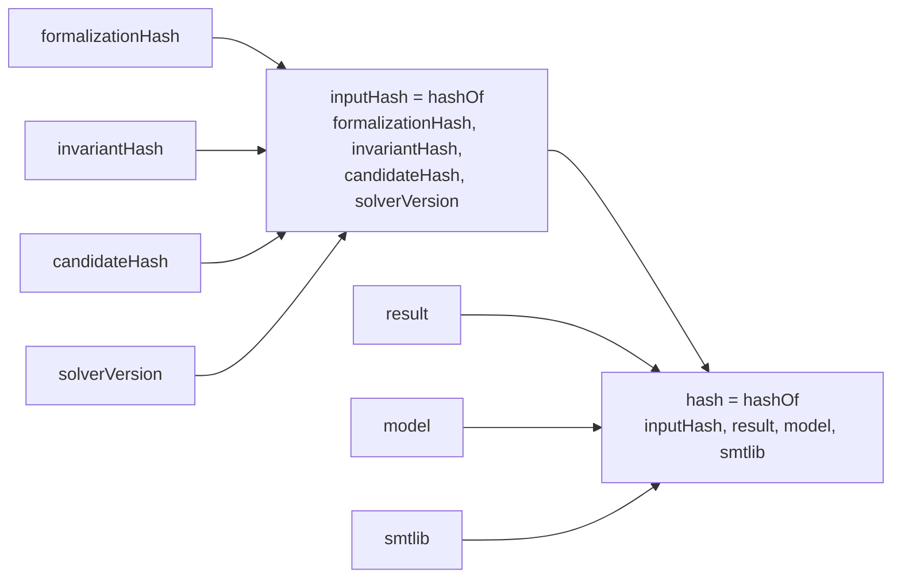

# 3.1 — Certificates & Canonical Hashing

## Relevant Source Files
- `src/core/certificate.ts`
- `src/core/canonical.ts`

## TL;DR

`src/core/canonical.ts` deterministically serializes any JSON-like value (sorted object keys, no `undefined`) and SHA-256-hashes it; `src/core/certificate.ts` uses that to build a self-verifying `Certificate` — one whose `hash` can be recomputed from its own stored fields with no other database lookups, so a certificate can be re-verified in isolation.

## Overview

Every claim of "certified" in this product traces back to one of these certificates, and the whole point of hashing everything canonically is that a certificate's integrity can be checked without trusting whatever produced it. This directly supports the project's non-negotiable claim discipline (`CLAUDE.md`): UI copy must render "Certified within model {formalizationId} v{version}", and that claim has to be independently checkable, not just asserted.

## Key Concepts

| Concept | Description | Source |
|---------|-------------|--------|
| `canonicalJson()` | Recursive serializer: sorts object keys, rejects `undefined` and non-finite numbers, no library dependency | `src/core/canonical.ts:3-21` |
| `hashOf()` | `sha256Hex(canonicalJson(value))` — the one hashing entrypoint used everywhere in the codebase | `src/core/canonical.ts:27` |
| `Certificate` | candidateId + 3 input hashes (formalization/invariant/candidate) + solver result/model/smtlib + `inputHash` + `hash` | `src/core/certificate.ts:4-16` |
| `verifyCertificate()` | Recomputes both `inputHash` and `hash` from a certificate's own fields and compares | `src/core/certificate.ts:37-42` |

## How It Works

`buildCertificate()` (`src/core/certificate.ts:31-35`) is called from `src/server/attack-run.ts:88-98` right after a `certify()` call returns `sat`. It hashes the *formalization*, the *invariant* it was checked against, and the *candidate* separately (each via `hashOf()` on the plain object) — this means a certificate is bound not just to "this candidate was certified" but to the exact formalization version and exact invariant text at the time, matching `CLAUDE.md`'s rule that source text and IR artifacts are immutable and versioned.

`verifyCertificate(c)` recomputes `inputHash` from the four stored hash/version fields, checks it matches `c.inputHash`, then recomputes `hash` from `inputHash + result + model + smtlib` and checks that against `c.hash`. Both checks must pass — a certificate row could otherwise have its `result` field (e.g. `sat`) tampered with independently of its hash.

## Component Reference

| Component | Type | Responsibility | Source |
|-----------|------|----------------|--------|
| `canonicalJson()` | function | Deterministic JSON string for hashing | `src/core/canonical.ts:3-21` |
| `sha256Hex()` | function | SHA-256 of a UTF-8 string | `src/core/canonical.ts:23-25` |
| `hashOf()` | function | Composed canonicalJson + sha256Hex | `src/core/canonical.ts:27` |
| `buildCertificate()` | function | Computes `inputHash`/`hash`, returns full `Certificate` | `src/core/certificate.ts:31-35` |
| `verifyCertificate()` | function | Independently re-derives and checks both hashes | `src/core/certificate.ts:37-42` |

## Gotchas & Conventions

> 📌 **Convention**: `canonicalJson()` throws on `undefined` values and non-finite numbers (`src/core/canonical.ts:6-7,15`) rather than silently dropping/coercing them — any object passed to `hashOf()` (formalizations, candidates, invariants, models) must be fully JSON-safe. This is why `RepairProposal`'s `IrPatchInput` schema in `src/ai/repair.ts:11-14` explicitly lists both keys as always-present arrays instead of using Zod `.default()`, which "silently drops [a key] from `required`" for Groq's strict structured-output mode — an empty array serializes deterministically; a missing key does not.

> ⚠️ **Gotcha**: `formalizationHash`/`invariantHash`/`candidateHash` are computed over the *entire* object, including fields like `spanIds` order. Reordering an array field anywhere in one of these types changes its hash, which changes `inputHash`, which changes every existing certificate's expected value if recomputed — certificates are only ever built once and stored, never recomputed for existing rows.

## Cross-References
- Parent: [03 — Z3 Compilation & Certification Engine](03-z3-engine.md)
- Related: [06 — Database Schema](06-database-schema.md) (`certificates` table)
