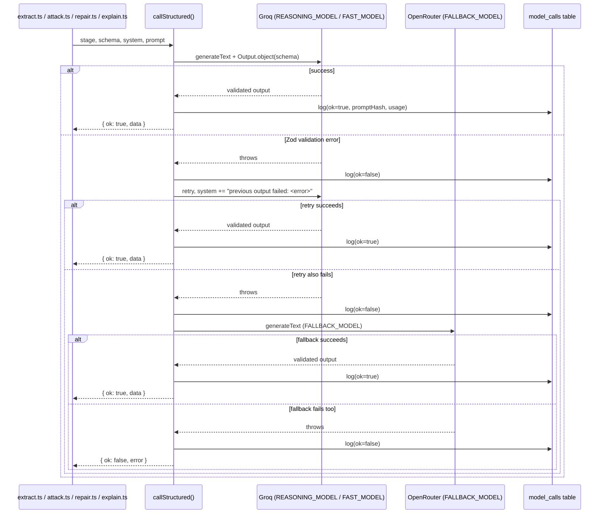

# 4 — AI Pipeline

## Relevant Source Files
- `src/ai/call.ts`
- `src/ai/models.ts`
- `src/ai/explain.ts`
- `src/ai/schemas.ts`

## TL;DR

`src/ai/call.ts` exports `callStructured()`, the single chokepoint every LLM call in the codebase goes through: Groq primary → same-model retry with the validation error appended → OpenRouter fallback, all via the Vercel AI SDK's `Output.object({ schema })` for Zod-validated structured output. Every attempt is logged to `model_calls` (prompt *hash* only, never raw text).

## Overview

The AI layer's entire job is to *propose* — extractions, exploit candidates, repair patches, human-readable explanations — and everything it produces is Zod-validated then re-checked by `src/core` before it can affect a `certified` status. This page covers the shared machinery (`call.ts`, `models.ts`, `schemas.ts`, `explain.ts`); see [04.1 — Extraction & Reconciliation](04.1-extraction-and-reconciliation.md) for the compile-stage dual-extractor pipeline and [04.2 — Attack Generation & Repair Synthesis](04.2-attack-and-repair.md) for the attack/repair stages. This directly implements the architecture rule in `CLAUDE.md`: "LLM calls go straight to providers, no AI Gateway... tried by `callStructured` in a plain try/catch when the Groq call throws."

## Architecture Diagram

## Key Concepts

| Concept | Description | Source |
|---------|-------------|--------|
| `callStructured()` | Groq → retry → OpenRouter fallback, Zod-validated, logs every attempt | `src/ai/call.ts:48-88` |
| `CallStructuredResult<T>` | `{ ok: true, data: T } \| { ok: false, error: string }` — every caller must handle both | `src/ai/call.ts:8` |
| `REASONING_MODEL` / `FAST_MODEL` | Two Groq model tiers: extraction/repair use `'reasoning'`, attack/explain use `'fast'` | `src/ai/models.ts:12-13` |
| `VarDeclFlat` | A flattened, non-discriminated-union `VarDecl` shape LLMs must emit, because Groq's strict JSON schema mode chokes on Zod discriminated unions with overlapping field names | `src/ai/schemas.ts:15-23` |
| `ATTEMPT_TIMEOUT_MS` | 30s `AbortSignal.timeout` per individual attempt (3 attempts max = up to 90s) | `src/ai/call.ts:10, 60` |

## How It Works

### The Groq-strict-schema constraint

Groq's structured-output mode requires **every** property to be listed in the schema's `required` array — a Zod `.optional()` or `.default()` silently removes a key from `required` instead, and Groq's validator then rejects the request outright before generation even starts. Two places in the codebase work around this by making fields "always present, sometimes semantically unused" rather than optional:

- `VarDeclFlat` (`src/ai/schemas.ts:10-23`): every var carries `min`, `max`, *and* `values`, regardless of `sort` — `flatVarsToVarDecls()` (`src/ai/schemas.ts:31-54`) then only reads the fields relevant to the declared sort, and **drops** (rather than throws on) an `int` with `min >= max` or an `enum` with fewer than 2 `values`, recording a reason string for the reconciliation/dispute UI.
- `IrPatchInput` in `src/ai/repair.ts:11-14`: both `addDefinitions` and `replaceRules` are plain (non-default) arrays the model must always return, empty or not.

### `callStructured()` retry ladder (`src/ai/call.ts:48-88`)

1. **Attempt 1**: Groq, `REASONING_MODEL` or `FAST_MODEL` per `args.model`.
2. **Attempt 2** (only on failure): same Groq model, with the Zod error message appended to the system prompt as `"Your previous output failed validation: <message>\nFix it and return valid output."` — a self-correction loop, not a different model.
3. **Attempt 3** (only if 2 also fails): OpenRouter, `FALLBACK_MODEL`, fresh system prompt (no error context).
4. If all three fail, returns `{ ok: false, error }` — callers (`runDualExtraction`, `generateAttackBatch`, `generateRepairProposals`) all `throw new Error(...)` on this, which surfaces as a `run.status = 'failed'` (see [05 — Server Layer](05-server-layer.md)).

Every attempt — success or failure — is logged via `logModelCall()` (`src/ai/call.ts:21-40`), which stores `sha256Hex(prompt)` rather than the prompt text itself, and is a no-op if `args.runId` is unset (e.g. ad hoc calls outside a tracked run).

### `explainCertificate()` (`src/ai/explain.ts:32-55`)

Called only after a candidate is already `certified` by Z3 — its job is purely presentational: turn the deterministic `buildProofTrace()` (see [02 — Legal IR & DSL](02-legal-ir-and-dsl.md)'s sibling, `src/core/explain-plain.ts`) into a friendlier `complies`/`harms` narrative. It validates the LLM's `citations` against the trace's actual `spanIds` (`result.data.citations.every((c) => traceSpanIds.has(c))`, `src/ai/explain.ts:50`) and falls back to a fully deterministic, non-LLM explanation (`deterministicFallback()`, `src/ai/explain.ts:20-30`) if the model either fails or cites spans that don't exist in the trace. This is the one place in the AI layer explicitly designed to degrade to zero-LLM behavior on any doubt.

## Component Reference

| Component | Type | Responsibility | Source |
|-----------|------|----------------|--------|
| `callStructured()` | async function | Groq/retry/fallback ladder, Zod-validated output, attempt logging | `src/ai/call.ts:48-88` |
| `logModelCall()` | async function | Writes one `model_calls` row (or no-ops without `runId`) | `src/ai/call.ts:21-40` |
| `groq` / `openrouter` | AI SDK provider instances | Configured from env, OpenRouter is OpenAI-compatible | `src/ai/models.ts:4-10` |
| `flatVarsToVarDecls()` | function | Converts LLM-safe flat var shape into the real `VarDecl` union, dropping invalid ones | `src/ai/schemas.ts:31-54` |
| `explainCertificate()` | async function | LLM narrative over a deterministic proof trace, with fallback | `src/ai/explain.ts:32-55` |

## Configuration & Environment

| Key | Description | Source |
|-----|-------------|--------|
| `GROQ_API_KEY` | Groq provider auth | `src/ai/models.ts:4` |
| `REASONING_MODEL` | Groq model id used for extraction + repair | `src/ai/models.ts:12` |
| `FAST_MODEL` | Groq model id used for attack + explain | `src/ai/models.ts:13` |
| `OPENROUTER_API_KEY` | Fallback provider auth | `src/ai/models.ts:8` |
| `FALLBACK_MODEL` | OpenRouter model id, last resort only | `src/ai/models.ts:14` |

All are required env vars (non-null assertion `!` in `src/ai/models.ts:4,12-14`) — already populated in `.env.local` per `CLAUDE.md`.

## Gotchas & Conventions

> ⚠️ **Gotcha**: the retry ladder's second Groq attempt reuses the *same* model with an appended error message — it is not a different, more capable model. A systematic schema mismatch (e.g. the model consistently omitting a required field) will fail identically on attempt 1 and attempt 2, and only the OpenRouter fallback (a different model entirely) has a real chance of succeeding.

> 📌 **Convention**: `callStructured` never logs prompt text, only `sha256Hex(prompt)` — this is a deliberate privacy/security choice, not an oversight. Do not add a `prompt` or `promptText` column to `model_calls` without checking whether the source spans it's built from (potentially private legal text) should be logged.

## Cross-References
- Parent: [01 — Overview](01-overview.md)
- Child: [04.1 — Extraction & Reconciliation](04.1-extraction-and-reconciliation.md)
- Child: [04.2 — Attack Generation & Repair Synthesis](04.2-attack-and-repair.md)
- Related: [03 — Z3 Engine](03-z3-engine.md), [06 — Database Schema](06-database-schema.md) (`model_calls`)
