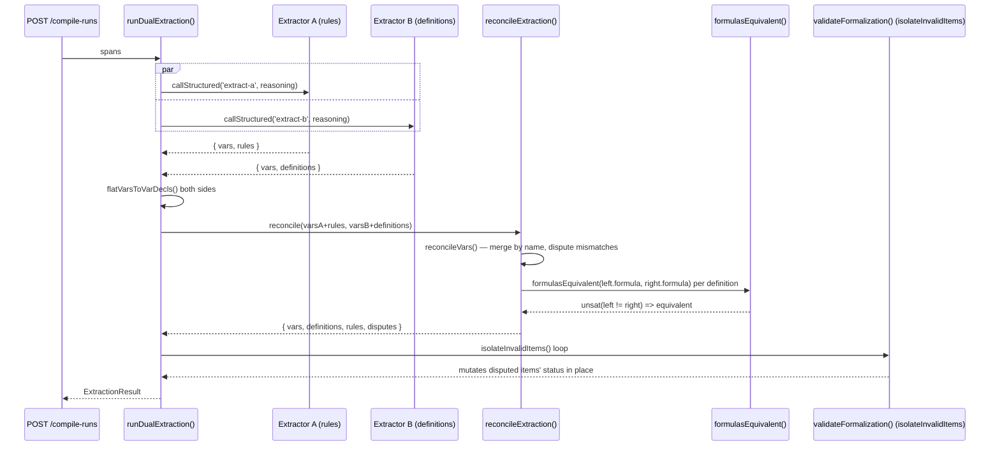

# 4.1 — Extraction & Reconciliation

## Relevant Source Files
- `src/ai/extract.ts`
- `src/core/reconcile.ts`

## TL;DR

`runDualExtraction()` runs two independent LLM extractors in parallel over the same source spans — Extractor A produces `vars` + `rules`, Extractor B produces `vars` + `definitions` — then `reconcileExtraction()` merges them, using Z3 (`formulasEquivalent()`) to tell "same rule, different phrasing" apart from a genuine disagreement. Anything that doesn't validate afterward gets marked `disputed`, not discarded.

## Overview

This is the compile stage of the pipeline: turning raw legal text (split into `SourceSpan`s) into a `Formalization`. Running two independent extractors and reconciling them is a deliberate cross-check — a single extractor's confident-but-wrong output would otherwise become "ground truth." See [02 — Legal IR & DSL](02-legal-ir-and-dsl.md) for the target shape, and [04 — AI Pipeline](04-ai-pipeline.md) for the shared `callStructured()` machinery both extractors use.

## Architecture Diagram

## Key Concepts

| Concept | Description | Source |
|---------|-------------|--------|
| `SpanInput` | A labeled chunk of source text (from `splitIntoSpans`, see [09 — Ingest Paths](09-ingest-paths.md)) fed to both extractors | `src/ai/prompts/extract-a.ts` |
| `ReviewItem` | A `var_conflict` or `definition_conflict` dispute: message, spanIds, `left`/`right` conflicting values | `src/core/reconcile.ts:5-11` |
| `formulasEquivalent()` | Z3-backed logical equivalence check between two formula strings over a shared variable universe | `src/core/reconcile.ts:37-57` |
| `isolateInvalidItems()` | Runs `validateFormalization` in a loop, marking the specific offending rule/definition `disputed` rather than failing the whole extraction | `src/ai/extract.ts:28-56` |

## How It Works

### Why two extractors, not one

Extractor A is prompted to find **rules** (`when` → `require`), Extractor B is prompted to find **definitions** (named boolean terms). Both are also asked for `vars` independently, since a var might only be implied by one side's phrasing. This split-by-concern design means the two outputs rarely conflict on their "own" concept (A doesn't propose definitions, B doesn't propose rules) but *do* need reconciling on the `vars` both declare.

### `reconcileVars()` (`src/core/reconcile.ts:59-85`)

Merges by variable `name`. If both sides declared the same name with structurally equal declarations (`varDeclEqual()`, `src/core/reconcile.ts:22-29` — same `sort`, and matching `min`/`max` for `int` or matching `values` for `enum`), the merge keeps the union of both sides' `spanIds` (wider traceability). If the declarations *conflict* (different sort, different bounds), it's pushed to `disputes` as a `var_conflict` and the first-seen (`a`'s) declaration wins provisionally.

### `reconcileDefinitions()` (`src/core/reconcile.ts:87-118`)

Currently only reconciles against an empty `a` array (called as `reconcileDefinitions([], b.definitions, vars)` from `reconcileExtraction`, `src/core/reconcile.ts:129`) — i.e. only Extractor B's definitions exist to reconcile, since Extractor A doesn't propose them. `[NEEDS INVESTIGATION]`: this function's signature accepts two definition lists but is only ever called with the first empty; whether this is a planned extension point for a future third extractor or dead generality was not verified against `docs/plans/2026-09-27-loophole-lexhack-plan.md`.

### `isolateInvalidItems()` (`src/ai/extract.ts:28-56`)

After reconciliation, the merged `{ vars, definitions, rules }` might still fail `validateFormalization()` — e.g. a rule referencing an undeclared variable. Rather than failing the whole compile run, this function loops (max 10 iterations) over validation failures, regex-matches each reason string for `rule '(...)' ` or `definition '(...)' `, and flips that specific item's `status` to `'disputed'`, recording a `ReviewItem`. It stops early if a validation pass produces reasons that can't be attributed to a specific item (`mutated` stays `false`) — those structural failures are left for the caller to see in the final `validateFormalization` state.

## Component Reference

| Component | Type | Responsibility | Source |
|-----------|------|----------------|--------|
| `runDualExtraction()` | async function | Orchestrates both extractors, flattening, reconciliation, and isolation | `src/ai/extract.ts:58-100` |
| `reconcileExtraction()` | async function | Top-level merge: vars, defs (Z3-checked), rules (pass-through from A) | `src/core/reconcile.ts:127-131` |
| `reconcileVars()` | function | Name-keyed merge with structural-equality dispute detection | `src/core/reconcile.ts:59-85` |
| `reconcileDefinitions()` | async function | Name-keyed merge with Z3-equivalence dispute detection | `src/core/reconcile.ts:87-118` |
| `formulasEquivalent()` | async function | `unsat(left != right)` check via a scaffold `Formalization` | `src/core/reconcile.ts:37-57` |

## Gotchas & Conventions

> ⚠️ **Gotcha**: `isolateInvalidItems()` parses `validateFormalization()`'s human-readable error strings with regex (`reason.match(/rule '([^']+)'/)`, `src/ai/extract.ts:36-37`). Any future change to the wording of `reasons.push(...)` calls in `src/core/ir.ts` will silently break this attribution logic — items that should be isolated will instead fall through as unattributable structural failures.

> 📌 **Convention**: disputes accumulate from three sources into one `disputes` array on `ExtractionResult`: dropped vars from `flatVarsToVarDecls` (invalid int/enum bounds), reconciliation conflicts from `reconcileVars`/`reconcileDefinitions`, and post-validation isolations from `isolateInvalidItems` — all normalized to the same `ReviewItem` shape so the compile-stage review UI (`src/components/compile/rule-row.tsx`) doesn't need to know which stage produced a given dispute.

## Cross-References
- Parent: [04 — AI Pipeline](04-ai-pipeline.md)
- Related: [02 — Legal IR & DSL](02-legal-ir-and-dsl.md), [09 — Ingest Paths](09-ingest-paths.md)
