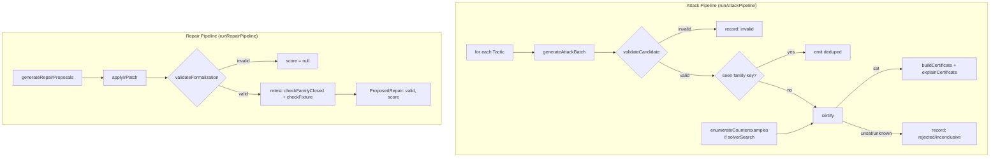

# 4.2 — Attack Generation & Repair Synthesis

## Relevant Source Files
- `src/ai/attack.ts`
- `src/ai/repair.ts`
- `src/server/attack-run.ts`
- `src/server/repair-run.ts`

## TL;DR

`generateAttackBatch()` asks the fast Groq model for up to `budget` exploit `Candidate`s per `Tactic`; `runAttackPipeline()` (server-side) then validates, dedupes by pin family, and runs every surviving candidate through `certify()` — only a `sat` result gets a certificate. `generateRepairProposals()` asks the reasoning model for IR patches; `runRepairPipeline()` validates each patch and, if valid, scores it with `retest()` before ever showing it to the user.

## Overview

These two orchestrators (`src/server/attack-run.ts`, `src/server/repair-run.ts`) are the request handlers behind the Attack and Repair stage pages ([08 — Frontend](08-frontend-pages.md)). Both follow the same shape: call the AI layer for *proposals*, then immediately hand every proposal to `src/core` for the actual decision — no AI output is trusted as final. See [03 — Z3 Engine](03-z3-engine.md) for `certify()`/`retest()`, and [04 — AI Pipeline](04-ai-pipeline.md) for `callStructured()`.

## Architecture Diagram

## Key Concepts

| Concept | Description | Source |
|---------|-------------|--------|
| `Tactic` | One of 10 named exploit strategies: `threshold_split`, `relabel`, `affiliate`, `timing`, `exception_abuse`, `nominal_review`, `redefine_consideration`, `no_consideration`, `procedure_without_outcome`, `solver_found` | `src/core/ir.ts:83-94` |
| Family key | The subset of a candidate's pins (`familyKeys`) that define its equivalence class — used to dedupe near-identical candidates and to re-check whether a *class* of exploit is closed after repair | `src/core/ir.ts:100`, `src/server/attack-run.ts:58-63` |
| `AttackRunSummary` | Running tally: `generated`/`invalid`/`rejected`/`inconclusive`/`certified` | `src/server/attack-run.ts:24-30` |
| `ProposedRepair` | One repair candidate's outcome: `valid` (passed `validateFormalization`), `reasons`, and `score` (a `RetestReport` or `null`) | `src/server/repair-run.ts:20-26` |
| `MAX_CANDIDATES` | Route-level cap: `tactics.length * budgetPerTactic + (solverSearch ? 5 : 0) <= 40` | `src/app/api/projects/[projectId]/attack-runs/route.ts:22-35` |

## How It Works

### Attack pipeline (`runAttackPipeline`, `src/server/attack-run.ts:39-167`)

For each requested `Tactic`, `generateAttackBatch()` (`src/ai/attack.ts:18-36`) calls `callStructured` with `model: 'fast'` and a schema capped at 8 candidates, then truncates to `budget` and stamps each with an `id` (`${tactic}-${i+1}`) and the `tactic` itself (both omitted from what the LLM has to produce, per `CandidateInput = Candidate.omit({ id: true, tactic: true })`, `src/ai/attack.ts:6`).

`processCandidate()` (`src/server/attack-run.ts:44-124`) is the per-candidate gate:
1. `validateCandidate()` — invalid candidates are recorded and dropped, never reach the solver.
2. Family-key dedup: `hashOf(pick(candidate.pins, candidate.familyKeys))` against an in-memory `seenFamilies` set for this run — a second candidate pinning the same "essential" facts is skipped even if its narrative differs.
3. `certify()` — see [03 — Z3 Engine](03-z3-engine.md#certify). Only `status === 'certified'` triggers certificate building: `buildCertificate()` (hash-chained, see [03.1](03.1-certificates-and-hashing.md)) then `explainCertificate()` (LLM narrative + deterministic fallback, see [04 — AI Pipeline](04-ai-pipeline.md#explaincertificate)).

If `input.mode === 'demo'` and `demoRecordedCandidates` is supplied, the pipeline replays a **pre-recorded** candidate list (loaded from `fixtures/golden/ccpa-2018/candidates.original.json` when `project.demoTemplate === 'ccpa-2018'`, `src/app/api/projects/[projectId]/attack-runs/route.ts:37-41,83`) through the exact same `processCandidate()` gate, with an artificial `DEMO_STAGE_DELAY_MS = 250` between each — no LLM call happens in demo mode, but every candidate still goes through real `certify()`.

If `input.solverSearch` is set, after the tactic loop the pipeline also runs `enumerateCounterexamples()` per purpose invariant (see [03 — Z3 Engine](03-z3-engine.md#enumeratecounterexamples-srccoreenginets150-176)) and feeds each found model through the same `processCandidate()` gate as a `tactic: 'solver_found'` (or `'no_consideration'` if the model pins `consideration: 'none'`) candidate — this is exploit-finding with zero AI narrative involved.

### Repair pipeline (`runRepairPipeline`, `src/server/repair-run.ts:28-67`)

`generateRepairProposals()` (`src/ai/repair.ts:32-54`) calls `callStructured` with `model: 'reasoning'`, capped at 3 proposals. For each proposal:
1. `applyIrPatch(baseFormalization, proposal.irPatch)` — merge (see [02 — Legal IR & DSL](02-legal-ir-and-dsl.md#component-reference)).
2. `validateFormalization(nextIr)` — if this fails, the proposal is stored with `score: null` and its validation reasons, but **never scored against the solver**.
3. If valid, `retest(nextIr, purpose, certifiedCandidates, fixtures)` — checks that every previously certified exploit's family is now `unsat` (closed) *and* every legitimate fixture still behaves as expected (preserved). Both `RetestReport.allClosed` and `.allPreserved` must be true for a repair to be sound.

Every proposal — valid or not, closed or not — is persisted to the `repairs` table (`src/db/schema.ts:130-138`) with its full redline + score, so a rejected or partial repair is still visible for review, not silently discarded.

## Component Reference

| Component | Type | Responsibility | Source |
|-----------|------|----------------|--------|
| `generateAttackBatch()` | async function | LLM call → up to `budget` `Candidate[]` for one tactic | `src/ai/attack.ts:18-36` |
| `runAttackPipeline()` | async function | Full attack orchestration: generate, validate, dedupe, certify | `src/server/attack-run.ts:39-167` |
| `processCandidate()` | async function (closure) | Per-candidate validate → dedupe → certify → persist | `src/server/attack-run.ts:44-124` |
| `generateRepairProposals()` | async function | LLM call → up to 3 `RepairProposal[]` | `src/ai/repair.ts:32-54` |
| `runRepairPipeline()` | async function | Apply patch, validate, retest, persist each proposal | `src/server/repair-run.ts:28-67` |

## Gotchas & Conventions

> ⚠️ **Gotcha**: demo mode (`mode: 'demo'`) still calls `certify()` for real — it only skips the LLM call for candidate *generation*, replaying a fixed candidate list instead. A demo run against a formalization that differs from the recorded golden fixture (e.g. after editing the CCPA rules) can legitimately produce different certify results than the recorded demo expects.

> 📌 **Convention**: the 40-candidate cap (`MAX_CANDIDATES`) is enforced at the API route layer (`src/app/api/projects/[projectId]/attack-runs/route.ts:26-35`) via a Zod `.refine()`, not inside `runAttackPipeline()` itself — the pipeline function has no budget ceiling of its own beyond what each tactic's `budgetPerTactic` and `solverSearch`'s fixed `SOLVER_SEARCH_LIMIT = 5` impose.

## Cross-References
- Parent: [04 — AI Pipeline](04-ai-pipeline.md)
- Related: [03 — Z3 Engine](03-z3-engine.md), [05 — Server Layer](05-server-layer.md), [07 — API Routes](07-api-routes.md)
