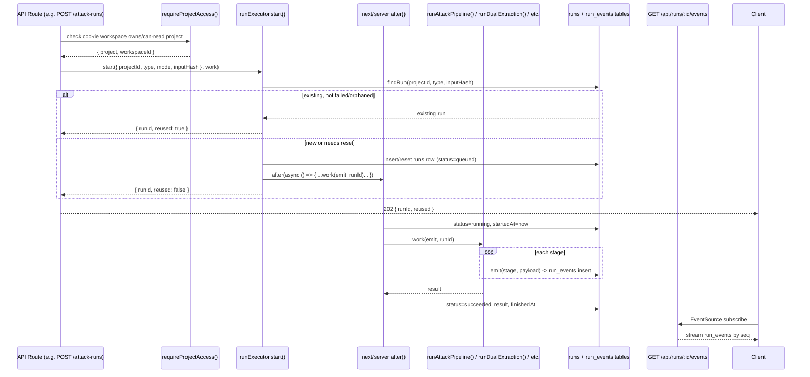

# 5 — Server Layer: Runs, Workspace, Auth

## Relevant Source Files
- `src/server/runs.ts`
- `src/server/workspace.ts`
- `src/server/errors.ts`
- `src/server/rate-limit.ts`
- `src/server/audit.ts`
- `src/server/projects.ts`
- `src/db/client.ts`

## TL;DR

`src/server` is the glue between API routes and `src/core`/`src/ai`: `runs.ts` gives every long-running pipeline a durable, deduped, resumable background job via Next.js `after()` + a Postgres `run_events` table (no in-memory pub/sub, no Vercel Workflow); `workspace.ts` implements a cookie-based anonymous auth with server-enforced ownership; `errors.ts` maps every domain error type to an HTTP status uniformly.

## Overview

This layer exists because the product's actual work (LLM calls, Z3 solves) can take longer than a typical HTTP request budget, and because serverless instances don't share memory — so progress has to live in Postgres, not in a process. It sits between [07 — API Routes](07-api-routes.md) (which call `runExecutor.start()`) and [03 — Z3 Engine](03-z3-engine.md) / [04 — AI Pipeline](04-ai-pipeline.md) (which do the actual work inside a run).

## Architecture Diagram

## Key Concepts

| Concept | Description | Source |
|---------|-------------|--------|
| `RunExecutor.start()` | Dedupes by `(projectId, type, inputHash)`; reuses a live/succeeded run, resets a failed/orphaned one, otherwise inserts fresh and schedules work | `src/server/runs.ts:68-109` |
| `Emit` | `(stage: string, payload: unknown) => Promise<void>` — appends one row to `run_events` with an auto-incrementing `seq` | `src/server/runs.ts:8, 23-29` |
| `STALE_RUN_MS` | 5 minutes — a run still `'running'` past this is considered orphaned (killed process, dev-server restart) and gets reset | `src/server/runs.ts:41-47` |
| Workspace cookie | `lh_ws`, httpOnly, `sameSite: 'strict'`, `secure` in prod, holds a random token whose SHA-256 hash is stored server-side (never the token itself) | `src/server/workspace.ts:13-41` |
| `AccessMode` | `'read' \| 'write'` — public projects allow anonymous `read`; everything else requires workspace ownership | `src/server/workspace.ts:43, 50-67` |
| `HttpError` mapping | `GateError→409`, `ZodError→400`, `NotFoundError→404`, `ForbiddenError→403`, `RateLimitError→429`, `CongressApiError→502`, else `500` with a logged `requestId` | `src/server/errors.ts:15-40` |

## How It Works

### `runExecutor.start()` (`src/server/runs.ts:68-109`)

1. Looks up an existing run by the exact `(projectId, type, inputHash)` triple — this is why every route computes `inputHash = hashOf({...everything that affects the result...})` before calling `start()` (e.g. `src/app/api/projects/[projectId]/attack-runs/route.ts:74-81`): identical inputs reuse the same run instead of duplicating work or double-billing LLM calls.
2. If a matching run exists and is not `'failed'` and not orphaned (`isOrphaned()`, stale `'running'` past `STALE_RUN_MS`), it's returned as `{ reused: true }` with no new work scheduled.
3. If it exists but is `'failed'` or orphaned, its `run_events` are deleted and the row is reset to `'queued'` in place — the unique constraint on `(project_id, type, input_hash)` (`src/db/schema.ts:91`) means retrying the same logical run **can't** insert a new row, so it must be reset instead.
4. If no run exists, insert fresh with `onConflictDoNothing()` — if that returns nothing (a concurrent request won the race), re-query and return the winner's run as `reused: true`.
5. `scheduleWork()` wraps the actual `work` function in `next/server`'s `after()`, which runs after the response is sent but before the serverless function fully terminates — sets `status='running'`, catches any error into `status='failed'` + `error message`, otherwise `status='succeeded'` + `result`.

### `requireProjectAccess()` (`src/server/workspace.ts:50-67`)

`mode: 'read'` on a public project (`project.isPublic`) needs no workspace at all — this is what lets the public `/r/[slug]` report page and forked-benchmark browsing work with zero auth. Every other case calls `getOrCreateWorkspace()` (creating a new anonymous workspace + cookie on first visit) and throws `ForbiddenError` (→ HTTP 403) if the resolved `workspaceId` doesn't match `project.workspaceId`. A nonexistent project always throws `NotFoundError` (→ 404) regardless of mode, so existence isn't leaked differently by read vs. write.

## Component Reference

| Component | Type | Responsibility | Source |
|-----------|------|----------------|--------|
| `runExecutor.start()` | async method | Dedup/reset/insert a run, schedule its background work | `src/server/runs.ts:68-109` |
| `scheduleWork()` | function | Wraps `work` in `after()`, manages run status transitions | `src/server/runs.ts:49-66` |
| `isOrphaned()` | function | Detects a stale `'running'` run past `STALE_RUN_MS` | `src/server/runs.ts:43-47` |
| `getOrCreateWorkspace()` | async function | Reads/creates the `lh_ws` cookie + `workspaces` row | `src/server/workspace.ts:20-41` |
| `requireProjectAccess()` | async function | Public-read shortcut + workspace-ownership enforcement | `src/server/workspace.ts:50-67` |
| `toHttpError()` | function | Maps every known error class to `{ status, body }` | `src/server/errors.ts:15-40` |
| `rateLimit()` | function | Process-local token-bucket-ish limiter, keyed by string | `src/server/rate-limit.ts:19-35` |
| `logAudit()` | async function | Appends one `audit_events` row | `src/server/audit.ts:13-22` |
| `forkGoldenProject()` | async function | Deep-copies the seeded CCPA benchmark project into a new workspace-owned project | `src/server/projects.ts:22-113` |

## Configuration & Environment

| Key | Default | Description | Source |
|-----|---------|-------------|--------|
| `lh_ws` cookie `maxAge` | 30 days (`60*60*24*30`) | Workspace session length | `src/server/workspace.ts:14, 37` |
| `MAX_PASTE_CHARS` | `60000` | Cap on pasted draft text length | `src/server/projects.ts:10` |

## Gotchas & Conventions

> ⚠️ **Gotcha**: `rateLimit()` is explicitly process-local (`src/server/rate-limit.ts:14-18`) — "does not share state across serverless instances." On a real multi-instance serverless deployment, the effective rate limit is `limit × instanceCount`, not `limit`. The module comment already documents the intended fix ("Swap for a Postgres-backed counter") — this is acceptable for a hackathon single-instance dev/demo deployment, not for scaled production.

> ⚠️ **Gotcha**: `scheduleWork()`'s `after()` callback runs with no request-scoped timeout of its own — the *route's* `export const maxDuration = 300` (`src/app/api/projects/[projectId]/attack-runs/route.ts:19`) is what actually bounds it on Vercel. Every individual LLM call inside that work is separately timeout-guarded (`ATTEMPT_TIMEOUT_MS` in `src/ai/call.ts`), which is why a healthy run is expected to always terminate well within the 5-minute `STALE_RUN_MS` orphan threshold.

> 📌 **Convention**: workspace tokens are never stored in plaintext — only `sha256Hex(token)` (`src/server/workspace.ts:16-18, 25, 30`). A database read of the `workspaces` table cannot recover a usable session token, only confirm a given token's hash matches an existing row.

## Cross-References
- Parent: [01 — Overview](01-overview.md)
- Next: [06 — Database Schema](06-database-schema.md)
- Related: [07 — API Routes](07-api-routes.md), [09 — Ingest Paths](09-ingest-paths.md)
