# 6 — Database Schema (Drizzle + Neon)

## Relevant Source Files
- `src/db/schema.ts`
- `src/db/client.ts`
- `drizzle.config.ts`
- `drizzle/` (generated migrations)

## TL;DR

15 tables in `src/db/schema.ts`, all Drizzle `pgTable` definitions against a Neon Postgres database. Every artifact in the pipeline (sources, purpose contracts, formalizations, certificates, repairs) is inserted as a new immutable row, never updated in place — versioning is the mechanism, not mutation, matching `CLAUDE.md`'s rule that IR artifacts are "versioned and immutable... write a new version instead."

## Overview

This schema is the durable backbone the whole app reads from and writes to — every stage page in [08 — Frontend](08-frontend-pages.md) is effectively a query over these tables, and every background run in [05 — Server Layer](05-server-layer.md) is a sequence of inserts into them. `src/db/client.ts` wires Drizzle's `neon-http` driver directly to `DATABASE_URL` — no connection pooling layer beyond what Neon's serverless driver provides.

## Architecture Diagram

```mermaid
erDiagram
    workspaces ||--o{ projects : owns
    projects ||--o{ sources : has
    sources ||--o{ source_spans : "split into"
    projects ||--o{ purpose_contracts : has
    projects ||--o{ formalizations : "has (versioned)"
    formalizations ||--o| formalizations : "parentId (prior version)"
    projects ||--o{ test_fixtures : has
    projects ||--o{ runs : has
    runs ||--o{ run_events : "streams to"
    runs ||--o{ attack_candidates : produces
    runs ||--o{ model_calls : logs
    attack_candidates ||--o| certificates : "certify() ->"
    certificates ||--o{ repairs : "repair target"
    formalizations ||--o{ repairs : "base / repaired"
    projects ||--o{ audit_events : logs

    workspaces {
        uuid id PK
        text token_hash UK
    }
    projects {
        uuid id PK
        uuid workspace_id FK
        text slug UK
        boolean is_public
        uuid forked_from
    }
    formalizations {
        uuid id PK
        uuid project_id FK
        uuid source_id FK
        int version
        uuid parent_id
        text status "draft|locked"
        jsonb ir
        text ir_hash
    }
    runs {
        uuid id PK
        uuid project_id FK
        text type "compile|attack|repair|retest"
        text mode "demo|live"
        text status "queued|running|succeeded|failed"
        text input_hash
        jsonb result
    }
    certificates {
        uuid id PK
        uuid candidate_id FK UK
        uuid formalization_id FK
        text result "sat|unsat|unknown"
        text hash
        text input_hash
    }
    repairs {
        uuid id PK
        uuid certificate_id FK
        uuid base_formalization_id FK
        uuid repaired_formalization_id
        text status "proposed|approved|rejected"
    }
```

## Key Concepts

| Concept | Description | Source |
|---------|-------------|--------|
| Version-not-mutate | `formalizations` and `purpose_contracts` both key uniqueness on `(project_id, version)` and are never updated — a new compile always inserts `nextVersion = (latest?.version ?? 0) + 1` | `src/db/schema.ts:56, 69`, `src/app/api/projects/[projectId]/compile-runs/route.ts:42-46` |
| Run dedup key | `unique('runs_project_type_input_hash_key').on(t.projectId, t.type, t.inputHash)` — the mechanism behind `runExecutor.start()`'s reuse/reset logic | `src/db/schema.ts:91` |
| Certificate self-containment | `certificates` stores all three input hashes plus `inputHash`/`hash` so `verifyCertificate()` needs no other table lookup | `src/db/schema.ts:120-127` |
| `runEvents.seq` | Per-run monotonic sequence number, unique with `runId` — drives SSE resume via `Last-Event-ID` | `src/db/schema.ts:93-100` |
| `model_calls.ok` | Every LLM attempt is logged, success or failure, so schema-validity rate can be computed from real outcomes (`scripts/eval.ts`) | `src/db/schema.ts:151` |

## Component Reference

| Table | Responsibility | Source |
|-------|----------------|--------|
| `workspaces` | Anonymous owner identity, keyed by hashed cookie token | `src/db/schema.ts:4-8` |
| `projects` | One legal-text workspace: slug, public flag, `demoTemplate`, `forkedFrom` | `src/db/schema.ts:10-19` |
| `sources` | Raw source text + provenance (`canonicalUrl`, `officialVersionId`, `sha256`) | `src/db/schema.ts:21-33` |
| `source_spans` | Section-split chunks of a source, full-text-searchable via a `gin` index on `to_tsvector` | `src/db/schema.ts:35-46` |
| `purpose_contracts` | Versioned purpose statement + invariants, `proposed`/`approved` | `src/db/schema.ts:48-56` |
| `formalizations` | Versioned compiled IR, `draft`/`locked`, `parentId` chain | `src/db/schema.ts:58-69` |
| `test_fixtures` | Legitimate/exploit pin sets with expected `sat`/`unsat` | `src/db/schema.ts:71-78` |
| `runs` | One durable background job, deduped by input hash | `src/db/schema.ts:80-91` |
| `run_events` | Ordered SSE-streamable stage events for a run | `src/db/schema.ts:93-100` |
| `attack_candidates` | Every candidate a run produced, with its outcome status | `src/db/schema.ts:102-109` |
| `certificates` | Solver-signed proof for a certified candidate | `src/db/schema.ts:111-128` |
| `repairs` | Proposed IR patch + retest score for a certificate | `src/db/schema.ts:130-138` |
| `model_calls` | Every LLM attempt: model, prompt hash, usage, ok/fail | `src/db/schema.ts:140-153` |
| `audit_events` | Free-form actor/action/entity log | `src/db/schema.ts:155-164` |

## Data Flow

```mermaid
flowchart LR
    SRC[source text] -->|splitIntoSpans| SPANS[source_spans]
    SPANS -->|runDualExtraction| FORM1[formalizations v1 draft]
    FORM1 -->|user locks| FORM1L[formalizations v1 locked]
    FORM1L -->|generateAttackBatch + certify| CAND[attack_candidates]
    CAND -->|sat| CERT[certificates]
    CERT -->|generateRepairProposals + applyIrPatch| REP[repairs proposed]
    REP -->|retest allClosed & allPreserved, user approves| FORM2[formalizations v2 = repairedFormalizationId]
```



## Configuration & Environment

| Key | Description | Source |
|-----|-------------|--------|
| `DATABASE_URL` | Pooled Neon connection string, `neon-http` driver, runtime queries | `src/db/client.ts:5` |
| `DATABASE_DIRECT_URL` | Direct connection, migrations only (`drizzle.config.ts`), never in the request path | `CLAUDE.md` |

## Gotchas & Conventions

> 📌 **Convention**: `formalizations.id` stays the *same* logical formalization across versions only via `id: LHP-${project.slug}` embedded in the IR payload (`src/app/api/projects/[projectId]/compile-runs/route.ts:58`) — the **row** id (`formalizations.id` uuid PK) is a new row per version. Don't conflate the IR's own `Formalization.id` field with the Postgres row id; they're different identifiers with different lifetimes.

> ⚠️ **Gotcha**: `repairs.repairedFormalizationId` is nullable (`src/db/schema.ts:134`) — a proposed repair has no repaired-formalization row until `PATCH /api/repairs/[repairId]` is called with `{ approve: true }`. That handler re-applies `applyIrPatch()` to the *base* formalization (not necessarily the same object stored on the `repairs` row at proposal time), re-validates, and inserts a fresh `formalizations` row at `base.version + 1` with `status: 'draft'` — it does **not** auto-lock the new version (`src/app/api/repairs/[repairId]/route.ts:43-89`). A caller must still separately lock it before it can be attacked again.

## Cross-References
- Parent: [01 — Overview](01-overview.md)
- Prior: [05 — Server Layer](05-server-layer.md)
- Next: [07 — API Routes](07-api-routes.md)
