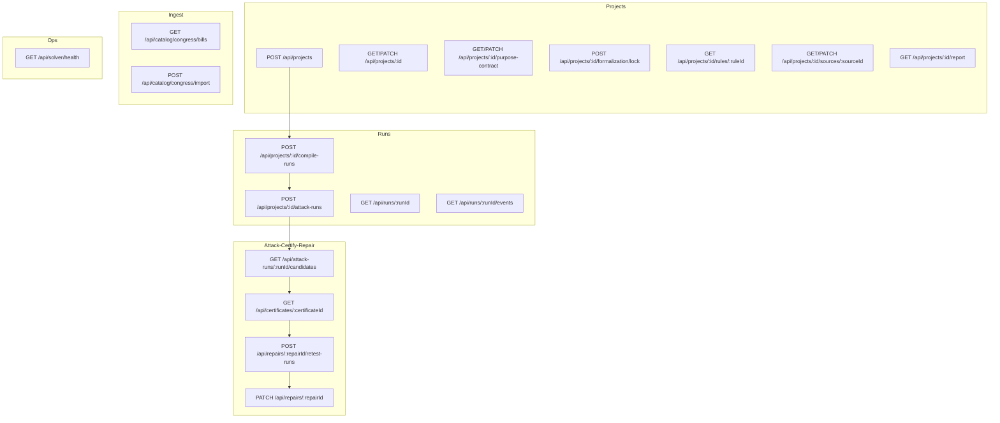

# 7 — API Routes

## Relevant Source Files
- `src/app/api/**/route.ts`

## TL;DR

Every route follows the same shape: `requireProjectAccess()` (or `parseUuidParam` + a lookup), a Zod-parsed body, then either a direct DB read or `runExecutor.start()` for anything that does real work — wrapped in a uniform `try { ... } catch (error) { toHttpError(error) }`. Every route that touches `z3-solver` or the AI layer sets `export const runtime = 'nodejs'`.

## Overview

This page is the request-response contract for the pipeline described in [01 — Overview](01-overview.md) — see [05 — Server Layer](05-server-layer.md) for the shared `runExecutor`/`requireProjectAccess`/`toHttpError` machinery every route below calls into, and [06 — Database Schema](06-database-schema.md) for the tables they read/write.

## Architecture Diagram

## Key Concepts

| Concept | Description | Source |
|---------|-------------|--------|
| Route segment config | `runtime = 'nodejs'` (Z3/AI-touching routes), `dynamic = 'force-dynamic'` (no caching of per-workspace data), `maxDuration = 300` (long-running compile/attack) | e.g. `src/app/api/projects/[projectId]/attack-runs/route.ts:17-19` |
| Uniform error envelope | Every route's catch block returns `NextResponse.json(body, { status })` from `toHttpError()` — same shape across the whole API surface | [05 — Server Layer](05-server-layer.md#key-concepts) |
| `202 { runId, reused }` | The response shape for every run-starting route — the client then subscribes to `GET /api/runs/:runId/events` | `src/app/api/projects/[projectId]/attack-runs/route.ts:106`, `.../compile-runs/route.ts:85` |
| SSE with heartbeat + poll fallback | `GET /api/runs/:runId/events` polls Postgres every 400ms, sends a comment heartbeat every 15s if idle, closes the stream once the run is terminal and no events remain | `src/app/api/runs/[runId]/events/route.ts:11-12, 35-69` |

## How It Works

### `POST /api/projects/[projectId]/compile-runs` (`src/app/api/projects/[projectId]/compile-runs/route.ts`)

Rate-limited (20/hour per workspace), loads the latest source's spans (optionally filtered by `spanIds`), computes `nextVersion`, hashes `{ sourceId, spanIds, version }` as the run's dedup key, and starts a run whose work calls `runDualExtraction()` then inserts a new `formalizations` row at `status: 'draft'`. See [04.1 — Extraction & Reconciliation](04.1-extraction-and-reconciliation.md).

### `POST /api/projects/[projectId]/attack-runs` (`src/app/api/projects/[projectId]/attack-runs/route.ts`)

Requires the project's latest formalization to be `status: 'locked'` and its latest purpose contract to be `status: 'approved'` — otherwise throws `GateError` (→ 409) before any work is scheduled (`src/app/api/projects/[projectId]/attack-runs/route.ts:58-69`). Body is Zod-refined so `tactics.length * budgetPerTactic + (solverSearch ? 5 : 0) <= 40` (`MAX_CANDIDATES`). In `demo` mode against the seeded `ccpa-2018` template, candidates are replayed from `fixtures/golden/ccpa-2018/candidates.original.json` instead of generated live. See [04.2 — Attack Generation & Repair Synthesis](04.2-attack-and-repair.md).

### `PATCH /api/repairs/[repairId]` (`src/app/api/repairs/[repairId]/route.ts`)

A single endpoint with two bodies, discriminated by a Zod `z.union`: `{ approve: true }` re-applies the stored `irPatch` to the *current* base formalization, re-validates, inserts a new `formalizations` version (`status: 'draft'`, not auto-locked), and flips the `repairs` row to `approved`; the other shape edits a still-`proposed` repair's `title`/`redline`/`rationale` in place. Both branches 409 if the repair isn't in the expected state.

### `GET /api/runs/[runId]/events` — SSE (`src/app/api/runs/[runId]/events/route.ts`)

A `ReadableStream` loop, not a push mechanism: every ~400ms it queries `run_events` for `seq > lastSeq` (resuming from the client's `Last-Event-ID` header on reconnect), streams each as an SSE `id:`/`data:` pair, and closes the stream once the run's `status` is terminal (`succeeded`/`failed`) *and* there are no more events to flush. `src/components/run/use-run-events.ts` is the client-side counterpart — see [08 — Frontend](08-frontend-pages.md).

### `POST /api/catalog/congress/import` and `GET /api/catalog/congress/bills`

Thin wrappers over `src/server/congress.ts` — see [09 — Ingest Paths](09-ingest-paths.md).

## Component Reference

| Route | Method | Responsibility | Source |
|-------|--------|-----------------|--------|
| `/api/projects` | POST | Create a project (paste or blank) | `src/app/api/projects/route.ts` |
| `/api/projects/[projectId]` | GET/PATCH | Read/update project metadata | `src/app/api/projects/[projectId]/route.ts` |
| `/api/projects/[projectId]/purpose-contract` | GET/PATCH | Read/propose/approve the purpose contract | `src/app/api/projects/[projectId]/purpose-contract/route.ts` |
| `/api/projects/[projectId]/compile-runs` | POST | Start an extraction+compile run | `src/app/api/projects/[projectId]/compile-runs/route.ts` |
| `/api/projects/[projectId]/formalization/lock` | POST | Lock the current draft formalization | `src/app/api/projects/[projectId]/formalization/lock/route.ts` |
| `/api/projects/[projectId]/attack-runs` | POST | Start an attack run (tactics, budget, solverSearch) | `src/app/api/projects/[projectId]/attack-runs/route.ts` |
| `/api/attack-runs/[runId]/candidates` | GET | List candidates produced by a run | `src/app/api/attack-runs/[runId]/candidates/route.ts` |
| `/api/certificates/[certificateId]` | GET | Fetch + independently re-verify a certificate | `src/app/api/certificates/[certificateId]/route.ts:13-55` |
| `/api/repairs/[repairId]/retest-runs` | POST | Start a repair-synthesis-and-retest run | `src/app/api/repairs/[repairId]/retest-runs/route.ts` |
| `/api/repairs/[repairId]` | PATCH | Approve or edit a proposed repair | `src/app/api/repairs/[repairId]/route.ts:30-112` |
| `/api/runs/[runId]` | GET | Poll a run's terminal status (SSE fallback) | `src/app/api/runs/[runId]/route.ts` |
| `/api/runs/[runId]/events` | GET | SSE stream of `run_events` | `src/app/api/runs/[runId]/events/route.ts:14-78` |
| `/api/projects/[projectId]/report` | GET | Aggregate report data (also used by `/r/[slug]`) | `src/app/api/projects/[projectId]/report/route.ts` |
| `/api/catalog/congress/bills` | GET | Search Congress.gov bills | `src/app/api/catalog/congress/bills/route.ts` |
| `/api/catalog/congress/import` | POST | Import a bill's text as a new project | `src/app/api/catalog/congress/import/route.ts` |
| `/api/solver/health` | GET | Solver liveness check | `src/app/api/solver/health/route.ts` |

## Gotchas & Conventions

> 📌 **Convention**: every route that starts a run computes its `inputHash` from exactly the fields that determine the *result* (source+spans+version for compile; formalization+purpose+tactics+budget+solverSearch+mode for attack), never from incidental request metadata — this is what makes `runExecutor.start()`'s dedup meaningful rather than accidental.

> ⚠️ **Gotcha**: the SSE route's stream loop (`src/app/api/runs/[runId]/events/route.ts:37-64`) has no maximum iteration count of its own — it runs until the run reaches a terminal status. A run stuck in `'running'` (before `STALE_RUN_MS` orphan detection kicks in on the *next* `runExecutor.start()` call for that key) will hold its SSE connection open indefinitely from the client's perspective, bounded only by the route's own `maxDuration`/platform connection limits.

## Cross-References
- Parent: [01 — Overview](01-overview.md)
- Prior: [06 — Database Schema](06-database-schema.md)
- Next: [08 — Frontend: Pages & Stage Flow](08-frontend-pages.md)
- Related: [05 — Server Layer](05-server-layer.md)
