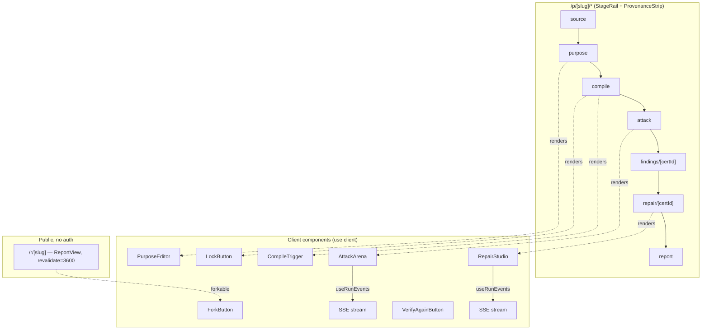

# 8 — Frontend: Pages & Stage Flow

## Relevant Source Files
- `src/app/p/[slug]/**/page.tsx`
- `src/app/r/[slug]/page.tsx`
- `src/components/brand/*`
- `src/components/attack/attack-arena.tsx`
- `src/components/repair/repair-studio.tsx`
- `src/components/report/report-view.tsx`

## TL;DR

Every project lives at `/p/[slug]/{source,purpose,compile,attack,findings/[certId],repair/[certId],report}`, laid out with a shared `StageRail` (nav, shows which stages are complete) and `ProvenanceStrip` (source hash / purpose version / formalization id+version). Each stage page server-loads its data via `loadProjectPageData()`, gates on prior-stage completion, and hands off to a client component for the interactive part. `/r/[slug]` is a separate, public, cacheable (`revalidate = 3600`) read-only replay of a project's full report — the only page that doesn't require workspace ownership.

## Overview

This is the surface a user (or judge) actually interacts with — a linear five(+)-stage workflow mirroring the pipeline in [01 — Overview](01-overview.md). Server components do the data loading and gating (`loadProjectPageData`, `completedStages`, both in `src/server/page-data.ts`); client components (`'use client'`, e.g. `AttackArena`, `RepairStudio`) own the interactive/streaming parts, talking to [07 — API Routes](07-api-routes.md) and subscribing to run progress via `useRunEvents` ([05 — Server Layer](05-server-layer.md#how-it-works)).

## Architecture Diagram

## Key Concepts

| Concept | Description | Source |
|---------|-------------|--------|
| `StageRail` | Nav sidebar; highlights the active stage by `usePathname()`, checkmarks stages in `completed` | `src/components/brand/stage-rail.tsx:18-43` |
| `completedStages()` | Derives `['source', 'purpose', 'compile']` (etc.) from loaded row statuses | `src/server/page-data.ts:37-43` |
| `ProvenanceStrip` | Always-visible header showing exactly which source hash / purpose version / formalization id+version a page's content traces to | `src/app/p/[slug]/attack/page.tsx:43-49` |
| Stage gating | A stage page checks its prerequisite's status server-side and renders a "do the prior step first" message instead of the real UI if unmet | `src/app/p/[slug]/attack/page.tsx:24-39` |
| Public report | `/r/[slug]`, `revalidate = 3600`, 404s if `!data.project.isPublic` even for the owning workspace | `src/app/r/[slug]/page.tsx:6, 19` |

## How It Works

### Server-side gating pattern

Every stage page after `source` follows the same shape (illustrated by the Attack page, `src/app/p/[slug]/attack/page.tsx:11-63`):

1. `loadProjectPageData(slug)` — throws `NotFoundError` → `notFound()` if the project or workspace access fails (see [05 — Server Layer](05-server-layer.md#how-it-works)).
2. Check the specific precondition for *this* stage (e.g. Attack requires `formalizationRow?.status === 'locked'` **and** `purposeRow?.status === 'approved'`) — if unmet, render `StageRail` + a short explanation, no interactive component.
3. If met, render `ProvenanceStrip` + `StageRail` + the stage's client component, passing down IDs/slugs it needs to call the API itself.

This means the gating logic lives once per stage page (not duplicated into API routes' Gate checks, which independently re-verify via `GateError` — see [07 — API Routes](07-api-routes.md#how-it-works)) — the UI gate is a UX convenience, the API gate is the actual enforcement.

### Attack Arena / Repair Studio streaming pattern

`AttackArena` and `RepairStudio` are `'use client'` components that: POST to the run-starting route, receive `{ runId, reused }`, then call `useRunEvents(runId)` to subscribe via SSE (falling back to polling `GET /api/runs/[runId]` on connection failure — see [05 — Server Layer](05-server-layer.md#how-it-works)) and render each `run_events` payload as it streams in (`generated` → `solving` → `certified`/`rejected`/`inconclusive` for attack; `generating` → `proposed` for repair).

### Public report / fork

`/r/[slug]/page.tsx` renders `ReportView` with `forkable` — the same `ReportView` component is presumably also used from an owner's private view without forking, since `loadReportData()` ([06 — Database Schema](06-database-schema.md#data-flow)) works for any project a workspace can read. `ForkButton` (`src/components/report/fork-button.tsx`) calls `forkGoldenProject()`-style logic to copy a public benchmark into the visitor's own workspace so they can run their own attacks against it.

## Component Reference

| Component | Type | Responsibility | Source |
|-----------|------|-----------------|--------|
| `StageRail` | client component | Stage navigation with completion checkmarks | `src/components/brand/stage-rail.tsx` |
| `ProvenanceStrip` | component | Shows source/purpose/formalization identity for the current view | `src/components/brand/provenance-strip.tsx` |
| `StatusBadge` | component | Small `sat`/`unsat`/`certified`/etc. status pill | `src/components/brand/status-badge.tsx` |
| `FooterDisclaimer` | component | The mandatory "Research and drafting support. Not legal advice..." footer | `src/components/brand/footer-disclaimer.tsx` |
| `AttackArena` | client component | Starts an attack run, streams candidates/certificates live | `src/components/attack/attack-arena.tsx` |
| `RepairStudio` | client component | Starts a repair run, shows proposals + retest scores | `src/components/repair/repair-studio.tsx` |
| `PurposeEditor` | client component | Edit/approve purpose contract invariants | `src/components/purpose/purpose-editor.tsx` |
| `CompileTrigger` / `LockButton` / `RuleRow` | client components | Start compile run, lock a formalization, review one rule/definition | `src/components/compile/*.tsx` |
| `VerifyAgainButton` | client component | Re-runs `verifyCertificate()`-style check from the client | `src/components/findings/verify-again-button.tsx` |
| `ReportView` | component | Renders the full `ReportData` (see [06](06-database-schema.md)) | `src/components/report/report-view.tsx` |
| `ForkButton` | client component | Copies a public project into the visitor's workspace | `src/components/report/fork-button.tsx` |
| `useRunEvents()` | hook | SSE subscription + poll fallback for a run | `src/components/run/use-run-events.ts:21-67` |

## Gotchas & Conventions

> 📌 **Convention**: `StageRail`'s `STAGES` list (`src/components/brand/stage-rail.tsx:8-16`) includes `findings` and `repair` as separate rail entries even though their routes are parameterized by `certId` (`findings/[certId]`, `repair/[certId]`) — the rail links to the bare `/p/[slug]/findings` path, so navigating via the rail before a certificate is selected likely 404s or needs its own redirect/landing behavior. `[NEEDS INVESTIGATION]`: the `findings` and `repair` index routes (without a `certId`) were not read; confirm they redirect to a most-recent-certificate view rather than 404ing.

> 📌 **Convention**: the `/r/[slug]` report page uses `revalidate = 3600` (ISR) while every `/p/[slug]/*` stage page uses `dynamic = 'force-dynamic'` — the public report is the one page in the app that's allowed to serve slightly-stale data, because it's the shareable, cacheable artifact; the private workspace views always hit the database fresh.

## Cross-References
- Parent: [01 — Overview](01-overview.md)
- Prior: [07 — API Routes](07-api-routes.md)
- Related: [05 — Server Layer](05-server-layer.md) (`useRunEvents`, SSE), [06 — Database Schema](06-database-schema.md) (`ReportData`)
