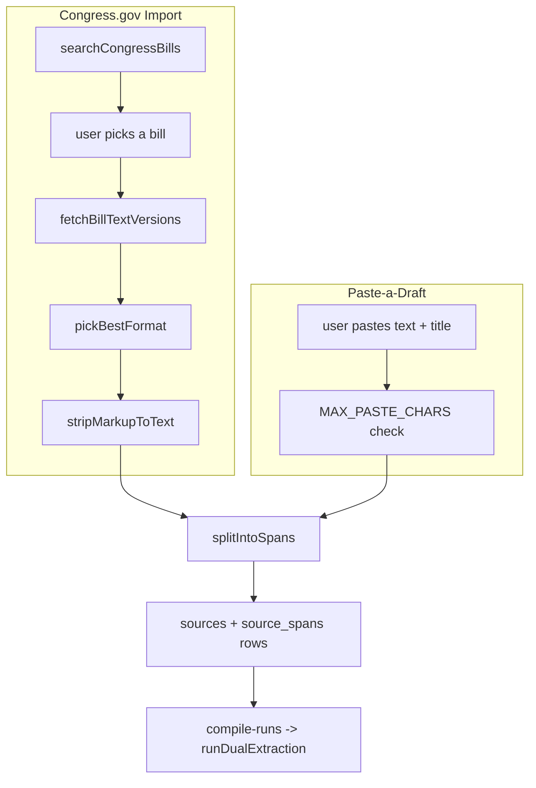

# 9 — Ingest Paths: Congress.gov & Paste-a-Draft

## Relevant Source Files
- `src/server/congress.ts`
- `src/server/paste-split.ts`
- `src/server/projects.ts`

## TL;DR

A new project's source text arrives one of two ways: live import from Congress.gov (`importBillText()`), or a user-pasted draft (`createPasteProject()`). Both end up calling the same `splitIntoSpans()` section-marker splitter and produce the same `sources` + `source_spans` rows — the rest of the pipeline (extraction, compile) doesn't know or care which path a project came from.

## Overview

This is the front door of the product: how legal text gets in before it can be formalized. Both paths funnel into the same span-splitting logic so [04.1 — Extraction & Reconciliation](04.1-extraction-and-reconciliation.md) always operates over the same `SourceSpan` shape regardless of origin.

## Architecture Diagram

## Key Concepts

| Concept | Description | Source |
|---------|-------------|--------|
| `ALLOWED_HOSTS` | Congress.gov fetches are restricted to `api.congress.gov`, `www.congress.gov`, `www.govinfo.gov` over HTTPS only — an SSRF guard | `src/server/congress.ts:8, 20-26` |
| `MAX_BYTES` | 2MB response size cap, checked both via `Content-Length` header and actual byte count after fetch | `src/server/congress.ts:10, 33-37` |
| `FORMAT_PREFERENCE` | Prefers `Formatted Text` > `Text` > `Formatted XML` > `PDF`; PDF is explicitly rejected later (`importBillText`) since PDF import isn't supported | `src/server/congress.ts:95-103, 144` |
| `MARKER` regex | Section boundary pattern: `SEC. N.`, `Section N.`, or a lettered/numbered subsection `(a)`, `(1)`, `(A)` | `src/server/paste-split.ts:12` |
| `MAX_SPANS` | 20 — the paste-splitter caps span count, folding overflow into the last kept span rather than dropping text | `src/server/paste-split.ts:8, 37` |

## How It Works

### Congress.gov import (`importBillText()`, `src/server/congress.ts:137-190`)

1. `searchCongressBills()` — the Congress.gov v3 API has **no full-text search parameter** (a documented finding, `src/server/congress.ts:58-62`), so this fetches a page of bills by congress/type and filters client-side by title/number substring.
2. `fetchBillTextVersions()` — lists available text versions for a specific bill.
3. Picks the **latest** version (`versions[versions.length - 1]`), then `pickBestFormat()` on its `formats`.
4. `fetchWithLimits()` enforces host allowlist + timeout (`FETCH_TIMEOUT_MS = 10_000`) + size cap on every external call.
5. `stripMarkupToText()` — a regex-based tag stripper (not a full HTML parser); safe here specifically because government formatted-text responses are "simple markup (no scripts/styles to worry about)" per the code comment (`src/server/congress.ts:113-114`).
6. Creates a new `projects` row (`slug: import-<8 hex chars>`), a `sources` row with `metadata.sourceType: 'congress-import'`, splits into spans, and logs an audit event.

### Paste-a-draft (`createPasteProject()`, `src/server/projects.ts:121-162`)

Simpler: validates length against `MAX_PASTE_CHARS = 60000`, creates a `projects` row (`slug: draft-<8 hex chars>`), a `sources` row with `metadata.sourceType: 'paste'` and `jurisdiction: 'unspecified'`, splits into spans via the same `splitIntoSpans()`, and logs an audit event.

### `splitIntoSpans()` (`src/server/paste-split.ts:24-57`)

Finds every `MARKER` match position in the text; if none found, returns a single full-text span (`sectionPath: 'full-text'`). Otherwise builds contiguous chunks between consecutive marker positions (plus a leading `preamble` chunk if text precedes the first marker), caps at `MAX_SPANS` by simply taking the first 20 marker boundaries (later text folds into the 20th span since chunk boundaries are marker-to-marker), and labels each span with its first line (truncated to 80 chars) or the marker text itself.

## Component Reference

| Component | Type | Responsibility | Source |
|-----------|------|-----------------|--------|
| `searchCongressBills()` | async function | Client-side-filtered bill listing | `src/server/congress.ts:63-83` |
| `fetchBillTextVersions()` | async function | Lists a bill's available text versions | `src/server/congress.ts:105-111` |
| `importBillText()` | async function | Full import: fetch, strip, split, persist | `src/server/congress.ts:137-190` |
| `stripMarkupToText()` | function | Regex tag/entity stripper | `src/server/congress.ts:115-129` |
| `splitIntoSpans()` | function | Section-marker-based text splitter, shared by both ingest paths | `src/server/paste-split.ts:24-57` |
| `createPasteProject()` | async function | Persists a pasted draft as a new project | `src/server/projects.ts:121-162` |

## Configuration & Environment

| Key | Description | Source |
|-----|-------------|--------|
| `CONGRESS_GOV_API_KEY` | Required for all Congress.gov calls; throws `CongressApiError` if unset | `src/server/congress.ts:14-18` |
| `MAX_PASTE_CHARS` | `60000` | `src/server/projects.ts:10` |
| `FETCH_TIMEOUT_MS` | `10000` | `src/server/congress.ts:9` |
| `MAX_BYTES` | `2 * 1024 * 1024` | `src/server/congress.ts:10` |

## Gotchas & Conventions

> ⚠️ **Gotcha**: `MARKER`'s subsection patterns (`\([a-z]{1,2}\)`, `\([0-9]{1,3}\)`, `\([A-Z]{1,2}\)`) will match *any* parenthetical of that shape anywhere at the start of a line — including something like `(see)` if it happened to be 1-2 lowercase letters at a line start, though the realistic false-positive rate on actual bill text is low since such markers are a genuine legal drafting convention.

> 📌 **Convention**: both ingest paths reuse the exact same downstream shape (`sources` + `source_spans` with `sha256`-hashed text) — when adding a third ingest path (e.g. PDF upload, mentioned as explicitly unsupported for PDF text versions today), follow this same "produce spans, insert `sources`+`source_spans`, log an audit event" pattern rather than introducing a parallel data path.

## Cross-References
- Parent: [01 — Overview](01-overview.md)
- Related: [04.1 — Extraction & Reconciliation](04.1-extraction-and-reconciliation.md), [05 — Server Layer](05-server-layer.md) (`logAudit`)
