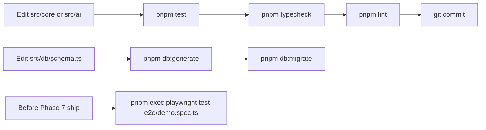

# 10 — Build & Development

## Relevant Source Files
- `package.json`
- `next.config.ts`
- `drizzle.config.ts`
- `scripts/seed-golden.ts`, `scripts/hash-golden.ts`, `scripts/eval.ts`
- `vitest.config.ts`

## TL;DR

pnpm-managed Next.js 16 app. `pnpm dev`/`build`/`start` for the app; `pnpm test`/`typecheck`/`lint` as pre-commit gates (mandatory before any commit touching `src/core` or `src/ai`); `pnpm db:generate`/`db:migrate` for Drizzle schema changes via Neon; `pnpm seed` loads the CCPA golden fixture. Standalone scripts touching `z3-solver` must call `process.exit(0)` or the WASM runtime hangs the process.

## Overview

This page consolidates the commands and dev-workflow rules scattered across `CLAUDE.md` into one reference, grounded in the actual `package.json` scripts and config files. See [11 — Testing Infrastructure](11-testing.md) for what each test command actually exercises.

## Commands

```bash
pnpm dev                      # next dev — local dev server
pnpm build                    # next build
pnpm start                    # next start (production server)
pnpm lint                     # eslint
pnpm test                     # vitest run — all unit/integration tests, excludes e2e/
pnpm test:watch               # vitest (watch mode)
pnpm typecheck                # tsc --noEmit
pnpm db:generate               # drizzle-kit generate (after src/db/schema.ts changes)
pnpm db:migrate                # drizzle-kit migrate (direct DB connection only)
pnpm seed                     # tsx scripts/seed-golden.ts — loads fixtures/golden/ccpa-2018
pnpm e2e                      # playwright test — runs e2e/*.spec.ts
```

## Pipeline



## Key Concepts

| Concept | Description | Source |
|---------|-------------|--------|
| `z3-solver` in `serverExternalPackages` | Required Next.js config so the WASM module isn't bundled by webpack | `CLAUDE.md`, `next.config.ts` |
| `runtime = 'nodejs'` | Every route touching `z3-solver` must set this — the default edge runtime can't run WASM the same way | `CLAUDE.md`, e.g. `src/app/api/projects/[projectId]/attack-runs/route.ts:17` |
| `process.exit(0)` requirement | Standalone Node scripts using `src/core/z3.ts` must exit explicitly; Vitest/route handlers are unaffected | `scripts/seed-golden.ts`, `scripts/eval.ts`, `CLAUDE.md` |
| Neon CLI provisioning | `DATABASE_URL`/`DATABASE_DIRECT_URL` are generated via `neon connection-string`, never hand-written | `CLAUDE.md` |

## Component Reference

| Script | Responsibility | Source |
|--------|-----------------|--------|
| `scripts/seed-golden.ts` | Loads `fixtures/golden/ccpa-2018/*.json` into a fresh DB as the seeded benchmark project | `scripts/seed-golden.ts` |
| `scripts/hash-golden.ts` | Computes/verifies canonical hashes over the golden fixtures | `scripts/hash-golden.ts` |
| `scripts/eval.ts` | Reads `model_calls` to compute schema-validity/success rate across LLM calls; prints an eval table | `scripts/eval.ts` |

## Configuration & Environment

| Key | Description |
|-----|-------------|
| `DATABASE_URL` | Pooled Neon connection, runtime queries (`drizzle-orm/neon-http`) |
| `DATABASE_DIRECT_URL` | Direct connection, `drizzle.config.ts` migrations only |
| `GROQ_API_KEY`, `REASONING_MODEL`, `FAST_MODEL` | Primary LLM provider |
| `OPENROUTER_API_KEY`, `FALLBACK_MODEL` | Fallback LLM provider |
| `CONGRESS_GOV_API_KEY` | Congress.gov import |

All are pre-populated in `.env.local` for this project (`CLAUDE.md` — "Don't ask for them again").

## Gotchas & Conventions

> ⚠️ **Gotcha**: `pnpm test -- --filter=<name>` (per `CLAUDE.md`) is preferred over the full `pnpm test` while iterating on a single test file — the full suite includes solver-backed tests (`src/core/__tests__/*`) whose real Z3 checks add latency Vitest's default reporting doesn't distinguish from actual regressions until you look closely.

> 📌 **Convention**: never `git checkout .`/`git reset --hard`/force-push without explicit instruction, never skip hooks (`--no-verify`), and work directly on `main` — no worktrees, no feature branches for this project (`CLAUDE.md`). Commit once per completed plan phase, not per task.

## Cross-References
- Parent: [01 — Overview](01-overview.md)
- Next: [11 — Testing Infrastructure](11-testing.md)
