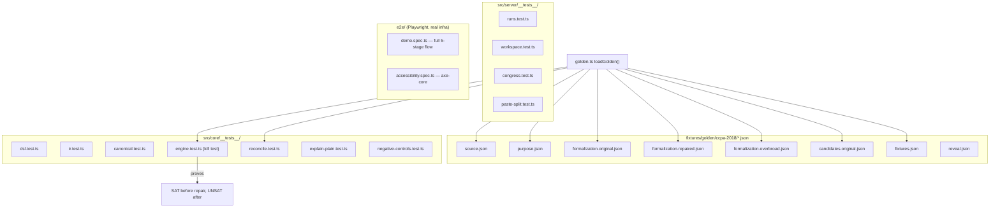

# 11 — Testing Infrastructure

## Relevant Source Files
- `src/core/__tests__/*.test.ts`, `src/core/__tests__/golden.ts`
- `src/server/__tests__/*.test.ts`
- `src/ai/__tests__/schemas.test.ts`
- `e2e/demo.spec.ts`, `e2e/accessibility.spec.ts`
- `fixtures/golden/ccpa-2018/*.json`

## TL;DR

Unit/integration tests (Vitest, real Z3 solves — not mocked) live under `src/**/__tests__/`; the most important suite is `src/core/__tests__/engine.test.ts`, which is where the **kill test** lives — proving the golden CCPA formalization is `SAT` (exploitable) before repair and `UNSAT` (closed) after, using recorded fixtures in `fixtures/golden/ccpa-2018/`. Playwright (`e2e/`) drives the full 3-minute demo path against a real running app, real Groq calls, and a real Postgres DB.

## Overview

Testing here isn't a formality — per `CLAUDE.md`, "Task 1.6 (the kill test) is a gate. If the golden CCPA case doesn't produce SAT on the original law and UNSAT after repair, stop and fix `src/core`, don't paper over it with UI polish." This page maps what each test layer actually proves, building on [03 — Z3 Engine](03-z3-engine.md) (what's being tested) and [10 — Build & Development](10-build-and-development.md) (how to run it).

## Architecture Diagram

## Key Concepts

| Concept | Description | Source |
|---------|-------------|--------|
| Golden fixture set | 8 JSON files modeling one real case (CCPA 2018): original + repaired + overbroad formalizations, the purpose contract, recorded attack candidates, positive/negative fixtures, and a `reveal.json` | `fixtures/golden/ccpa-2018/*.json` |
| `loadGolden()` | Zod-parses every golden file into typed IR objects, used by any test that needs a realistic (not synthetic) formalization | `src/core/__tests__/golden.ts:19-29` |
| Kill test | The specific assertion that `certify()` on `formalization.original.json` returns `sat` for the recorded exploit candidate, and `retest()`/`certify()` on `formalization.repaired.json` returns `unsat` for the same candidate family | `src/core/__tests__/engine.test.ts`, `CLAUDE.md` |
| No mocking of Z3 | Every `src/core/__tests__` test calls the real `z3-solver` WASM module — these are integration tests of the actual solver behavior, not unit tests against a stub | `src/core/__tests__/engine.test.ts:1-4` |

## How It Works

### Test layers

1. **`src/core/__tests__/*`** — the trust-boundary tests. `dsl.test.ts` and `ir.test.ts` cover the parser/typechecker/validator in isolation (no solver). `canonical.test.ts` covers `hashOf`/`canonicalJson` determinism. `engine.test.ts`, `reconcile.test.ts`, `explain-plain.test.ts` all exercise real Z3 solves, several against `loadGolden()`'s real CCPA fixtures rather than synthetic minimal formalizations — `engine.test.ts` also builds its own minimal synthetic formalization (`makeFormalization()`/`makePurpose()`, `src/core/__tests__/engine.test.ts:7-64`) for faster, more targeted cases alongside the golden ones. `negative-controls.test.ts` presumably checks that things which *shouldn't* certify, don't (`[NEEDS INVESTIGATION]`: the exact negative cases weren't read directly).
2. **`src/server/__tests__/*`** — `runs.test.ts` (dedup/reset/orphan logic), `workspace.test.ts` (cookie auth, access control), `congress.test.ts` (host allowlist, format preference, markup stripping), `paste-split.test.ts` (span splitting edge cases).
3. **`src/ai/__tests__/schemas.test.ts`** — `flatVarsToVarDecls()` conversion/dropping logic (see [04 — AI Pipeline](04-ai-pipeline.md#key-concepts)).
4. **`e2e/demo.spec.ts`** — a real Playwright browser session against a real running dev server, real Groq API calls, real Postgres. It forks the golden benchmark, walks Purpose → Compile → Attack (waits for `'2 certified'`, up to 200s) → Findings → Repair (waits for AI-drafted proposals, up to 120s, then approves and re-attacks, asserting `'UNSAT'` appears at least twice) → the public `/r/ccpa-2018-benchmark` report. Its own comment documents that real observed latency (~140s for one attack run) exceeds the plan's originally stated 90s budget, hence `test.setTimeout(240_000)`.
5. **`e2e/accessibility.spec.ts`** — `@axe-core/playwright`-based automated accessibility checks (`assertNoSeriousViolations`).

### Why the golden fixtures matter beyond one test

`formalization.original.json` / `.repaired.json` / `.overbroad.json` aren't just test data — `formalization.original.json` is also the seed data for the live `ccpa-2018-benchmark` project (`scripts/seed-golden.ts`), `candidates.original.json` is replayed verbatim in demo-mode attack runs (`src/app/api/projects/[projectId]/attack-runs/route.ts:37-41`), and the same fixtures back the e2e demo spec. One fixture set is the single source of truth for "the golden CCPA case" across unit tests, the seeded demo project, and the e2e smoke test.

## Component Reference

| Component | Type | Responsibility | Source |
|-----------|------|-----------------|--------|
| `loadGolden()` | function | Parses all golden fixture files into typed IR values | `src/core/__tests__/golden.ts:19-29` |
| `findCandidate()` | function | Looks up one recorded candidate by id, throws if missing | `src/core/__tests__/golden.ts:31-35` |
| `assertNoSeriousViolations()` | function | axe-core assertion helper | `e2e/accessibility.spec.ts:4` |
| `forkGolden()` | function | e2e test helper to start from the seeded benchmark | `e2e/accessibility.spec.ts:10` |

## Gotchas & Conventions

> ⚠️ **Gotcha**: `src/core/__tests__` tests are not fast unit tests — they call real Z3 via WASM, and `vitest.config.ts` sets `testTimeout: 20000` (20s per test, well above a typical unit test default) to accommodate this. Running `pnpm test` repeatedly during tight iteration is noticeably slower than a pure-JS test suite; `pnpm test -- --filter=<name>` is the documented workaround (`CLAUDE.md`).

> 📌 **Convention**: `e2e/demo.spec.ts` asserts on real AI output timing and real Groq latency, not synthetic mocks — its generous timeouts (200s for attack certification, 120s for repair drafting) are calibrated from observed production latency, not from a budget assumption. If this spec times out after an AI provider or model change, check whether the new model is simply slower before assuming a regression.

## Cross-References
- Parent: [01 — Overview](01-overview.md)
- Prior: [10 — Build & Development](10-build-and-development.md)
- Related: [03 — Z3 Engine](03-z3-engine.md), [04.2 — Attack Generation & Repair Synthesis](04.2-attack-and-repair.md)
